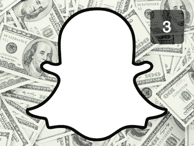

# Snapchat 要达到 30 亿美元的收入目标必须达到哪些？

> 原文：<https://web.archive.org/web/https://techcrunch.com/2013/11/13/what-are-the-revenue-targets-snapchat-must-meet-to-be-worth-3-billion/>

今天[《华尔街日报》报道【Snapchat 拒绝了来自脸书的 30 亿美元或更多的现金收购要约。这一消息让许多人感到意外，因为 Snapchat 没有收入，而且是一家非常年轻的公司。](https://web.archive.org/web/20230201161624/http://blogs.wsj.com/digits/2013/11/13/snapchat-spurned-3-billion-acquisition-offer-from-facebook/)

泄露的报价可能是某种帮助 Snapchat 筹集下一轮资金的试探气球，据报道，该轮融资将对公司[的估值定为 35 亿美元](https://web.archive.org/web/20230201161624/http://allthingsd.com/20131025/snapchat-is-mulling-another-huge-round-at-a-3-5-billion-valuation/)。外部市场最近对该公司的看法是，以这个价格筹集巨额现金几乎没有问题。

然而，尽管最近几个月 Snapchat 用户每天发送的“快照”数量快速增长，拟议中的第[轮还没有结束](https://web.archive.org/web/20230201161624/http://blogs.wsj.com/digits/2013/11/13/snapchat-spurned-3-billion-acquisition-offer-from-facebook/)。拒绝 30 亿美元对任何人来说都是一个艰难的选择。在没有收入和针对变化无常的市场类别的产品的背景下做这件事是彻头彻尾的大胆。

如今 30 亿美元的市值是多少？好吧，我们可以将这一市值与 Twitter 最近的 IPO 进行对比，得出类似的收入，回答这个问题:在 Twitter 的 IPO 和第一天的估值中，其收入与估值的比率是多少？然后，我们可以将其应用于 Snapchat，无论是现在还是未来，以估计 Snapchat 必须赚取多少收入才能增长到目前的估值水平，以及在以后的退出或公开募股中，只要它达到其中之一。

或者，换句话说，我们可以得到一些粗略的数字，看看 Snapchat 要成为一家估值合理的公司，还需要从目前的起跑线上跑多远。我们将很快深入探讨这种比较的真实性和公平性，但我们可以简单地指出，Twitter 和 Snapchat 是社交、移动优先的消息平台，在年轻时都面临公众对其赚钱能力的担忧。我根本不是想说 Snapchat 应该只占 Twitter 收入的一小部分，而是说通过广泛的比较，我们可以学到很多东西。

我们从推特开始。

## 推特

先把 Twitter 赔钱这件事放一边。Snapchat 也是如此。考虑到这一点，我们将把重点放在收入上。在过去的 12 个月(TTM)中，Twitter 的最后一个私人季度(截至 9 月 30 日)的收入为 5.345 亿美元。这是使用提供的 2013 年 9 个月的数字，然后从提供的 2012 年全年数字中减去 2012 年 9 个月的数字，然后将两者相加( [S-1](https://web.archive.org/web/20230201161624/http://www.sec.gov/Archives/edgar/data/1418091/000119312513424260/d564001ds1a.htm) )。

Twitter 申请以每股 26 美元的价格上市。使用[完全稀释后的股份总数](https://web.archive.org/web/20230201161624/https://techcrunch.com/2013/11/07/twitter-nyse-day-1/) [705，098，594](https://web.archive.org/web/20230201161624/https://techcrunch.com/2013/11/07/twitter-nyse-day-1/) ，Twitter 对自己的估值为 183 亿美元。相反，公司[以 45.10 美元](https://web.archive.org/web/20230201161624/https://techcrunch.com/2013/11/07/twitter-nyse-day-1/)开盘，对该公司的估值为 318 亿美元(再次使用稀释后的股票计数)。

将这些数字与 Twitter 的营收相比，该公司对自己的估值是过去 12 个月营收的 34.2 倍。当然，其未来收入数字将会大幅减少。相反，市场对 Twitter 的估值为 318 亿美元，是其过往收入的 59.5 倍。

有了这两个数字，我们现在可以转向 Snapchat，看看它必须产生的收入范围，才能在 Twitter 的估值范围内交易，以及如果上市，它希望达到的水平。

## Snapchat

在市场类别中，年轻的科技公司不像更成熟的公司那样关注收入。所以下面的数据点是不公平的。然而，我们是故意不公平的，因为 Snapchat 的估值意味着它最终将获得一定水平的收入。

因此，我们可以计算出该公司目前的收入赤字(T10 ),前提是它作为一家独立的公司继续运营，我对此表示怀疑。然而，如果它这样做了，它将需要收入，并最终获得利润。

而且，鉴于投资者愿意将 Snapchat 的估值定在 10 位数的范围内，我不认为以这种方式将其指标与 Twitter 进行比较太过刻薄；投资者押注 Snapchat 将在以后的日子里与 Twitter 齐名。

我们将首先使用 Twitter 自己设定的价值收入比来比较 Snapchat 的几个收入指标:

*   Snapchat 价值:30 亿美元。Twitter 的价值收入比:34.2。这一估值意味着 Snapchat 的收入赤字:**:8770 万美元** (TTM，但我们可以称之为放松的 12 个月)
*   Snapchat 价值:35 亿美元。Twitter 的价值收入比:34.2。在此估值下，Snapchat 的隐含收入赤字:**:1.023 亿美元**(重复上述警告)
*   Snapchat 价值:40 亿美元。Twitter 的价值收入比:34.2。这一估值意味着 Snapchat 收入赤字:**1.17 亿美元(重复上述警告)**
***   有趣的是，Snapchat 的估值为 60 亿美元，是脸书据报道提供的估值的两倍，这是计算潜在回报等目的的两倍:Snapchat 价值:60 亿美元。Twitter 的价值收入比:34.2。这一估值意味着 Snapchat 的收入赤字:**1.754 亿美元(重复上述警告)****

 ****计算收入赤字有什么价值？从本质上讲，它显示了该公司需要取得多大的进步，才能配得上一个非常泡沫化的、赔钱的估值，就像 Twitter 在 IPO 中附加在自己身上的估值一样。

现在，公众投资者对 Twitter 的评价很高，因为他们以更高的价值收入比对该公司进行估值，这意味着他们愿意对 Twitter 的每一美元进行高于该公司 IPO 前的估值。现在，这将导致 Snapchat 的隐含收入赤字降低，但数据值得一看。我们重复上述内容:

*   Snapchat 价值:30 亿美元。Twitter 的价值收入比:59.5。这一估值意味着 Snapchat 的收入赤字:**:5040 万美元** (TTM，但我们可以称之为放松的 12 个月)
*   Snapchat 价值:35 亿美元。Twitter 的价值收入比:59.5。这一估值意味着 Snapchat 收入赤字:**5880 万美元(重复上述警告)**
***   Snapchat 价值:40 亿美元。Twitter 的价值收入比:59.5。在此估值下，Snapchat 的隐含收入赤字:**【6720 万美元】**(重复上述警告)*   有趣的是，Snapchat 的估值为 60 亿美元，是脸书据报道提供的估值的两倍，这是计算潜在回报等目的的两倍:Snapchat 价值:60 亿美元。Twitter 的价值收入比:59.5。这一估值意味着 Snapchat 收入赤字:**【100.8 百万美元】**(重复上述警告)**

 **—

眼下，硅谷流传着一个有悖常理的小笑话，即尽可能推迟营收，这样你就可以卖掉自己的公司，赚更多的钱。开始赚钱，像 Tumblr 一样，奋斗，像 Tumblr 一样，你可能只会得到区区十亿美元！

以上述价值点押注 Snapchat 的投资者是在下两种赌注之一:要么有人足够愚蠢(雅虎)，要么有人足够害怕(脸书)以至少 2 倍的估值倍数收购 Snapchat。或者，Snapchat 是一个杀手级企业，它将会超越上述收入范围，成为一家成熟的上市公司。

如果是后者，他们肯定已经计算出他们离零有多远，因为他们为 Snapchat 尚未诞生的收入预付了费用。他们为此支付了额外费用。回想一下，如果你的估值增长过快，可能很难找到收购者。你可能不得不向朋友求助。

好吧，一旦你的估值达到数十亿，就没有朋友或家人保释你的余地了——如果你足够幸运，只有傻瓜才会这么做。

对 Snapchat 被炒得沸沸扬扬的估值嗤之以鼻，你会被告知 Snapchat 有太多的赚钱方式。看看脸书吧！我不相信。脸书的数据图表是其广告系统发挥作用的原因；理论上，Snapchat 会删除它可以用来定向投放广告的信息。

这就是我目前看到 Snapchat 的地方。一个有趣的应用程序，一个我用得越来越多的应用程序，但我很难理解它头上嗡嗡作响的数字。******