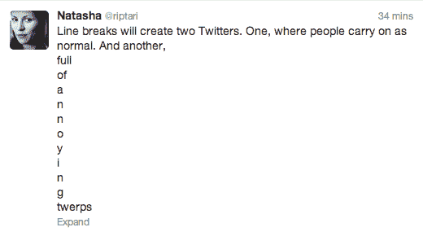
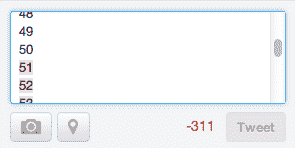
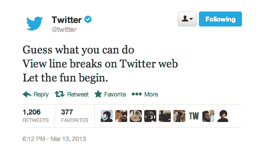
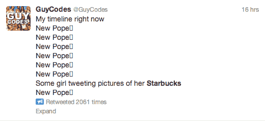
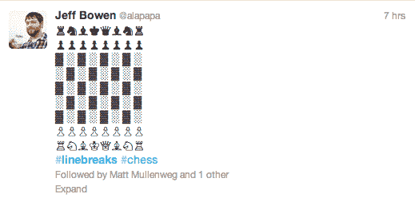
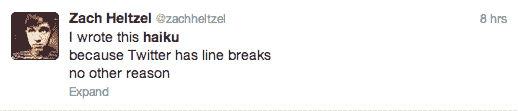
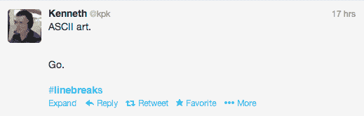

# Twitter 换行符有什么用？

> 原文：<https://web.archive.org/web/https://techcrunch.com/2013/03/14/what-are-twitter-line-breaks-good-for/>

# Twitter 换行符有什么用？

你可能还没有注意到，Twitter 昨天增加了查看换行的功能。这一变化显然还没有完全被理解——至少，还没有被我的 Twitter 流理解(今天早上我的 Twitter 流和往常一样只有两行业务)。但是期待一些夸张的推文很快开始在你的订阅中传播。

添加查看换行符的功能表面上看是一个非常微妙的变化，但是几个硬回车就可以将 140 个字符传播很远:

【T2

Twitter 不会让你发巨大的空白块(我查过了)。但是，如果你每次只写一个字符，你应该可以在 70 行左右的篇幅内写完你的推文(并且希望真的很烦人):

推特的一个巨大优势(在我看来)是推特的简洁，以及由此产生的推特信息流的密度。Twitter 现在允许后者分手。从某种意义上来说，这是件大事。但希望不会对 Twitter 用户造成太大的干扰——比如，如果你关注的每个人突然变成了一个五岁的孩子。

Twitter 为什么要加换行符？官方上，该公司没有说太多——除了暗示它会很“有趣”:

有可能 Twitter 正在回应广告商，他们希望有更多的方式让他们的[推广推文](https://web.archive.org/web/20230406224142/https://business.twitter.com/products/promoted-tweets-self-service)脱颖而出——即通过占据更多的信息流。但由于任何人都可以在推文中添加额外的填充，这可能并不总是一个很大的区别。

【T2

Twitter web 客户端和 Twitter 的官方应用程序都支持换行符。但是第三方客户可能需要时间来赶上。(你可以想象一些人会把缺乏支持作为一个特性来吹捧。)

在 Twitter 上搜索 [#linebreaks](https://web.archive.org/web/20230406224142/https://twitter.com/search?q=%23linebreaks&src=hash) ，会出现关于这一新功能的各种观点(有一些明显的[抱怨](https://web.archive.org/web/20230406224142/https://twitter.com/LavLobster/status/312063086691491842))。还有一些创新的用法——比如断行棋: ~~~~ 

Twitter 慷慨的最直接受益者是[微博客](https://web.archive.org/web/20230406224142/https://twitter.com/search?q=%23micropoetry&src=hash)(以及[俳句](https://web.archive.org/web/20230406224142/https://twitter.com/search?q=%23haiku&src=hash)、 [senryu](https://web.archive.org/web/20230406224142/https://twitter.com/search?q=%23senryu&src=hash) 和 [gogyohka](https://web.archive.org/web/20230406224142/http://pssms.com/gogyohka) 的微博用户):

我可以看到两个主要的 Twitter 出现后线突破(假设 Twitter 没有临阵退缩，扣球功能)。一个版本是，对使用 Twitter 作为信息服务感兴趣的用户继续在 Twitter 上发布他们标准的两行智慧，同时从一个准 RSS 阅读器中收集大量有用的知识。

还有另一个 Twitter，孩子们在那里闲逛，互相交换歌词并在 Twitter 上发布表情符号风格的图形——尽可能多的分散在许多线上，就像许多数字涂鸦一样。

换句话说:

或者 MySpace redux。