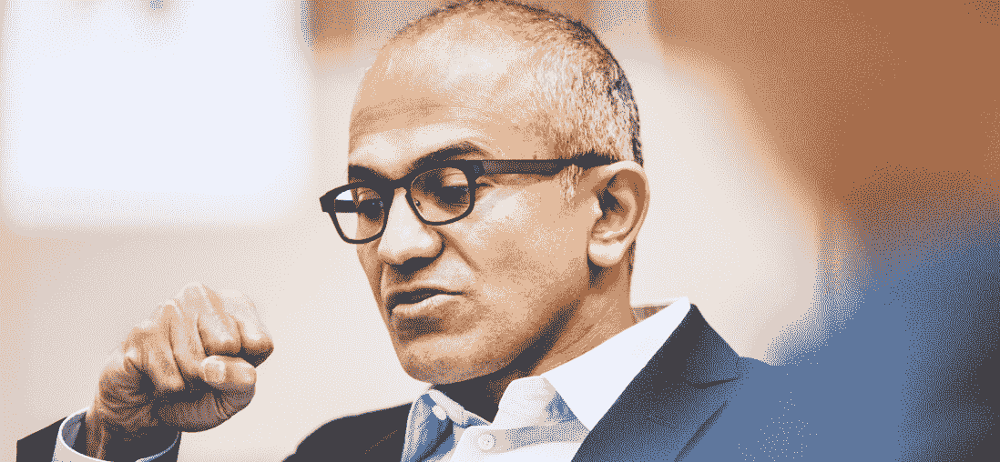
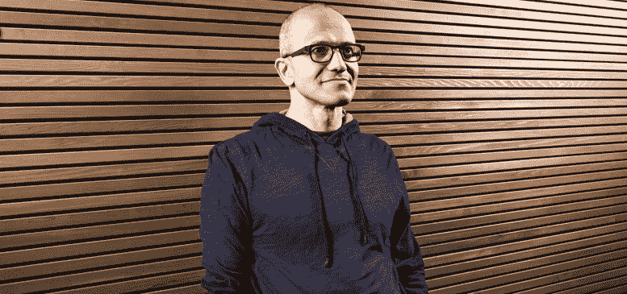

# 塞特亚·纳德拉会出什么问题？

> 原文：<https://web.archive.org/web/http://techcrunch.com/2014/02/04/what-could-go-wrong-for-satya-nadella/>

微软[今天](https://web.archive.org/web/20230129092446/https://techcrunch.com/2014/02/04/bill-gates-steps-up-to-new-role-at-microsoft-as-technology-advisor-thompson-becomes-new-chairman/)迎来了新的领导人，塞特亚·纳德拉从前任 CEO 史蒂夫·鲍尔默手中接过了控制权。比尔·盖茨将花一部分时间在公司协助产品选择。

虽然纳德拉基本上是公司外部一致的选择——包括你卑微的仆人——但他的剪报已经变得太好了。让我们花点时间来关注一下新 CEO 可能会出什么问题。

坦率地说，纳德拉的新角色是技术领域最难的工作之一，如果不是最难的话。微软在改变其商业模式的同时仍在进行重组。这使得纳德拉在公司的两个关键和巧合的变化中掌舵。

以下是纳德拉在担任微软首席执行官期间可能面临的问题和挑战的一个例子:

**Windows Phone 增长停滞，在未来两年内无法达到 10%的市场份额**

Windows Phone 出色的 2013 年被 LumiaWindows Phone 手机令人失望的第四季度销售数据所掩盖。如果这预示着 Windows Phone 销售的广泛放缓，微软的移动势头可能会停止，将这个神奇的 10%的市场份额数字越推越远。

这将损害开发者对 Windows Phone 的兴趣，进而损害更大的 Windows 生态系统，从而损害仍处于萌芽状态的 Windows Store。这并不是说 Windows Phone 本身需要所有开发者的关注。对这种溺爱来说，增长下降是一种诅咒。

**个人电脑市场可能面临比预期更糟糕的回报**

预计今年全球个人电脑市场将收缩几个百分点，然后在 2015 年触底反弹。这可能不会发生。如果个人电脑市场持续疲软，类似于 2013 年的情况，个人电脑出货量可能会下降，直到主要合作伙伴 OEM 退出。

PC 卷一直是 Windows 8.x 平台的救星，因为它已经慢慢地把鸭子排成了一排。如果没有新设备的涌入，Windows 8.x 的商店就会变得花枝招展，没有人陪它跳舞。

低于预期的个人电脑销售也将损害微软的 OEM 收入，包括来自消费者和企业的收入。这使我们想到:

**企业拒绝放弃 Windows XP**

个人电脑市场的很大一部分仍在 Windows XP 上。准确地说，接近百分之三十。对于一个微软想在四月[黑暗](https://web.archive.org/web/20230129092446/http://www.microsoft.com/en-us/windows/enterprise/endofsupport.aspx)的操作系统来说，这真是令人沮丧。

随着 Windows XP 的老化，它推迟了未来的个人电脑购买，并使使用它的公司更不安全。微软更喜欢运行闪亮的新 Windows 7 或 8 机器的更安全的客户。有一种假设认为 XP 用户会做出改变。似乎没有。这是纳德拉的新问题。

**尽管有更新，Windows 8.x 未能获得显著的平板电脑市场份额**

Surface 在 2013 年第四季度表现强劲，获得了 8.93 亿美元的收入。然而，那是在微软花重金为其刚刚推出的两款新设备做广告的季度。

我不认为有人认为微软会在本季度超过这个数字。一个更好的问题是运行 Windows 8.x 的大型平板设备销售情况如何。微软正在准备 Windows 8.x 的更新，主要专注于改善鼠标和键盘体验，而不是它的触摸兄弟。

因此，我们今天用于移动设备的 Windows 8.x 很可能是我们将在一段时间内用于移动设备的 Windows 8.x。迄今为止，消费者是否愿意购买这些设备一直是个大杂烩。纳德拉需要找到一种方法来增加平板电脑的销量，我怀疑这种设备类别在单位规模上使用 Windows Store 应用程序的比例高于其他形式。

**表面继续赔钱**

尽管 Surface 在此期间的收入增加了一倍多，但在过去的一个季度中，它亏损了数千万美元。

过去，微软一直高调表示，它打算在 Surface 系列产品上获得丰厚的利润。但是表面收入的成本比收入本身更大，这意味着这一时期更大的表面损失比你想象的要大得多。

投入巨资支持你的新商业模式是一个好计划。但在某些时候，表面将需要翻转到黑色。这取决于纳德拉，以确保 Surface 项目最终能够摆脱财政支持，独立发展。

**Office 365 的收入赶不上传统 Office 收入的下降**

Office 365 在早期阶段增长非常强劲。例如，微软报告称，在最近的收益电话会议中，Office 365 家庭高级版已经吸引了[350 万用户](https://web.archive.org/web/20230129092446/http://www.zdnet.com/microsoft-office-365-home-premium-3-5-million-subscribers-7000025523/)。这是一个很好的数字，但它只显示了大约 3 亿美元的收入。

微软还向大小企业、政府和教育客户销售 Office 365。不清楚的是，微软是否有足够的市场空间来完全取代其传统的 Office 收入，然后增加总收入，这可能不会发生。到目前为止，微软表现出了良好的势头，但纳德拉可能会发现自己的替代产品无法产生像其前身那样多的现金。

**随着纳德拉的领导地位被绑在别处，Azure 可能会在亚马逊的 AWS 面前滑落**

鉴于纳德拉的注意力现在将更加分散，Windows Azure、微软的 IaaS 和 PaaS 云计算服务可能会下滑。纳德拉是云的代名词是有原因的。

如果微软向亚马逊让步，或者更准确地说，未能扩大其在这一市场的份额，可能会损害其推广自己软件产品的能力，更不用说看到一个关键的新收入来源停滞不前了。

另一次经济放缓可能会损害对微软增长至关重要的商业购买周期

经济依然脆弱。这对纳德拉来说是一个重大风险。例如，正是企业支出使得微软的 OEM 收入在最近一个季度没有大幅下降。正如 TechCrunch 报道的那样:

> 至关重要的是，这一时期的 Windows OEM 收入仅下降了 3 %,商业客户的 OEM 收入增加了 12%。因此，大公司在很大程度上抵消了消费者需求的疲软。

这是一个更普遍的风险，但微软迄今为止的部分复苏是由于其无法控制的宏观经济条件。这一转变让纳德拉面临一个新问题。

**诺基亚数万名工人的不良融入**

与诺基亚的交易将为微软的业务带来大量新员工，几乎与此同时，微软正在挑选一位新的领导人。那可能会很糟糕。纳德拉将不得不欢迎成群结队的人进入他刚刚掌管的文化。

而且，考虑到史蒂芬·埃洛普被认为是[领先的首席执行官候选人](https://web.archive.org/web/20230129092446/https://techcrunch.com/2013/11/08/elop-is-going-to-do-what-now/)，一些人可能会因为他们的人没有获胜而不高兴。

**诺基亚的硬件部门拖累了微软的利润率和净收入**

整个诺基亚并不是一家特别赚钱的公司。微软买的那块也好不到哪里去。我已经完成了关于诺基亚可能对微软收益产生什么影响的大部分前期工作，看起来影响不大。

但是，在谷歌收购和出售摩托罗拉的严酷余晖中，你不得不怀疑会发生什么。

**高管退场**

最后，人们一直认为纳德拉将充分利用微软的执行副总裁骨干。事实可能并非如此。

既然 CEO 的问题已经尘埃落定，那些希望得到这个职位但没有得到的人可以退出了。此外，虽然纳德拉被普遍认为在内部很受欢迎，但他很难受到普遍欢迎。如果关键人才离开，他会发现自己在关键领域缺乏领导力。

–

以上大部分内容完全是理论上的。但未来也是如此。纳德拉是一个强有力的首席执行官人选，但他的工作将是工业实力。让我们看看会发生什么。