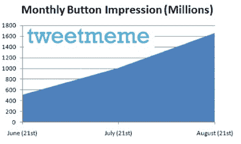
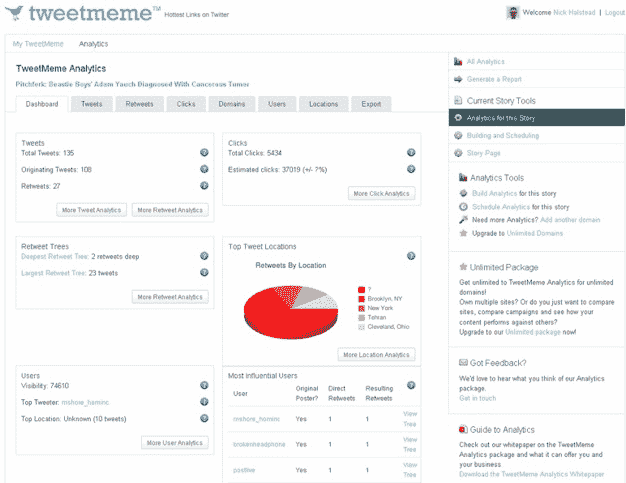

# 16 亿个转发按钮到底给你带来了什么？大约 600 万次转发。

> 原文：<https://web.archive.org/web/https://techcrunch.com/2009/08/21/what-exactly-do-16-billion-retweet-buttons-get-you-about-6-million-actual-retweets/>

# 16 亿个转发按钮到底给你带来了什么？大约 600 万次转发。

如果你看一下 TechCrunch 上任何一篇博文的右上角，你会看到它的评论数量和被转发的次数(链接到 Twitter 并在 Twitter 上传播)。通常转发数大于评论数，因为这样做要容易得多。因为一个通过的链接可以被解释为读者推荐，所以它被认为是对那个帖子的投票。每个转发链接的人实际上都是在向他们所有的关注者推荐这个链接，这有助于将流量推回到最初的帖子。至少理论上是这样。

但是实际上有多少转发按钮，有多少人点击了它们？当谈到按钮本身的传播时， [TweetMeme 今天提供了一些统计数据](https://web.archive.org/web/20230406154703/http://blog.tweetmeme.com/2009/08/21/growth/)，显示其转发按钮现在每月获得 16 亿次点击。仅在过去两个月，这个数字就翻了两番。新的 [retweet 市场进入者](https://web.archive.org/web/20230406154703/https://techcrunch.com/2009/08/19/retweetcom-launches-sure-looks-a-lot-like-tweetmeme/)有很多事情要做。只要等到转发按钮开始出现在个人评论上[就行了。](https://web.archive.org/web/20230406154703/https://techcrunch.com/2009/08/19/what-if-comments-could-be-retweeted-tweetmeme-is-working-on-it/)

然而，这意味着，按钮只是出现在每月被浏览 16 亿次的博客帖子和文章上，而不是它们被点击了那么多次。我问 Tweetmeme 的创始人尼克·霍尔斯特德，这些按钮实际上会产生多少转发。他还没有确切的数字，但他的最佳猜测是每天 20 万，或每月 600 万。这相当于微不足道的 0.375%的点击率。

关于这个数字有几点需要注意。它不包括点击转发按钮的非 Twitter 成员。它只计算重叠部分。所以实际点击量无疑更高。事实上，在 RSS feeds 中的 retweet 按钮上，对于已经登录 Twitter 的人(TweetMeme 可以测量)，点击率是 1%。但是绝大多数的印象都是针对没有登录的人。所以真正的点击率在 0.375%到 1%之间。

另一件要记住的事情是，相比于 Diggs，一篇文章被转发的次数更少。根据每个转发者有多少关注者和有多少人实际点击了链接，几个转发就可以让很多人转到那个博客帖子。Twitter 当然为 TechCrunch 带来了大量的流量，但是我们并不知道其中有多少是由于转发。

TweetMeme 正致力于让使用其转发按钮的网站更好地了解下游流量。霍尔斯特德还透露，它将发布一项分析服务，测量来自转发的流量。他最好在 Twitter 抢先一步之前抓紧时间。

