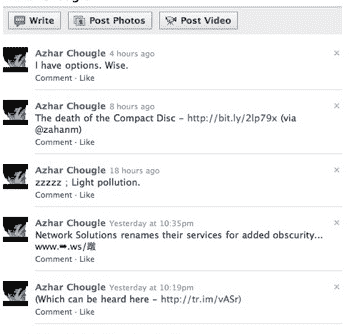

# 脸书建兴实际上是什么。提示:这不是 Twitter 或 FriendFeed。TechCrunch

> 原文：<https://web.archive.org/web/https://techcrunch.com/2009/08/12/what-facebook-lite-actually-is-hint-its-not-twitter/>

# 脸书建兴实际上是什么。提示:这不是 Twitter 或 FriendFeed。

所以，今晚网络上出现了一种叫做“[脸书 Lite](https://web.archive.org/web/20230130112446/http://techcrunch.com/2009/08/11/facebook-begins-testing-facebook-lite-a-faster-simpler-version-of-the-service/) 的东西，这是一种显然正在由脸书进行 beta 测试的新服务。但收到邀请他们测试的信息的用户，当链接不起作用时感到沮丧。这是有原因的:今晚向大多数用户推出测试是一个错误，脸书向我们证实了这一点。

但是，随着猫从袋子里出来，每个人现在都急于得出一些结论，脸书建兴实际上是什么。这些假设大多围绕着 Twitter 和 FriendFeed。原因应该是显而易见的:首先，脸书和 Twitter 似乎正在进行一场精彩的竞争，看谁是最热门的社交资产。第二，脸书刚刚[以](https://web.archive.org/web/20230130112446/http://techcrunch.com/2009/08/10/facebook-acquires-friendfeed/)[5000 万美元](https://web.archive.org/web/20230130112446/http://techcrunch.com/2009/08/10/the-cost-of-friendfeed-roughly-50-million-in-cash-and-stock/)收购了 FriendFeed，所以看起来他们可能想开发一个类似的服务。第三，我们之前发现的脸书 Lite 的截图，让它看起来很像 Twitter 和 FriendFeed。

但事实上，脸书 Lite 与 Twitter 或 FriendFeed 没有任何关系——至少现在没有。相反，脸书告诉我们，它是为世界上宽带速度不一且可能很贵的地区设计的。鉴于过去几天印度已经进行了初步测试，这是有意义的。

想想在美国这里的一些宽带连接上，脸书的加载速度有多慢，想象一下在慢几倍的连接上是什么样的。此外，还要考虑到脸书的所有数据中心都在美国。因此，要将数据传到世界各地，自然加载时间会更长。因此，脸书将网站剥离回来，让脸书 Lite 成为一个新用户可以快速在朋友的墙上留言、发送信息和建立社交网络的网站。最基本的。

正如我们所说的，它现在正在印度测试，但是我们听说，计划脸书 Lite 也将在俄国和中国等地推出。

话虽如此，这项服务完全有可能走向世界其他地方，成为那些不想要脸书提供的所有花哨功能，而只想要速度的人的一种选择。脸书对此没有什么可说的，特别是美国，但这似乎是合理的。毕竟，MySpace 也有一个“精简”版本。

但是不要相信我们已经开始听说脸书 Lite 是一个“推特杀手”的炒作——因为这根本不是它现在的意图。

