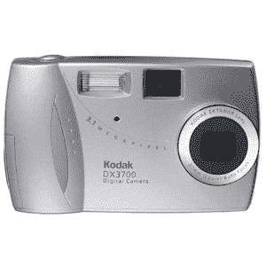
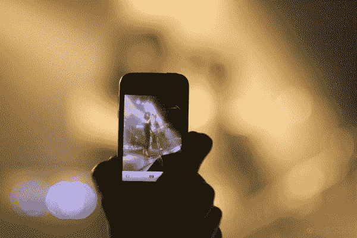
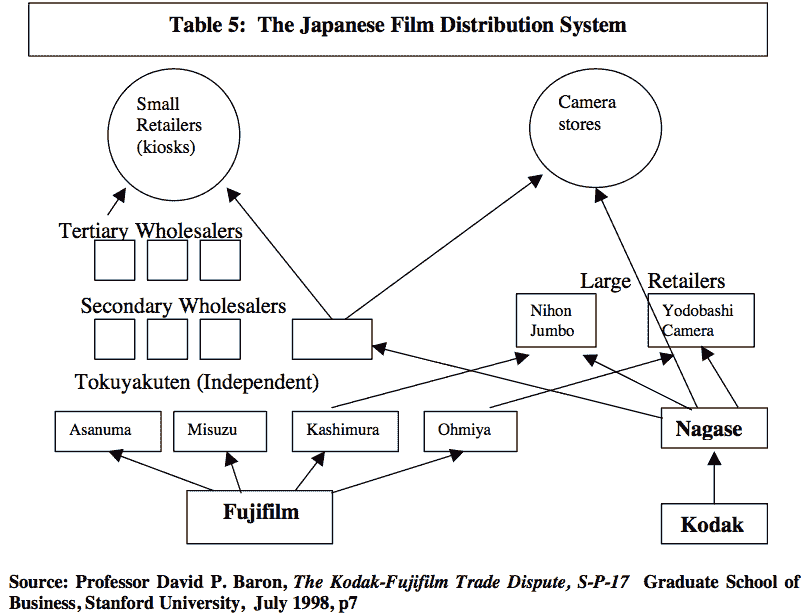
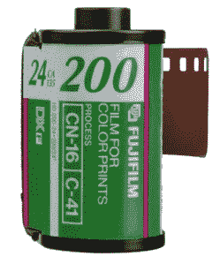

# 柯达瞬间怎么了？

> 原文：<https://web.archive.org/web/https://techcrunch.com/2012/01/21/what-happened-to-kodaks-moment/>

一个柯达瞬间:一个罕见的、一次性的瞬间，被一张照片捕捉到，或者应该被一张照片捕捉到

点击。

我们都有过这样的经历:你伸手拿起相机，让生活停顿一秒钟，捕捉一段记忆。几十年来，柯达是摄影领域坚如磐石的标准，当这家有着 131 年历史的公司申请破产保护时，“柯达时刻”可能是这个曾经是世界上最强大的公司之一所剩下的一切。柯达无法竞争，更不用说在这个新世界生存了。唯一让它们存活下来的是 11，000 项专利，即使是这些专利似乎也没有激起任何人的兴趣。

点击。

几年内从家喻户晓到大器晚成。这不是一个顽固的马鞭制造商因拒绝改变而倒闭的故事。这是一家汽车制造商，看似成功地向汽车转型，但很快就灾难性地失败了。

发生了什么事？

点击。

## 数字衰落

数码摄影开始流行，而柯达还没有做好准备。根据 PMA 的数据，从 90 年代末到大约 2008 年(也是拍照手机成为主流的时候)，美国的数码相机市场从 2000 年的 450 万台增长到 2007 年的 2830 万台。

有趣的是，柯达实际上在 1975 年发明了第一台数码相机，但却是索尼在 1981 年以索尼 Mavica 的形式首次向人们介绍了数码相机。另一方面，柯达将其数码技术集中于高端利基市场。他们带着各种混合方法来 bat 向其他公司提供传感器，而不是制造自己的消费产品(徕卡使用他们的传感器多年，甚至不问结果如何)——因为他们中的许多人无法想象这样一个世界，向少数高级用户销售一台数码相机会比向大众销售一次性胶片相机更有利可图……一次又一次。颠覆性技术就在现任者眼皮底下出现的经典案例。

在首席执行官乔治·费舍尔的领导下，柯达在 90 年代的大部分时间里一直在规划其数码战略。问题是，在 90 年代后期，除了日本以外，对数码影像行业增长的估计相当低。根据[密执安大学商学院的一项研究](https://web.archive.org/web/20230326165942/http://www-personal.umich.edu/~afuah/cases/case9.html)，“1997 年日本以外销售的数码相机总量估计只有 40 万台”，其中许多被认为是面向高级用户，而不是普通大众。

此外，柯达在日本的影响力很弱，充其量，富士在 90 年代绝对主导了日本的胶卷和相机市场。

这给柯达领导层留下了一个重大决定。柯达应该大举进军数码领域，冒险蚕食其依然强劲的核心业务吗？这就是问题所在，答案各不相同。

以下是柯达公司文献中的两段引文，摘自 [UM 研究](https://web.archive.org/web/20230326165942/http://www-personal.umich.edu/~afuah/cases/case9.html):

> 伊士曼成功地使摄影成为大众喜爱的休闲活动的关键是他发明了胶卷和廉价的盒式照相机。尽管今天的胶片和照相机更加复杂和多功能，但他的发明背后的基本原则并没有改变。

> 四年前，当我们谈论数码摄影的可能性时，人们笑了。今天，高科技世界正争先恐后地想要分一杯羹，称数字成像可能是计算机世界中最大的增长机会。而且，可能是。

显然，没有达成共识，为什么会有共识？富士在日本占主导地位，而就在柯达(T2)应该(T3)努力进入数码领域的时候，日本以外的任何地方的估价仍然很低。

显然，这些估计是错误的，柯达在这场游戏中不可避免地迟到了。他们的第一个数码影像产品不是相机，而是 1991 年他们所谓的“照片光盘”。1996 年，柯达用其袖珍 DC20 进行了另一次小规模推广。当时，数码产品还处于起步阶段，柯达没有看到这种可能性，而是专注于扫描仪等其他数码产品。事实上，[路透社](https://web.archive.org/web/20230326165942/http://www.reuters.com/article/2012/01/19/us-kodak-bankruptcy-idUSTRE80I1N020120119)报道称，1993 年柯达在数字成像研究上花费了 50 亿美元，却将它委托给了 23 个独立的扫描仪项目。

 然而，DC20 问世五年后，柯达凭借其 EasyShare 产品线向数码相机领域做出了最大努力。丹·卡普(Dan Carp)已经控制了这家公司，并且在一定程度上知道，如果他们至少不尝试数字化，那将是一个错误。但是到了 2001 年，市场已经很拥挤了。佳能和索尼已经在这个领域取得了巨大的飞跃，柯达也有一些重要的业务要做。

在某种程度上，对变化的恐惧是可以理解的，但这也是我们今天在 RIM 剧本中看到的那种倒退的老式思维。

问题的很大一部分在于人才。同样的员工可能是电影和电影摄像机的天才，但不一定是电子行业的佼佼者。当然，这无助于公司的团结，因为柯达的数码和胶片部门意见不一。柯达有很多伟大的人和伟大的摄影师，但他们不能保持他们的工资，因为其他主要玩家在 2000 年后进入数字游戏。

该公司在 90 年代中期发展得过于单薄，一直延续到下一个千年，花费数百万美元进行研究，结果却在许多不同领域发布了不断更新的产品。已经过去了，这只会让事情变得更糟。

然后在 2007 年，该公司犯了一个巨大的错误，以 23.5 亿美元的价格出售了其健康成像业务，这笔钱原本打算用于消费相机业务。不幸的是，健康成像对柯达来说是好事，公司及时卖掉了这项业务，错过了婴儿潮时期退休的机会。路透社报道称，柯达不想花费将医疗行业从模拟转向数字所需的资金。

到 2008 年，数码相机市场已经开始走下坡路。一项新技术已经出现:据 PMA 称，仅在美国，2008 年就有 1.2 亿部拍照手机在使用。同样在美国，2008 年数码相机销量首次下降，从 2007 年的 2830 万台降至 2770 万台。从那时起，该行业将经历缓慢但稳步的下滑。

【T2

但是是什么让柯达从 90 年代到现在发展如此缓慢呢？

## 已经坏了

首先，美国的零售业在 80 年代和 90 年代发生了巨大的变化。例如，沃尔玛在 80 年代经历了巨大的增长，并于 1988 年开设了第一家超市。虽然柯达乐于在大盒子连锁店中销售，但其他公司也同样乐于将产品放在沃尔玛这样的商店中。

你看，在 70 年代和 80 年代，每个小镇都有一个小小的电影商店。柯达拥有批发市场，份额在 80%到 90%之间。然后，沃尔玛，连同西尔斯、好市多和其他大型零售商，吞并了这些小夫妻店。零售商认识到多样性、混乱的营销和一站式购物对消费者非常重要，保持低成本的唯一方法是迫使制造商以更低的价格提供高质量的产品。

这就是富士发挥作用的地方，而柯达似乎从未预见到它的到来。

90 年代中期，柯达占据了日本市场 7%到 10%的份额，而富士占据了主导地位。事实上，每家公司都在自己的地盘上占有相当大的市场份额，富士占美国市场的 17%。但是这两个国家的销售渠道非常不同。当柯达和富士在美国直接向零售商销售产品时，经销商在日本扮演了中间人的角色。毫不奇怪，富士与日本的四大经销商关系密切，而柯达……嗯，他们不喜欢它。

1995 年，柯达根据 301 条款向美国贸易代表(USTR)提起诉讼，要求调查日本政府是否允许反竞争行为。经过两年半的诉讼，位于日内瓦的世界贸易组织发布了关于日本电影市场的“全面拒绝柯达的投诉”。

通过主导自己的市场并稳步打入美国市场，富士有相当多的现金可以用来购买新市场。这正是它所做的。根据佩斯大学的一项案例研究，“当美国的伊士曼·柯达公司沉睡的时候，日本的富士胶片公司在美国开设了第一家胶片生产厂，降低价格，积极营销，窃取了宝贵的市场份额。”

那是在 1996 年到 1997 年之间，当时柯达仍然占有大约 80%的美国市场，主要集中在胶卷和胶片相机上。但富士现在准备在价格战中一决雌雄，尽管两家公司都否认积极参与此类事情，但每次富士降价，柯达都予以猛烈回击。但是太少了，太晚了。在此之前的几年里，柯达拒绝降价，担心利润受到侵蚀。

 然而在 1996 年，柯达与好事多签订了一份独家协议，给富士留下了 250 万卷多余的胶卷。为了避免过期，该公司提供了 10%至 15%的降价。柯达拒绝参与，而且理所当然地拒绝参与，正如所罗门美邦分析师乔纳森·罗森茨韦格(Jonathan Rosenzweig)所计算的那样，“柯达胶片价格每下降 1%，每股收益就会下降 1%。”

与此同时，美国消费者正在发生变化。当人们仍然为“购买美国货”感到自豪时，进口货变得越来越有吸引力。几年后，也就是 1999 年 1 月，美国创下了迄今为止最大的一个月贸易逆差，达到 170 亿美元。坦率地说，进口超过了出口，富士凭借其低价胶卷顺利打入美国市场。

然而到了 1998 年，富士和柯达之间的竞争似乎放缓了。大多数价格战是以促销交易的形式发生的，而不是每天的价格，但比富士更致命的东西正在柯达身上悄然发生:数字革命。

## 唯一的希望

柯达的市场份额已经被富士蚕食，但是这家有着一个多世纪历史的公司有太多的骄傲去改变。说到底，骄傲和怀旧让柯达屈服了。但是今天有一个可取之处。

柯达拥有 11，000 项专利，分析师估计价值约 10 亿美元。因为柯达发明了第一台数码相机，而研究是柯达商业战略的四大支柱之一，所以在数码成像领域，他们拥有技术是合情合理的。

但现在表现得好像那些专利中的技术是开创性的已经太晚了。它无处不在，因此柯达起诉了所有人:RIM、苹果、HTC、富士和三星。该公司知道它的专利是它唯一稳定的收入来源，不管是通过出售还是授权。

不幸的是，诉讼需要数年时间，而且似乎没有人对购买柯达的专利感兴趣。这就把我们带到了今天。

在 2012 年 1 月 19 日申请破产保护后，[彭博](https://web.archive.org/web/20230326165942/http://www.bloomberg.com/news/2012-01-19/kodak-bankruptcy-may-shed-photography-bet-on-digital-printing.html)报道称，该公司打算将其业务转向打印机和墨水。卖掉它的相机部门，或许还有它的专利，应该可以让更多的现金投入到进一步的专利诉讼和许可中。

但这与昔日的柯达相去甚远。这家有着 131 年历史的公司曾经占据主导地位，现在正在为生存而战，如果在创新方面没有巨大的飞跃，这可能就是末日。

仍会有柯达瞬间，但可能不再有柯达了。