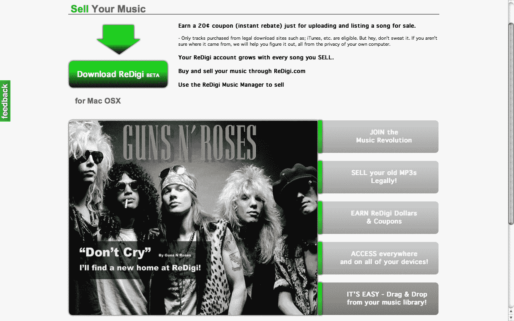

# 如果你可以合法转售你的数字音乐会怎么样？雷迪吉可能已经找到了解决办法。TechCrunch

> 原文：<https://web.archive.org/web/https://techcrunch.com/2011/10/14/what-if-you-could-legally-resell-your-digital-music-redigi-may-have-found-the-solution/>

这里有一条有趣的消息，肯定会重新点燃关于数字时代消费者权利的辩论:波士顿一家名为 [ReDigi](https://web.archive.org/web/20230203064727/https://www.redigi.com/home.html) 的初创公司本周推出了一个电子市场，允许用户转售他们的数字音乐，也可以低价购买新的和二手的歌曲。(后一项功能将在未来几周内启用。)

尽管数字内容二级转售市场的想法听起来毫无疑问很有吸引力，但考虑到音乐在网络上销售和分销的混乱(和诉讼)历史，这里存在许多棘手的法律问题。也就是说，随着音乐、电影、软件等数字发行的增加，对于所谓的[“首次销售原则”](https://web.archive.org/web/20230203064727/http://en.wikipedia.org/wiki/First-sale_doctrine)是否适用于数字交易，出现了过多的法律混乱。

基本上，在首次销售原则下，一旦拥有权利的人，比如说，一张 CD 出售了该作品的拷贝，所有者就放弃了对该单个拷贝的控制。一旦该拷贝到了新用户手中，他们就拥有了它，可以随心所欲地使用它，包括转售、出借或赠送。

然而，[一些人声称](https://web.archive.org/web/20230203064727/http://www.ca9.uscourts.gov/datastore/opinions/2010/09/10/09-35969.pdf)首次销售原则不适用于数字下载，例如，当数字财产已经被*许可*给购买者，而不是明确出售。在 Vernor 诉 Autodesk 一案中，软件公司起诉 Timothy Vernor(一家在线软件经销商)在易贝转售其软件，称根据使用条款，该软件已授权给他使用，而非出售；因此，他们声称他不拥有该软件的权利，不能合法转售他们的产品。

2008 年，华盛顿地区法院支持 Vernor，裁定该软件事实上已经售出，维护了 Vernor 的转售权。然而，该决定随后于 2010 年 9 月被美国第九巡回上诉法院推翻。随后在今年 10 月 4 日，最高法院决定拒绝审理此案，允许上诉法院的判决有效——这一决定显然会对 ReDigi、消费者等网站产生重大(负面)影响。

显然，在我们不断发展的数字世界中，首次销售原则有着相互冲突的先例，这些所有权和转售权的问题往往会陷入灰色地带和法律泥潭，往往导致那些试图创建合法二级转售市场的公司崩溃。

当然， [ReDigi 对这里的背景并不天真，它声称已经对波士顿、纽约和洛杉矶的许多律师事务所进行了尽职调查](https://web.archive.org/web/20230203064727/http://www.facebook.com/note.php?note_id=142848555779255)，事实上已经创建了一个既保护消费者权利又符合现行法律并支持音乐行业愿望的市场。尽管实现后者肯定类似于从帽子里变出一只兔子。

ReDigi 希望通过设计一个不是关于文件共享的市场，而是一种“促进双方合法转让音乐”的方法，在别人失败的地方取得成功。实际上，这里的关键是这家初创公司的技术能够实际验证一首曲目是否被寻求转售的人正确购买(或获得)，并管理卖家音乐库中发布的待售项目，以防止多个副本被拍卖。(这在实践中应该保护卖方免受版权侵犯。)

对 ReDigi 有利的另一个功能是，一旦数字交易完成，该曲目就会从卖家的音乐库以及任何与其音乐播放器同步的移动设备中删除。出售的歌曲拷贝由 ReDigi 持有，直到转让发生；一旦歌曲被购买，实际的曲目和许可证就被转让给新的所有者，于是卖家账户上的所有曲目拷贝都被删除。

由于 ReDigi 是一项完全免费的服务，没有订阅、安装、启动或升级费用，用户可以获得免费的私有云存储，以便他们可以随时随地购买(该功能即将推出)、出售或收听他们的音乐，这无疑对消费者有很大的吸引力。另外，ReDigi 已经有超过 1100 万首歌曲的目录。

毕竟，我们中有多少人积累了多年的 MP3 和数字歌曲，却不再听了？我知道，就我而言，我有几 GB 的音乐，我很乐意转售，当 ReDigi 从我的播放器和设备上删除这些歌曲时，我不会眨一下眼睛。

这可能就是为什么 ReDigi 能够在发布前吸引 12 万名社交网络粉丝，并正在完成一轮来自众多天使投资者的 150 万美元融资。

另一方面，这家初创公司声称，用户将能够“以 iTunes 上目前可用价格的一小部分”从经销商那里购买二手数字音乐，这肯定会让苹果、音乐唱片公司和版权所有者感到惊讶。

ReDigi 当然有很多优势，因为转售音乐的过程相当简单。你所要做的就是下载免费的“ReDigi 音乐管理器”,从他们的音乐库(iTunes，Windows Media Player 等)中拖拽歌曲进行转售。)，并将它们放到桌面上的 ReDigi 图标上。利用适当的验证引擎来确定销售者实际上是真实的许可证持有者，并且能够从销售者的设备中删除售出的拷贝，这可以有助于缓解音乐行业的担忧。

但是，再一次，人们注意到“执照持有人”的使用，由于法律的模糊观点，如果当权者决定打电话给他们的律师，仍然可能使 ReDigi 处于危险之中。

虽然 ReDigi 的投资者——以及过去几年一直致力于这一解决方案的团队——显然对这个问题进行了长时间的认真思考，设计了这个市场来解决音乐行业的法律问题(以及向艺术家和唱片公司支付销售和转售收入的相当大一部分)，但如果我们在未来的某个时候没有听到 ReDigi 的名字以及“诉讼”这个词，那将是令人惊讶的。

更多信息，请点击这里查看 ReDigi 主页，并请告诉我们您的想法。ReDigi 有机会改变数字内容的转售方式吗——还是他们注定要陷入法律泥沼？