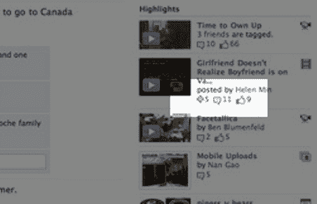

# 脸书的“外部世界”到底发生了什么？

> 原文：<https://web.archive.org/web/http://techcrunch.com/2009/08/26/what-is-going-on-in-facebooks-outside-world/>

# 脸书的“外部世界”到底发生了什么？

当我们今天早些时候写关于[脸书](https://web.archive.org/web/20230203104410/http://facebook.com/)的小[设计变更](https://web.archive.org/web/20230203104410/https://techcrunch.com/2009/08/26/facebook-tweaks-design-drops-rounded-corners/)时，我们没有仔细查看嵌入在附带的[博客文章](https://web.archive.org/web/20230203104410/http://www.facebook.com/note.php?note_id=143248897792&ref=mf)中的[截图](https://web.archive.org/web/20230203104410/http://www.facebook.com/photo.php?pid=2256206&op=1&view=all&subj=143248897792&aid=-1&auser=0&oid=143248897792&id=75877461389)该公司的设计团队发布了关于调整的内容。如果我们看到了，我们可能会也可能不会注意到他们有两个绝对值得再看一眼的金块，但肯定会引起注意。

他们看到了什么？

首先，脸书产品设计师 Alexandre Roche 的个人资料似乎为他的新闻订阅提供了一个额外的过滤器，标记为“外部世界”，并附有一个代表实验室烧杯的图标(可能是因为它涉及到一个实验功能)。

此外，FBhive 在罗氏个人资料页面的亮点部分发现了一个视频评论和类似数字旁边的新“加号”图标和数字。

这需要猜测！

FB hive——假设它不是第三方应用程序——认为“外部世界”是一个过滤器，可以显示你在脸书订阅的其他网站和应用程序的内容。这将把社交网络扩展成一个巨大的基于网络的 RSS 阅读器，可以与脸书提供的分享功能无缝集成。对我们来说是有意义的，我们可以想象如果这是真的，将会在网络世界掀起波澜。如果它能重见天日的话。

在我看来，FBhive 发现的第二件事更有趣。据以脸书为中心的博客报道，在一个突出显示的视频(由脸书员工[海伦·敏](https://web.archive.org/web/20230203104410/http://www.facebook.com/helenmin)上传)的评论和点赞数量旁边出现的(+)符号看起来像是用于[脸书学分](https://web.archive.org/web/20230203104410/http://www.facebook.com/help.php?page=837)的图标(自己查看[这里](https://web.archive.org/web/20230203104410/http://www.facebook.com/help.php))。社交网络的成员可以用它们在脸书的[礼品店](https://web.archive.org/web/20230203104410/http://www.facebook.com/giftshop.php)、[购买虚拟礼物，给其他用户](https://web.archive.org/web/20230203104410/https://techcrunch.com/2009/04/03/facebooks-newest-funding-source-you/)积分，或者与特定数量的第三方应用程序如 GroupCard 和 SocialCalendar 互动。

当然，除非它根本不是一个加号，而且我们看它的方式不对(Erick 说它看起来更像一颗钻石)。问题是它代表了什么，可能是分享或转发的数量，或者是书签内容的快捷方式？

如果它实际上是信用图标，那么问题是为什么这种虚拟货币在未来可能会被用户分配给视频和其他多媒体内容。FBhive 认为，这可能是出版商、业余爱好者和专业人士等通过微支付直接从观众和粉丝那里获得小费来将上传到社交网络服务的材料货币化的一种方式。同样，这是一个看似合理的解释，而且考虑到脸书备受期待的支付平台(目前正在测试，这是一个令人兴奋的解释。

介意再推测一下吗？

更新:脸书回复我们了。积分是脸书自 4 月份以来一直在测试的一项功能，而“外部世界”是脸书员工的一项功能，允许他们过滤掉其他脸书员工的信息流，只看到他们非脸书朋友的信息流。