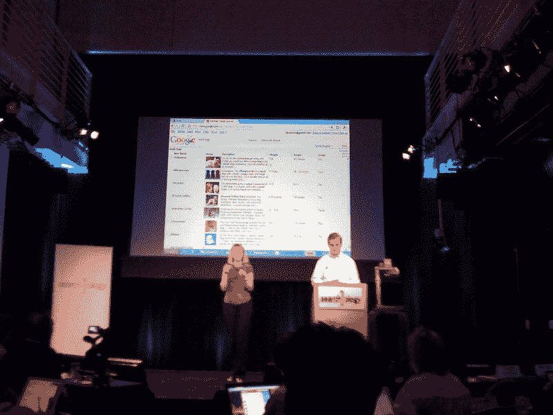

# Google Squared 是什么？这就是谷歌如何击败 Wolfram Alpha(独家视频)

> 原文：<https://web.archive.org/web/https://techcrunch.com/2009/05/12/what-is-google-squared-it-is-how-google-will-crush-wolfram-alpha-exclusive-video/>

搜索的下一个前沿领域之一是获取所有杂乱无章地散布在网络上的非结构化数据，并将其视为一个良好的结构化数据库。从数据库中得到答案更容易，因为数据库中的所有东西都被整齐地贴上标签、打上戳记并进行分类。随着网上信息数量的持续增长，关键词搜索越来越接近它的临界点。向网络添加结构是理解所有这些数据的一种方式，谷歌正在通过一个名为 Google Squared 的谷歌实验室项目开始解决这个问题，Marissa Mayer 今天早些时候在公司的 Searchology 简报会上提到了这个项目。

Google Squared 从网页中提取数据，并在搜索结果中以在线电子表格中的方块形式呈现出来。迈克尔出席了活动，并获得了个人演示(见下面的视频)。摘自迈克尔的[搜索笔记](https://web.archive.org/web/20230204181209/https://techcrunch.com/2009/05/12/live-from-google-searchology/):

> Google Squared 将于本月晚些时候在实验室推出。Google Squared 以电子表格格式返回搜索结果。它将网页上的非结构化数据结构化。所以搜索小狗会返回名字、描述、大小、体重、产地等结果。，以列和行的形式。
> 
> 谷歌在网上寻找隐含事实的数据结构，然后获取平方结果。“创造一个这样的正方形需要惊人的计算能力，”她说。

这种类型的技术对于许多类型的目标搜索有明显的应用，包括产品搜索、健康搜索、科学搜索等等。有几十家语义搜索初创公司试图在网络上强加结构来执行类似的把戏。另一家备受瞩目的搜索初创公司将于周一发布 [Wolfram Alpha](https://web.archive.org/web/20230204181209/http://www.wolframalpha.com/index.html) ，它采取了一种略有不同的方式，只是将大量信息吸收到自己的数据库中，在那里它可以随心所欲地进行查询。谷歌和 Wolfram 之间已经有了一点竞争，因为获取结构化结果是搜索的一个主要新方向。

Wolfram 在解析自己数据库中的信息方面做得很好，但这些数据库永远无法与网络上的信息相匹配。Wolfram 的数据库目前只能存储 10tb 的信息，这是网络上信息的一小部分。(我将很快发布我对 Wolfram 搜索引擎的印象)。Google Squared 是一个早期的尝试，它将网络上的杂乱数据放入简单的表格中。它仍然是非常实验性的，并不总是在目标上，但你可以看到它的发展方向。将网络变成一个巨大的数据库将粉碎任何将“最好的”信息分离到一个单独的数据库中的企图，这样它可以被更深入地处理和搜索。

在下面的视频演示中，搜索“相机”会在不同的列中按图像、描述、制造商、分辨率等对结果进行排序..您可以通过单击特定的列(如制造商)来细化结果。搜索“过山车”会根据名称、图片、描述、高度、长度和翻转次数对结果进行排序。但有时会混淆。搜索“宇宙飞船”会发现一艘轻巡洋舰和一艘导弹运输船。这将是一段时间之前，使它走出谷歌实验室

【YouTube http://www.youtube.com/watch?v=t2onuEXThPs&hl=en&fs=1]

