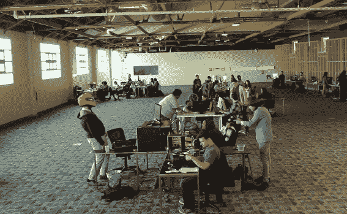
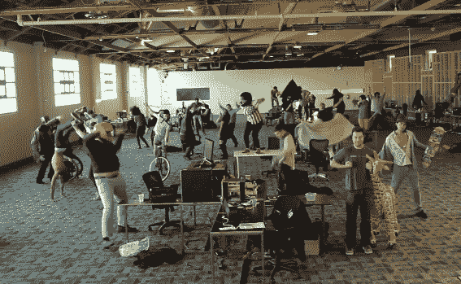
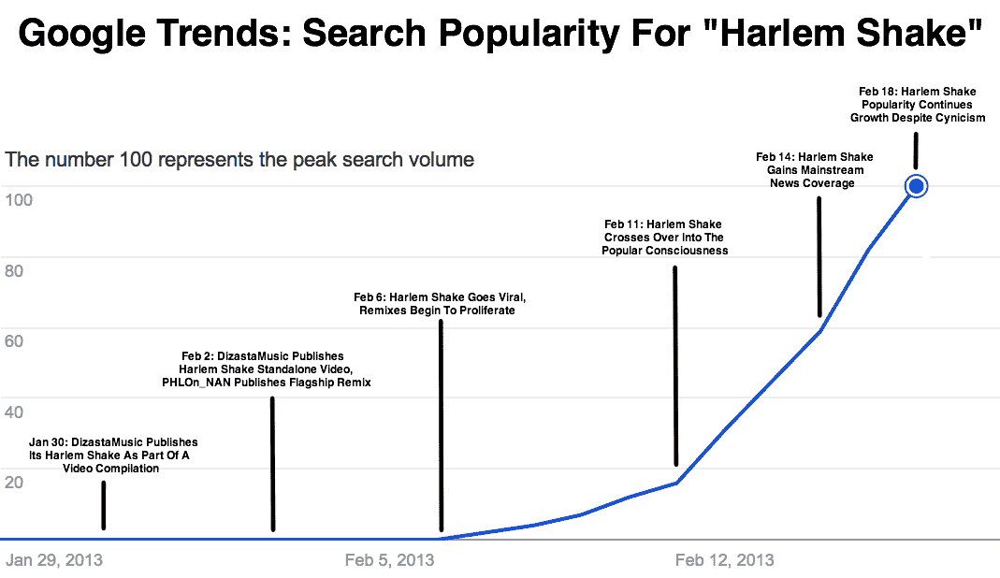

# 哈莱姆摇摆舞如此受欢迎背后的科学

> 原文：<https://web.archive.org/web/https://techcrunch.com/2013/02/18/what-is-the-harlem-shake-so-popular/>

五分钟的视频？没人有时间做那件事。不是看一个，也不是做一个。但是[哈莱姆摇摆舞](https://web.archive.org/web/20221202000133/http://knowyourmeme.com/memes/harlem-shake)的视频被限制在 30 秒。这就是为什么我们如此愿意多看一个化身，以及为什么很容易招募朋友来制作它们。结果是历史上最普遍的笑话之一。作为一种“共生迷因”，哈莱姆摇摆舞给所有内容创作者上了一课。
给人一个公式，他们会代入自己的变量。大多数人并没有那么有创造力。他们不会自己想出一些有趣的迷因。不过，有了一点结构，我们的大脑就会填补空白。

分解一下，哈莱姆摇摆舞迷因是:

[14T x(A1+V1)]= >δ= >[14T x(A2+V2)]= >[2T x(A3+V3)]

或者

[14 秒钟的(累积音乐)播放为(一个人被动地跳舞，而其他人在他们周围徘徊不动)]然后一个即时视频切换到[14 秒钟的(夸张的舞曲)播放为(许多人积极地跳舞)]然后[2 秒钟的(含糊不清的声音)和(积极跳舞的慢动作视频)]

或者以[《哈林摇 v3(办公版)》](https://web.archive.org/web/20221202000133/http://www.youtube.com/watch?v=0IJoKuTlvuM)为例:

[14 秒的(鲍尔的“哈莱姆摇摆舞”)播放(一个戴着头盔的人点头示意，其他人坐在桌子前或在电脑上工作)]然后一个即时视频切换到[14 秒的(鲍尔的“哈莱姆摇摆舞”高潮部分)】播放(人们打拳击、做手倒立、骑自行车、打填充长颈鹿)

任何人都可以把自己的变量代入这个方程，实际上每个人都这么做了。这个公式很容易复制，只需要很少的视频制作技巧，而且让人们站在周围，然后总共跳 30 秒钟，这并不是很难。在某个地方放一个摄像机，拍摄第一部分，让每个人都兴奋起来，拍摄第二部分，把它们剪辑在一起，加上慢动作效果。

最终产品非常可口。当你看到有人在脸书或推特上分享哈莱姆奶昔，点击链接的风险很小。最坏的情况是，你燃烧了 30 秒。最好的情况是，你得到一个惊喜和笑声。没有人愿意坐着看几分钟回报不确定的自制内容。这是 Twitter 的 6 秒视频分享应用 [Vine](https://web.archive.org/web/20221202000133/https://beta.techcrunch.com/2013/01/24/twitters-video-sharing-app-vine-goes-live-in-the-app-store/) 在无上限视频分享应用失败的地方取得成功的部分原因。

那么为什么这是一个“共生迷因”呢？这是我五年前写斯坦福大学网络社会学硕士毕业论文时创造的一个术语。当内容创作者提供一个带有充满变量的方程的迷因时，人们会重新混合这些变量，并将产品分享到自己的网络中。观众开始好奇原始内容是什么。这使得流量回到了迷因的原始版本或旗舰版本。

这就是为什么哈林 Shake meme 的原始 [DizastaMusic](https://web.archive.org/web/20221202000133/http://www.youtube.com/watch?v=8vJiSSAMNWw) 独立版本(从 diza stata[汇编](https://web.archive.org/web/20221202000133/http://www.youtube.com/watch?v=GeO3yCpLt0Q)中分解出来)有超过 1000 万的浏览量，而旗舰版本 [PHLOn NAN](https://web.archive.org/web/20221202000133/http://www.youtube.com/watch?v=W52rnrwG9p0) 将该公式具体化，有超过 800 万的浏览量。世界各地涌现的所有版本的哈莱姆摇摆舞迷因都建立在这些基础上，反过来增加了它们的受欢迎程度。这是一种共生关系。

内容创作者，尤其是“病毒式营销者”，在可能的情况下，会很好地围绕一个可重新组合的公式来构建他们的产品。给我们一本涂色书，我们会给你一些漂亮的图片和更多的关注。