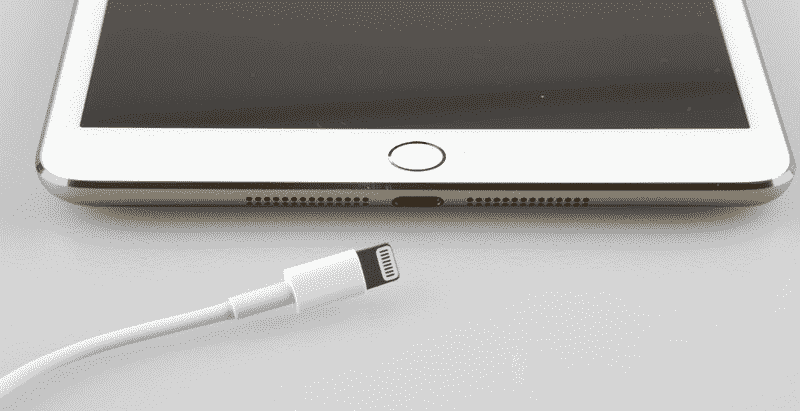

# 苹果 10 月 22 日的 iPad 和 Mac 发布会上有什么值得期待的

> 原文：<https://web.archive.org/web/https://techcrunch.com/2013/10/16/what-to-expect-at-apples-october-22-ipad-and-mac-event/>

从 press 收到的邀请函来看，苹果很可能会在下周二，10 月 22 日[的旧金山发布几个不同的公告。我们将会在现场告诉你到底会公布什么，但是现在，我们会像其他人一样根据现有的信息做出预测。以下是我们预计下周可能会看到的内容，以及我们看到它的可能性有多大。](https://web.archive.org/web/20221208185337/https://beta.techcrunch.com/2013/10/15/apple-ipad-mac-event-oct-22/)

## 新 iPads

 首先是苹果的新平板电脑，几乎可以肯定的是，我们将在下周看到它们。iPad 系列上次更新大约是在去年的这个时候，人们对 iPad mini 有很多期待，许多人预计它可能会更新到高分辨率的 Retina-syle 显示屏。

最新的传言表明， iPad mini 确实将获得 Retina 升级，像素密度增加一倍(事实上，由于屏幕更小，这将使它比 Retina iPad 第四代更清晰)。为了弥补这一点，据报道，小型 [iPad 将增加一些重量](https://web.archive.org/web/20221208185337/http://www.thefullsignal.com/apple/apple-ipad-mini-2/15927/ipad-mini-2-specs-could-include-bigger-battery):根据最新消息，大约 0.3 毫米。这将是第三代 iPad 在获得 Retina 功能时必须比 iPad 2 增加的额外重量的大约一半，在这两种情况下，任何增加的原因都是为了在外壳中塞进更大的电池。

新的 iPad minis 可能不会只有 Retina 版，我们已经听说 [Retina 版将会在发布会和明年极度缺货](https://web.archive.org/web/20221208185337/http://venturebeat.com/2013/10/02/apples-rumored-retina-ipad-mini-could-be-in-short-supply-this-year/)。无论如何，我仍然预计高密度显示屏 iPad mini 将于下周首次亮相，可能带有像 iPhone 5s 上那样的指纹传感器。

据报道，全尺寸 iPad 也在寻求升级。与前代产品相比，这款产品[实际上可能会减轻重量和腰围，因为它的外观更像 iPad mini(边框更窄)。泄露的照片声称显示了所有新 iPads 的太空灰甚至金色版本，而且，指纹传感器也是高端 9.7 英寸版本的一种可能。](https://web.archive.org/web/20221208185337/http://www.techradar.com/news/mobile-computing/tablets/youtube-video-claims-to-offer-first-look-at-narrower-ipad-5-1178067)

新款 iPads 可能会保留其前代产品的价格，并在发布会后一周左右开始销售，预购可能会在下周五开始。

## 新款 MacBook Pros

MacBook Pro 是时候升级了，这些笔记本的 Retina 版本应该也要升级了。围绕这些新机型正在讨论的关键功能是[英特尔的 Haswell 一代处理器](https://web.archive.org/web/20221208185337/http://www.latinospost.com/articles/29836/20131016/macbook-pro-retina-haswell-release-date-oct-22-reveal-24.htm)，它在今年早些时候被添加到 MacBook Air 中。Haswell 在功耗方面提供了相当大的好处，这应该有助于我们看到的任何新的 MacBook Pros 将其电池寿命延长到 10-12 小时。

大多数报告都同意，当这些 MacBook Pros 获得更新时，我们不会看到非 Retina 版本也得到更新；取而代之的是，这些将继续提供，但苹果有可能会逐步淘汰它们，最终支持更高分辨率的版本。如果是这样的话，我们可能会看到基本级别的 Retina Pros 进一步降价，我还预计显卡会有所改进，全高清网络摄像头和 802.11ac Wi-Fi 支持，这些都是基于最近更新的 iMacs 和 MacBook Airs 的新增功能。

这些也几乎是一个鞋在，甚至可能会立即上市销售后不久，他们宣布。

## 新款 Mac Pro

苹果的新 Mac Pro 已经不是秘密了，因为早在 6 月份的全球开发者大会上，苹果就做出了不同寻常的举动，在发布前[宣布了这一消息。但取代老化的铝制型号的专业级台式 OS X 电脑仍未收到官方发布日期或价格。](https://web.archive.org/web/20221208185337/https://beta.techcrunch.com/2013/06/10/apple-finally-updates-the-mac-pro/)

重新设计的 Mac Pro 与它所取代的机器几乎没有相似之处:一个光滑的黑色圆柱体，占据了旧版本的 1/4 的空间，是所有剩下的东西。但这个小盒子掩盖了令人印象深刻的规格，因为苹果已经推出了能够支持多个 4K 显示器的双工作站 GPU，一个多达 12 个内核的英特尔至强 E5 处理器，更快的 RAM 和更多内存。这一切都是围绕一个只有一个风扇的散热中心进行设计的，重点是通过 Thunderbolt 2、USB 3、以太网和 HDMI 进行外部扩展，而不是像旧款那样进行内部定制。

苹果只说它将在“秋季”发货，同时还透露它将在美国制造。根据最新报道，我们听说它可能在 11 月开始销售。目前还没有关于价格的消息，但预计它会很贵，因为这肯定是针对那些有专业级需求的人的。

## OS X 小牛队

苹果公司的最新操作系统即将上市，最近在预发布开发者版本中获得了通用汽车的地位。我们还听说苹果已经要求开发者开始为 Mavericks 提交应用。预计它将在新的 Retina MacBook Pros 到来时及时发货，如果不是在此之前，一如既往地，期待苹果为最近刚刚购买新 Mac 的人提供免费升级优惠，包括更新的 iMac。

OS X 更新的价格从 OS X 狮子的 29.99 美元下降到 OS X Mountain Lion 的 19.99 美元，所以我们可能会看到另一次下降，但雪豹和狮子保留了相同的定价，所以苹果可以轻松保持 20 美元的费用，因为它已经很低了。

## 苹果电视

有传言称苹果电视将会更新，但传言称这将是苹果目前提供的流媒体盒子的一个进化变化，而不是已经讨论了很久的神话般的苹果电视。除了通常的处理器升级之外，没有任何消息表明具体会需要什么，但我们自己的撰稿人 [MG Siegler 表示，本月某个时候苹果电视产品线的更新硬件将有理由令人兴奋](https://web.archive.org/web/20221208185337/http://appleinsider.com/articles/13/09/11/apple-rumored-to-release-new-apple-tv-product-in-coming-weeks)。

一如既往，期待至少一些惊喜，下周加入我们，我们将现场直播。

