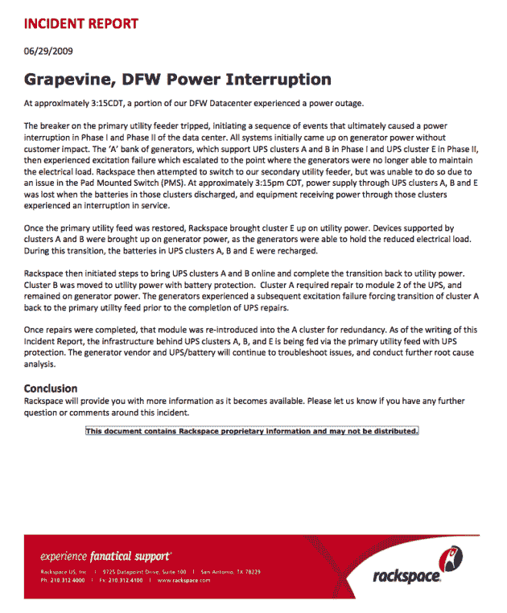

# 昨天 Rackspace 发生了什么？停电和一些备用故障。

> 原文：<https://web.archive.org/web/https://techcrunch.com/2009/06/30/what-went-down-at-rackspace-yesterday-a-power-outage-and-some-backup-failures/>

# 昨天 Rackspace 发生了什么？停电和一些备用故障。

正如你们许多人所知，许多使用 [Rackspace](https://web.archive.org/web/20221219143204/http://rackspace.com/) 作为主机提供商的网站昨天宕机了大约一个小时。那是因为 [Rackspace 的](https://web.archive.org/web/20221219143204/http://www.beta.techcrunch.com/2009/06/29/yes-rackspace-is-down-and-so-are-many-of-your-favorite-sites/)停机了。显然，这是一个数据中心停电造成的，我们得到的事故报告解释说。

虽然 Rackspace 有备份系统，但一系列事件显然导致这些备份失败，导致服务器停机。这是关键的金块:

> 主公共设施馈线上的断路器跳闸，引发一系列事件，最终导致数据中心一期和二期电力中断。所有系统最初都由发电机供电，对客户没有影响。“A”组发电机在第一阶段支持 UPS A 和 B 组，在第二阶段支持 UPS E 组，随后发生励磁故障，并升级到发电机不再能够维持电力负荷的程度。Rackspace 随后试图切换到我们的辅助公用事业馈线，但由于 Pad Mounted Switch (PMS)中的一个问题，无法这样做。CDT 时间下午 3:15 左右，当 UPS、B 和 E 集群中的电池放电时，这些集群的电源中断，通过这些集群接收电源的设备出现服务中断。

该服务表示，其九个数据中心中只有一个受到此次故障的影响，但许多备受瞩目的网站因此而崩溃，包括 EventBrite、贾斯汀·汀布莱克的网站和米歇尔·马尔金受欢迎的政治博客。正如 Rackspace [昨天指出的那样](https://web.archive.org/web/20221219143204/https://twitter.com/Rackspace/status/2397525176)“我们欠得更多，也将兑现。”

以下是完整的事故报告。

