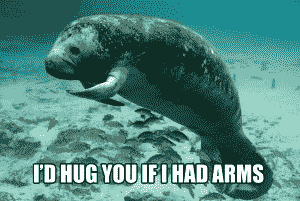

# 脸书完美的 IPO 风暴会留下什么？TechCrunch

> 原文：<https://web.archive.org/web/https://techcrunch.com/2012/05/29/what-will-facebooks-perfect-storm-of-an-ipo-leave-behind/>

脸书 IPO 本应是硅谷的辉煌时刻。这是第一波消费互联网公司之后的十年复苏的终结。这是下一个伟大的硅谷公司的首次亮相舞会，这个公司最有潜力持续一代人或更长时间。

相反，这变成了一场公关灾难。然而，如果我们更仔细地观察一下，脸书 IPO 对后期私募市场的其他部分的破坏性后果，可能比它对公司本身的影响更大。

**后期市场可能不得不重新定价:**脸书是最新一家与二级市场交易相比表现不佳的大型消费互联网 IPO。在二级市场交易的最后几周，我们看到股票以 40 美元和 44 美元的价格易手[。尽管这些二级市场的交易量并不高，但脸书是最活跃的，它有多年的定价历史。](https://web.archive.org/web/20221208111056/http://www.insidefacebook.com/2012/02/08/facebook-shares-climb-10-in-private-auction-to-103b-valuation/)

 当时的想法是，这些价格可能接近公开市场价格。很难判断散户投资者的兴趣有多高。这些二级市场可能有助于说服摩根士丹利和脸书将区间从最初的 28 至 35 美元(T4)提高到 34 至 38 美元(T6)的更高区间。

但实际上，后期估值有点错误。Zynga 和 Groupon 的情况类似。像 T. Rowe Price 这样的投资者在 2011 年 2 月参与了 Zynga 的 C 轮融资，以每股 14.03 美元的价格购买了股票。他们现在的价格是 [$6.61](https://web.archive.org/web/20221208111056/https://www.google.com/finance?client=ob&q=NASDAQ:ZNGA) 。(哭丧着脸。)

二级市场买家只需在投资上市前公司时稍微谨慎一点，如果他们不是长期投资的话。赚钱还是有可能的。只是公开市场不会盲目地达到 2 倍或 3 倍的后期估值。一年半前给了 Groupon 大约 10 亿美元的投资者现在仍然盈利。如果算上股票分割，他们支付的价格是现在的每股 7.90 美元。现在股价是 12.05 美元(T2)。脸书的上一轮大融资也比一年前上涨了约 80%，当时高盛以 500 亿美元的估值进入脸书。

上周在纽约举行的 TechCrunch Disrupt 上，联合广场风险投资公司的弗雷德·威尔逊说:“华尔街将根据你的增长率和现金流来评估你的业务。一旦上市，你将不得不面对一个不同类型的投资者。”

他补充道，“IPO 市场又回来了。但人们必须认识到，公司在公开市场上的价值不会像在后期市场上一样。后期市场给出的估值高于公开市场，因此这意味着后期市场将不得不稳定下来。”

因此，投资者需要对他们认为公开市场最终将如何评估他们的后期交易持更加保守的态度。[Evernote 10 亿美元？](https://web.archive.org/web/20221208111056/https://beta.techcrunch.com/2012/05/03/evernote-70-million/)[Dropbox 40 亿美元？](https://web.archive.org/web/20221208111056/https://beta.techcrunch.com/2011/08/30/index-leads-4-billion-valuation-round-in-dropbox/)[40 亿美元的 Spotify？](https://web.archive.org/web/20221208111056/http://dealbook.nytimes.com/2012/05/17/spotify-is-raising-millions-in-a-deal-that-would-value-it-at-4-billion/)这些公司只有在当前的运营率和增长轨迹支持它们的情况下，才能以这些估值上市。

如果脸书有另一个“冷静点”,它就能克服这一点。呼吸。”时刻:

如果我们在争论这是一次“好”的首次公开募股还是一次“糟糕”的首次公开募股，这真的取决于你站在谁的角度。

如果你着眼于脸书的长期前景，这次 IPO 一点也不差。他们筹集了 160 亿美元，其中约 70 亿美元直接进入公司，其余的给了早期股东。尽管在过去十年最大的交易中，脸书的首次公开募股有着最差的五天开局，但该公司正在淘汰更多的短期投机者，为长期持有股票的信徒留下空间。

*还要记住:惹恼了别人，然后道歉并重复你的方式来摆脱它是脸书的经典行为。*脸书通常在一年前做一件让人们非常生气的事情。然后他们修理它。这是他们的工作。也从来不是真的故意的。对此的委婉说法是，“动作要快。破事。”他们不能处理这种情况的唯一原因是因为平静期，但一旦他们出去了，他们会有一个策略。

 如果我们在看摩根士丹利，那就复杂了(哈)。他们已经向硅谷的上市前候选人证明，他们将袖手旁观他们的客户，支持价格，并采取一些负面宣传。如果我是一家考虑上市的公司，摩根士丹利似乎愿意为脸书吃土，这可能相当有吸引力。但另一方面，如果我是一个散户投资者，我会对他们未来给市场带来的技术产品持更加怀疑的态度。

接下来的几个季度将会很艰难。脸书必须证明它拥有的不仅仅是展示广告

虽然一些分析家[已经降低了第二季度的估计](https://web.archive.org/web/20221208111056/http://www.businessinsider.com/facebook-estimates-guidance-2012-5)，我也听说第三季度预计也会疲软。

[克里斯·狄克逊说得好。](https://web.archive.org/web/20221208111056/http://cdixon.org/2012/05/15/facebooks-business-model/)旨在产生意图的广告价值较低，因为它离购买点更远。几年来，脸书的理论一直认为，在网络上产生需求的广告数量大约是漏斗底部广告数量的 10 倍(例如谷歌的搜索广告)。他们认为这一销量弥补了较低的点击成本。

但是广告收入的季度环比下降表明脸书需要更多的支撑。[支付业务的季度环比收入增长持平](https://web.archive.org/web/20221208111056/https://beta.techcrunch.com/2012/04/24/a-closer-look-facebooks-operating-margins-decline-with-growing-headcount-international-growth/)也表明游戏垂直市场已经成熟[脸书将不得不很快将支付业务扩展到其他领域](https://web.archive.org/web/20221208111056/https://beta.techcrunch.com/2012/04/24/facebook-revenue-share-apps/)。

该公司将不得不依靠其他商业模式。[Karma 收购可能为整个网站与生日相关的真正礼物服务奠定基础](https://web.archive.org/web/20221208111056/https://beta.techcrunch.com/2012/05/18/facebook-acquires-karma/)。如果脸书 9.01 亿用户中有一个位数的比例开始通过网站或移动应用程序一年多次为朋友购买生日礼物，这不是一个微不足道的收入流。

他们也可以推出一个网络展示广告网络，如果你愿意的话，可以称之为广告杀手。但不清楚这将增加多少额外收入，因为脸书已经在整个网络展示印象中占据了相当大的份额。

尽管移动广告业务现在很艰难，但脸书实际上比竞争对手的移动广告网络有明显的竞争优势。如果苹果很快完全移除 UDID，将会损害其他人的定位能力。但由于脸书知道谁是它的用户，并且多年来记录了他们的品味和偏好，这对他们来说不是什么大问题。他们可以为所有应用推出移动显示广告网络。再说一次，移动显示广告是一个艰难的行业，不会给任何人带来那么多收入(即使是谷歌和苹果)，但如果脸书足够努力，它可以领先。

**但请记住，脸书是一家为长期发展而建立的公司:**尽管现在很吵，但脸书是上一代硅谷初创公司中的一家，它拥有足够多的未开发机会，并且有足够的使命驱动力，能够在未来几年吸引最优秀的人才。据《财富》杂志报道，苹果首席执行官蒂姆·库克甚至说脸书是“最接近”苹果的公司[。](https://web.archive.org/web/20221208111056/http://tech.fortune.cnn.com/2012/05/24/apple-tim-cook-ceo/)

如果在 6 个月的禁售期之前，股价下跌太多，如果该公司采取措施让员工对自己的薪酬感到更放心(尤其是在猎头公司出来的时候)，我不会感到意外。这是一个只需要十年就能成为老年公司的行业(见雅虎)。脸书八岁。天赋就是一切。

从内部来看，脸书的员工似乎并没有过多关注围绕 IPO 的媒体纠纷。有趣的是[因为导致 IPO 的黑客马拉松](https://web.archive.org/web/20221208111056/https://beta.techcrunch.com/2012/05/16/sleepover-time-all-night-hackathon-precedes-ipo-at-facebook-headquarters/)实际上有双重目的。这不仅仅是为了庆祝和维护脸书的文化。一位消息人士告诉我，这是为了让员工太累，以至于他们无法关注第二天早上的股票波动。确实是个好建议。

*本帖中的图片来自[CalmingManatee.com](https://web.archive.org/web/20221208111056/http://calmingmanatee.com/)，因为有什么比海牛更让人平静？*