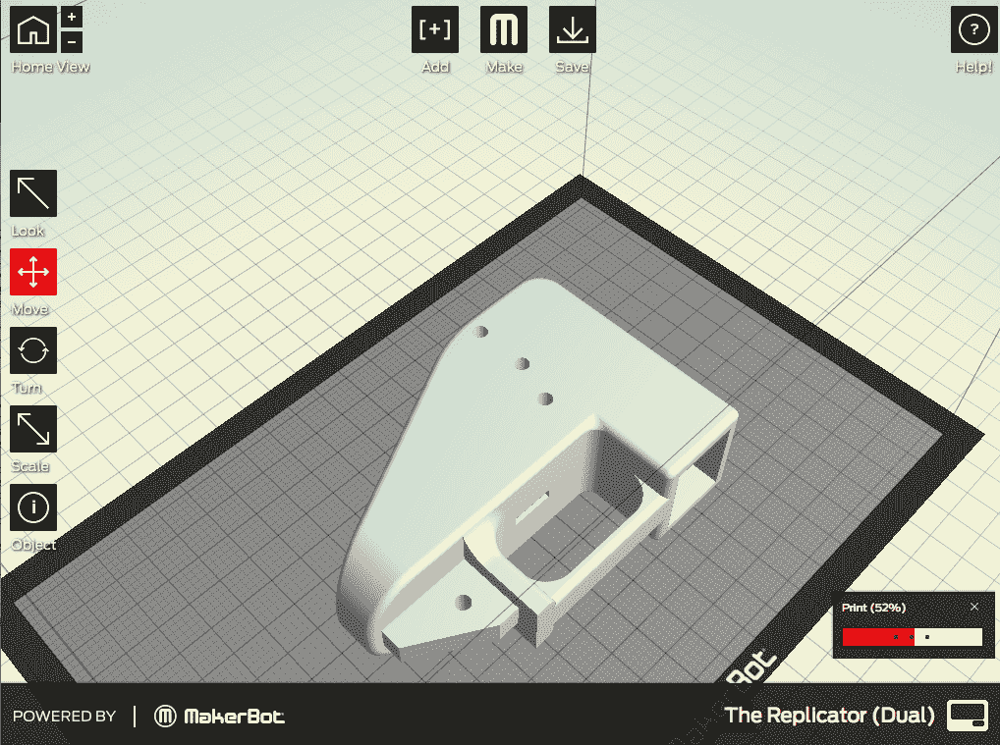

# 关于解放者 3D 打印手枪，你需要知道什么

> 原文：<https://web.archive.org/web/https://techcrunch.com/2013/05/06/what-you-need-to-know-about-the-liberator-3d-printed-pistol/>

【YouTube = https://www . YouTube . com/watch？v=drPz6n6UXQY]

既然我们已经确认了[解放者](https://web.archive.org/web/20230407002401/https://techcrunch.com/2013/05/03/defense-distributed-claims-to-have-produced-the-first-fully-3d-printable-pistol/) 3D 打印手枪可以在不破坏身体的情况下发射，那么让我们来解决这对于 3D 打印武器以及一般的自制武器意味着什么。

**手枪有用吗？**是的，它至少可以发射一次，不会对枪身或扣扳机的人造成伤害。[福布斯](https://web.archive.org/web/20230407002401/http://www.forbes.com/sites/andygreenberg/2013/05/05/meet-the-liberator-test-firing-the-worlds-first-fully-3d-printed-gun/)的安迪·格林伯格多次看到枪开火，上面的视频显示了其中一枪。

是真的手枪吗？不，与其说这是手枪，不如说这是一把拉链枪。拉链枪是由管子、橡皮筋和钉子制成的简易武器。当孩子们用管子和橡胶制作压缩枪时，他们被承诺会有一秒钟的令人毛骨悚然和可能致命的兴奋，这些孩子足够勇敢，可以开枪射击(这群人中包括我自己的父亲，他向我展示了如何制作它们)。要发射一颗，你把子弹装进管子里，然后拉起绑在橡皮筋上的钉子。如果子弹击中充电器，子弹就会发射。类似的事情正在这里发生:一个弹簧加载的钉子击中一个弹药筒。

枪管有螺纹，但我不认为这种武器会很准。把这把枪想象成可控爆炸发生器。它使用非常小的 0.380 口径子弹，这是致命的，当然，但相当小。

我能打印一份吗？是的。你可以很容易地从[DEFCAD.org](https://web.archive.org/web/20230407002401/http://defcad.org/liberator/)(这里有一个种子[)下载 3D 打印文件，如果你有一台 3D 打印机，你可以很容易地打印这些部分。](https://web.archive.org/web/20230407002401/https://thepiratebay.sx/torrent/8466466/Liberator_-_First_3D_Printable_Gun)

创造者使用[strata sys Dimension SST 3D](https://web.archive.org/web/20230407002401/http://www.stratasys.com/3d-printers/design-series/performance/dimension-1200es)打印机制造了这把枪，这是一种高分辨率打印机，工作原理类似于 Makerbot，但打印效果更好，更耐用。这台打印机的层厚为. 25 毫米，Makerbot[可以轻松匹配。](https://web.archive.org/web/20230407002401/https://techcrunch.com/tag/Makerbot)

我会用我的复制器打印和发射这个吗？不。我太厌恶风险了。我询问了多家 3D 家用打印机制造商，没有一家会对枪支发表具体评论，因此没有隐含或明确的安全承诺。

会有人尝试在家用设备上打印吗？是的。

**这合法吗？**是的，但我不是律师。这是一种合法的自制枪支，这些枪支在本世纪的大部分时间里都是在地下室作坊里制造的。在大多数情况下，开始制造或生产武器必须获得联邦枪支许可证。例如，任何制造这种枪的人都可能是“破坏性装置、破坏性装置弹药或穿甲弹药的制造商”任何人都可以申请这个许可证，从而使这个东西的制造合法。然而，几十年来，对许可证的需求是进入这一重要过程的一个小障碍。在你的地下室建造一把真枪所必需的工具和材料是昂贵的，合法地保护你的家庭作坊是有经济意义的。然而，3D 打印武器的制造是微不足道的，任何人都可以投资 8000 美元左右购买一台 Stratasys 打印机，或者投资 2000 美元左右购买一台家用 3D 打印机。

它的设计也符合 1988 年的《不可探测武器法案》,因为它含有一小块钢。根据打印说明:

如何合法组装 DD 解放者:
-侧边打印(仅)边框(最短尺寸为 Z 轴)。USC18 922(p)(2)(A)*:“就本小节(1988 年《无法检测的火器法》)而言，术语‘火器’不包括任何此类武器的框架或接收器；”
因此，即使没有 3.7 盎司的钢材，你也可以合法地只用塑料打印框架。-一旦框架完成，用环氧树脂将 1.19×1.19×0.99″的钢块固定在扳机护板前面的 1.2×1.2×1.0″的孔中。如果你不想让金属露出来，就在上面盖上底盖。-一旦环氧树脂起作用，钢材就不再可拆卸，而是框架的一个组成部分。现在你的枪有大约 6 盎司的钢，因此被认为是“可探测”的武器。所以现在你可以打印所有其他部分。

简而言之，制造枪支是合法的，这是一把枪。

**这能被阻止吗？**没有。

**下一步是什么？**愤世嫉俗者会说，我们很快就会看到第一起用 3D 打印的枪进行的谋杀。愤世嫉俗者还会说，这将使 3D 打印以一种全新的、更邪恶的方式出现，并可能极大地影响家庭打印行业。愤世嫉俗者还会期待大量混乱的立法机构将会产生，这取决于你在枪支辩论中支持哪一方，“让这些离开街道”或“侵犯我们的权利”

愤世嫉俗者还会说，整个国防分布式议程是一个最终弊大于利的例子。愤世嫉俗者还会说，政府的严厉镇压也同样愚蠢。

细致入微的方法是绝对必要的。

非愤世嫉俗的人会发现这更多的是一个概念的证明，而不是一个真正的人造武器，并说它最终一定会发生。3D 打印让制造业变得微不足道。这是一个根深蒂固的行业和百年产品的逻辑演变。枪械制造不是新爱好。然而，事情变得简单多了。