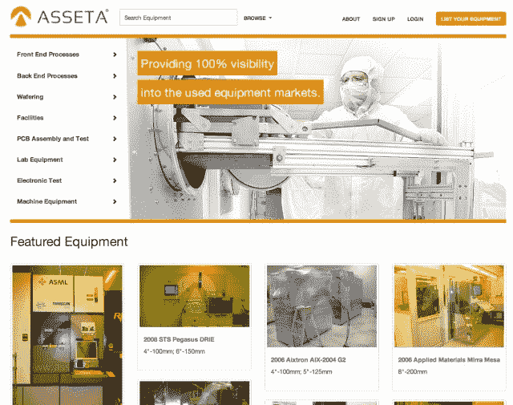
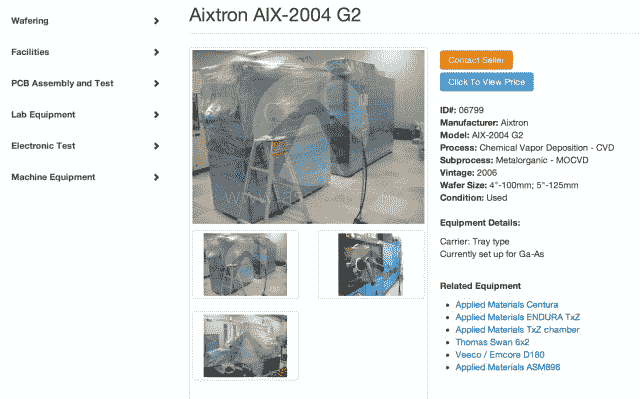

# 二手制造设备市场 Asseta 在 Y Combinator 做什么？嗯，赚钱 TechCrunch

> 原文：<https://web.archive.org/web/https://techcrunch.com/2013/08/02/whats-asseta-a-marketplace-for-used-manufacturing-equipment-doing-in-y-combinator-um-making-money/>

谢谢你，Y Combinator，你不仅投资了一百万个照片分享应用。虽然你个人可能不会对一个可以买卖二手制造设备(主要是半导体设备)的在线市场感到兴奋，但一家名为 [Asseta](https://web.archive.org/web/20230214191903/http://www.asseta.com/) 的新创公司展示了将现在人们熟悉的透明买方和卖方市场概念带到一个新的垂直市场的潜力，这个市场尚未被网络的力量及其允许的一对一连接所扁平化。

就像许多传统企业一样，它们的旧经营方式也发生了类似的转变——任何地方都有一个可以被淘汰的中间商——Asseta 也在竞争对手分散的市场中占据一席之地。今天，有数以百计的二手设备经纪人雇用销售人员管理这些货物的销售，通常不让买家知道设备来自哪里，卖家是谁，也绝对不知道物品的真实价格。

Asseta 的创始人当然知道这是如何运作的，因为这四个人中有三个为该行业最大的经纪人之一工作，该公司在 60 亿美元(截至 2010 年)的二手半导体设备销售市场中占 1.6%。

首席执行官 Anton Brevde 解释说，没有任何特定事件促使他和其他创始人，包括他的前经纪同事 Jonathan Pease 和 Garrett Beck，或 CTO Danial Afzal，离开目前的工作，建立 Asseta。“只是看看(我们以前的)公司赚了多少钱，流程和公司的运营效率有多低，这没有任何意义，”Brevde 说。“我们意识到这里有更大的机会……我们都很年轻，了解技术的潜力。我们认为我们可以做得更好。”

今天的网站充斥着普通人不太了解的商品，但该网站在某种程度上也很熟悉，它的图像很重(几乎类似于 Pinterest ),按类别导航，就像你在任何市场网站或电子商务商店中找到的一样。

然而，尽管看起来只是一个“X 的易贝”，Brevde 说，要使像 Asseta 这样的市场为企业服务，还需要做更多的工作。他指出，事实上，易贝迄今未能解决企业需求，其重点是对消费者友好。这就是为什么，除了实现买方和卖方之间的沟通，该公司现在正在努力向网站添加其他组件，如批准，合同，最后是支付。(如今，它离线处理这些事情。)

为了使用该网站，潜在的设备买家可以搜索 Asseta 客户的现有 10，000 个实时列表，其中包括该公司通过之前的行业关系形成的十几个或一些初始合作伙伴。

每个列表上都提供了产品信息(如品牌、型号、年份)，最重要的是包括价格。当买家准备购买时，他们只需通过系统联系卖家，然后 Asseta 就会参与进来，帮助促进销售，并处理付款、装运和履行事宜。佣金通常是 5%到 10%，低于行业平均 50%的标准。买家也可以注册他们想要但 Asseta 还没有的设备的通知。

同时，卖家可以单独上传列表或导入电子表格。阿塞塔在这里处理了很多繁重的工作，包括去现场和拍照。

现场的设备从几千美元到几百万美元不等，如前所述，目前主要是半导体设备。但该公司现在开始列出印刷电路板组装、光学、LED 和太阳能等领域的其他设备，这些设备都有自己相当大的市场。

Brevde 说，由于技术上的重叠，其他行业自然会来到这个网站，然后 Asseta 将能够把它们转换成上传他们出售的设备。虽然他拒绝提供自今年 6 月推出在线市场以来他们处理的交易数量或确切的美元金额(此前，他们一直在线下测试该模式)，但他会说 Asseta 已经完成了“六位数的销售额”，自市场推出以来一直盈利。除了 YC 和 YC 的风险投资基金，这家公司是白手起家的。

如上所述，Y Combinator 对 Asseta 的支持有些不同寻常——二手制造设备通常不是孵化器所追求的行业。Brevde 承认，在当前的 YC 课堂上，他们有点“与众不同”。“我们一直在努力让人们更容易理解我们在做什么，因为一开始有很多茫然的眼神，”他说。

然而，该团队决定加入 YC，因为他们之前从未做过创业，而 Asseta 是关于在一个行业中从一种商业模式到另一种商业模式的重大转变。“感觉就像我们从零开始，”Brevde 说。"得到雅虎邮箱和 Gmail 创始人的指导真的很有帮助."

Y Combinator 合伙人 Garry Tan 同意 Asseta 处于“一个不寻常和不性感的空间”，这也是 YC 第一次对二手设备进行此类投资。

“但这个团队是由领域专家组成的——这些人对这个行业了如指掌，这就是我们资助他们的原因，”Tan 说。"软件正在蚕食每一个市场，不管是性感的还是不性感的."