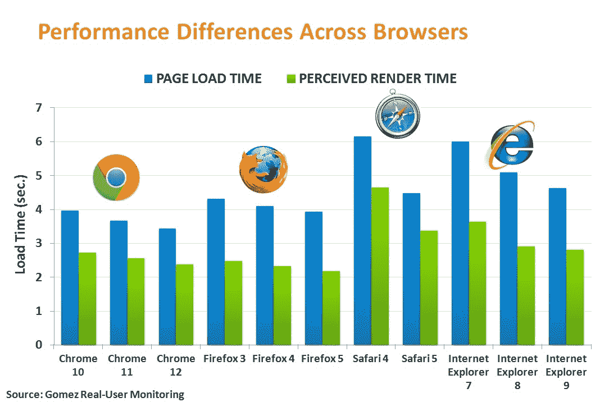

# “现实世界”中最快的网络浏览器是什么？Chrome。

> 原文：<https://web.archive.org/web/http://techcrunch.com/2011/08/08/whats-the-fastest-web-browser-in-the-real-world-chrome/>

# “现实世界”中最快的网络浏览器是什么？Chrome。

Compuware 的基准部门 Gomez 刚刚发布了一个网站测量项目的新数据，该项目的目标是确定在桌面用户的“真实世界”中最快的网络浏览器是什么。该项目只测量了用户在宽带连接上的加载时间。

这些数据是在一个月的时间框架内收集的，收集了 200 多个网站上 18.6 亿次个人测量的结果。测试的结果？毫不奇怪，赢家是谷歌浏览器。

在下面的图表中，你可以看到谷歌浏览器的最新版本~~Chrome 12 的页面加载时间(蓝色)最低(3.433 秒)。*更新:Chrome 13 是最新发布的版本，截至上周。*~~

高端的是苹果的 Safari 4 (6.149 秒)和 IE 7 (6.006 秒)，这两个版本都不是当前版本。

第二个指标，感知渲染时间(绿色)，是指页面的可见部分加载到浏览器中所花费的时间。同样，Chrome 在这里做得很好(2.374 秒)，但在这种情况下，Firefox 5 做得更好(2.18 秒)。

需要澄清的是，Gomez 并没有在实验室环境中测试浏览器的速度能力，它测量的是真实世界的性能——也就是说，测量的是人们*实际上*如何体验网络浏览器的性能。传统上，希望在部署后测试其 web 应用程序的企业会使用这些数据。

作为一名谷歌 Chrome 用户，这些发现支持了我对 Chrome 性能的看法——那东西太快了！不过，这也让我觉得火狐 5 可能值得再看一眼。

Compuware 说，这份报告的更多数据将在晚些时候公布。