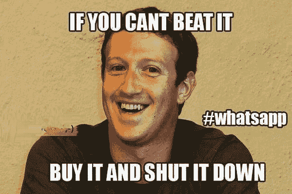
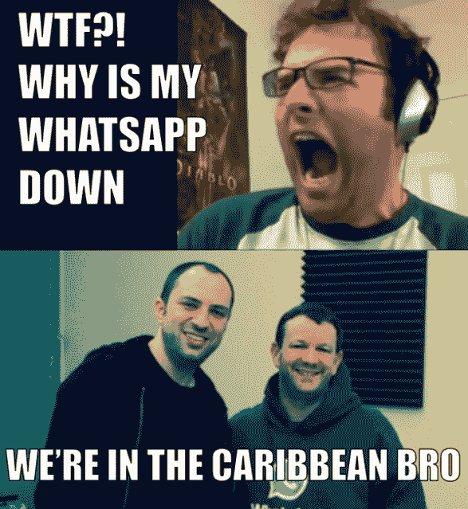

# WhatsApp 宕机，确认服务器问题[更新:宕机 210 分钟后恢复] | TechCrunch

> 原文：<https://web.archive.org/web/https://techcrunch.com/2014/02/22/whatsapp-is-down-facebooks-new-acquisition-confirms/>

更新:从太平洋时间今天上午 11 点到下午 2:30，WhatsApp 经历了大约 210 分钟的中断。世界各地的用户报告说他们无法发送消息，WhatsApp 在太平洋标准时间下午 12:16 分确认了这些问题，并在推特上声明“抱歉，我们目前遇到了服务器问题。我们希望能够尽快恢复。”

https://twitter.com/wa_status/status/437319926605680640

WhatsApp [在大约 150 到 210 分钟的停机时间后，于太平洋标准时间下午 2 点 30 分再次为部分用户启动](https://web.archive.org/web/20230307152618/https://twitter.com/avonsunshine_/status/437351187818758145/photo/1) [到](https://web.archive.org/web/20230307152618/https://twitter.com/Rashan_Marie/status/437351732872740864) [工作](https://web.archive.org/web/20230307152618/https://twitter.com/tsholo_tt/status/437351727726350336)。一些用户报告说，当 WhatsApp 第一次上线时，“最后一次看到”的标记从他们的对话中消失了，但现在有人说它们又出现了。

太平洋标准时间下午 2 点 48 分，WhatsApp 用这条推文证实了它的恢复

[https://twitter.com/wa_status/status/437319926605680640](https://web.archive.org/web/20230307152618/https://twitter.com/wa_status/status/437319926605680640)

大约在同一时间，WhatsApp 首席执行官简·库姆显然通过电子邮件告诉《华尔街日报》“我们的服务器出现了故障，现在应该没事了。”

WhatsApp 用户[涌向 Twitter](https://web.archive.org/web/20230307152618/https://twitter.com/search?q=whatsapp%20down&src=typd) 询问“WhatsApp 宕机了吗？”。他们遇到了开着玩笑的[迷因](https://web.archive.org/web/20230307152618/https://twitter.com/Whatleydude/status/437319406066991104),脸书正在关闭 WhatsApp，它的创始人去度假了，在服务器机房有一个[聚会，或者](https://web.archive.org/web/20230307152618/https://twitter.com/darth/status/437346792284250112/photo/1)[扎克本人](https://web.archive.org/web/20230307152618/https://twitter.com/SirJadeja/status/437349494191951872/photo/1)正在干预这个应用

WhatsApp 服务器机房

事实上，更有可能的是，脸书周三宣布的 190 亿美元收购 WhatsApp 的交易导致注册和使用量激增，使其服务器超载。我们已经联系了脸书，正在等待回复。

当用户(包括我在内)试图发送消息或查看他们现有的聊天对话时，WhatsApp 卡住了，显示一个无穷无尽的加载星号和警告“正在连接…”

“WhatsDown”报道在太平洋标准时间上午 11 点左右开始泛滥，但昨晚也出现了一些问题。我们收到了来自美国、印度、以色列和世界各地沮丧的用户的提示。如果收购获得监管机构的批准，此次中断可能会加剧人们对脸书会搞砸 WhatsApp 的担忧。

停机时间可能促使用户使用其他聊天应用，正如 Telegram 发推文所说:

避孕套品牌杜蕾斯(Durex)的肯尼亚分公司利用 WhatsApp 的问题进行了一些营销，这证明了这项服务在全球拥有 4.5 亿用户。

正如我周四所写的，被脸书的[收购可能会给 WhatsApp 提供工程支持](https://web.archive.org/web/20230307152618/https://techcrunch.com/2014/02/20/just-like-it-boosted-instagram/)，使其能够应对未来的中断。但今天，成为历史上最大的风险投资支持的收购对这家通讯初创公司不利。

过去半年，WhatsApp 每一两个月都会遭遇短暂的宕机。对于快速增长的应用程序来说，这样的失误有点常见，而且用户不太可能永久地离开，因为它相对来说很快就被修复了。尽管如此，脸书还是以天文数字的价格收购了这家初创公司，部分原因是这是发展中国家许多人对互联网的初次体验。现在，他们对脸书旗下 WhatsApp 的第一次体验已经变质。

—

## 更多重大 WhatsApp 新闻

[脸书以 190 亿美元收购 WhatsApp】](https://web.archive.org/web/20230307152618/https://techcrunch.com/2014/02/19/facebook-buying-whatsapp-for-16b-in-cash-and-stock-plus-3b-in-rsus/)

[脸书为何收购 WhatsApp:国际影响力](https://web.archive.org/web/20230307152618/https://techcrunch.com/2014/02/19/facebook-whatsapp/)

[WhatsApp 不会开始显示广告](https://web.archive.org/web/20230307152618/https://techcrunch.com/2014/02/19/whatsapp-will-monetize-later/)

[2008 年，WhatsApp 创始人在脸书求职被拒，但笑到了最后](https://web.archive.org/web/20230307152618/https://techcrunch.com/2014/02/19/how-things-change/)

关于我们所有的脸书/WhatsApp 故事，请点击下方

## 