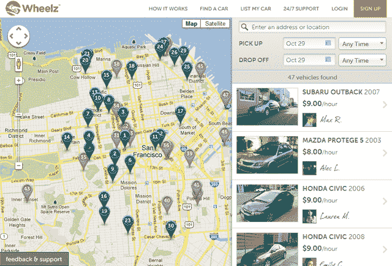

# 点对点汽车共享初创公司 Wheelz 在旧金山推出，与 RelayRides 和 Getaround 展开竞争 

> 原文：<https://web.archive.org/web/https://techcrunch.com/2012/10/30/wheelz-san-francisco-launch/>

点对点汽车共享越来越受欢迎，越来越被消费者接受，因为租车者现在不仅仅局限于 Enterprise 和 Avis 等传统租赁公司，甚至也不局限于 Zipcar 等公司的本地短期租赁。向普通人而不是单一公司租赁的想法终于流行起来。与此同时，车主们正在寻找从大部分时间闲置的昂贵资产中赚钱的方法。

RelayRides 和 Getaround 等汽车共享服务已经推出，以利用消费者行为的这一变化。现在旧金山市场又出现了另一个点对点汽车共享市场——Wheelz。

Wheelz 最初于 2011 年初推出，[专注于大学市场](https://web.archive.org/web/20221205155124/https://beta.techcrunch.com/2011/09/28/wheelz-automotive-veterans-launch-p2p-car-sharing-platform-backed-by-former-facebook-vp/)，在加州大学伯克利分校、斯坦福大学、南加州大学和其他大学校园铺开。在那里成功上市后，该公司现在准备向公众推广。至少对旧金山的公众来说是这样。

随着 Wheelz 在第一个城市市场的推出，它将与现有的点对点汽车共享服务 RelayRides 和 Getaround 展开竞争。但它试图通过在汽车上安装硬件来使自己与众不同，这将促进通过互联网和移动设备实际租车的过程。

你看，使用 Getaround 和 RelayRides 的一个大问题是，大多数时候，用户不仅要同意租赁时间和条款，还要交换相关车辆的钥匙。这在系统中造成了很大的摩擦，因为那些要租车的人和那些想租车的人必须同步他们的时间表，等等。我个人曾几次尝试使用 GetAround 和 RelayRides，但每次都因缺乏响应和安排会议花费的额外时间而受挫。

Wheelz 通过在用户的汽车上安装所谓的 DriveBox 来解决这个问题，一旦获得批准，租车者就可以立即获得租车服务。该系统的工作方式与 Zipcar 的硬件工作方式非常相似，用户可以使用 DriveCard 解锁车辆，然后开车离开，而无需设定与车主见面的时间。这消除了汽车共享市场目前存在的许多摩擦。对于车主来说，DriveBox 还允许车主通过 GPS 跟踪他们汽车的位置。

DriveBox 的额外便利意味着绝大多数租赁都是在短时间内完成的——在他们需要汽车的两个小时内。这在典型的 Zipcar 领域造成了阻碍，因为它使汽车共享比以前更加按需体验。这也意味着用户更有可能回来，因为大约三分之二的用户是重复租房者。与此同时，车主通过这项服务平均每月可赚 250 美元，最高可达 1000 美元。

当然，Wheelz 并不是唯一一个试图让租赁体验更加按需的公司。Getaround 和 RelayRides 都在试图做同样的事情:今年早些时候，RelayRides [宣布与通用](https://web.archive.org/web/20221205155124/https://beta.techcrunch.com/2012/07/16/relayrides-teams-up-with-onstar-makes-car-sharing-easier-for-millions-of-gm-owners/)合作，允许安装了 OnStar 的车主让他们的汽车更容易接近。 [Getaround 也推出了其服务](https://web.archive.org/web/20221205155124/https://beta.techcrunch.com/2012/08/02/getaround-raises-13-9m-series-a-led-by-menlo-ventures-launches-getaway-for-managed-car-rentals/)的点播版本，名为“逃逸”,它在汽车中安装硬件，并为车主管理即时租赁。

今年早些时候，Wheelz 宣布已经从 Zipcar 和底特律交通技术投资专家 Fontinalis Partners 获得了 1370 万美元的战略投资。这家初创公司的其他投资者包括前脸书副总裁 Chamath Palihaptiya、Felicis Ventures、Red Swan Ventures 以及天使投资人，如前安永&副董事长 Jim Freer 和 Playfish 创始人 Sebastien de Halleux。