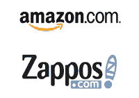
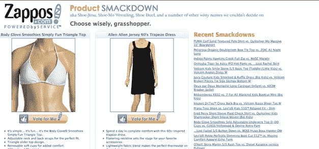

# 当亚马逊收购 Zappos 时，Clothes.com 也加入了进来 

> 原文：<https://web.archive.org/web/https://techcrunch.com/2009/08/07/when-amazon-bought-zappos-clothescom-also-came-in-the-box/>

# 当亚马逊收购 Zappos 时，Clothes.com 也加入了进来

当亚马逊 7 月份以 9 . 28 亿美元收购 Zappos(T2)时，它得到了一个额外的东西:Clothes.com(T4)域名。原来，Zappos 去年以 490 万美元的价格从 Idealab 手中买下了这个域名。

细节隐藏在亚马逊提交给美国证券交易委员会的关于收购 Zappos 的文件中:

> 2008 年 5 月，我们从 Idealab 收购了 Clothes.com 互联网域名。域名被确认为购买的无形资产，使用寿命为 20 年。490 万美元的全部购买价格被指定为域名无形资产的价格，并将在其剩余的估计使用寿命内以直线法摊销。

那句话里的“我们”就是 Zappos(现在的亚马逊)。以 490 万美元的价格，Clothes.com 的交易将成为 2008 年继 Fund.com(1000 万美元)之后的第二大域名交易，也是今年迄今为止继 Toys.com(510 万美元)之后的第二大域名交易。

Clothes.com 的网址会转到 Zappos 的登陆页面，上面有一个服装产品的广告。Zappos 主要以在线鞋类零售商闻名，但也销售服装。然而，如此大的投资表明，Zappos 可能已经计划更积极地向服装领域扩张，也许是在 Clothes.com 的领域下。

(感谢读者乔治·基里科斯的提示)。

