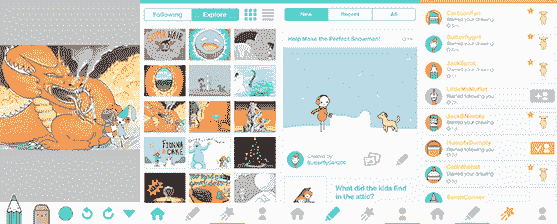
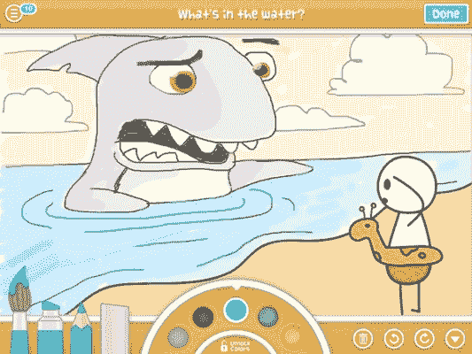

# 有牵引力但没有现金，4chan 创始人杀死了画布/DrawQuest | TechCrunch

> 原文：<https://web.archive.org/web/https://techcrunch.com/2014/01/21/when-goods-not-good-enough/>

“有很多对创业公司和创始人的赞美。人们把失败掩盖起来，但这是你能做的最糟糕的事情。“你必须直面它，”莫特又名克里斯托弗·普尔说。因此，今天晚些时候，他将宣布关闭，而不是为他的混音艺术家社区 [Canvas](https://web.archive.org/web/20230405011643/https://canv.as/) 和游戏 [DrawQuest](https://web.archive.org/web/20230405011643/http://drawquest.com/) 筹集更多资金。“没有软着陆，没有招聘，只是‘关闭’关闭。”

【更新:】DrawQuest 和 [Canvas](https://web.archive.org/web/20230405011643/http://blog.canv.as/post/74083065642/all-good-things-must-come-to-an-end) 现在已经发布博文证实了这篇文章，并告诉他们的用户发生了什么。穆特也为他的创业公司写了自己的颂词，并希望在未来写更多，以教育其他企业家。

在他的回顾中，有一个感人的部分，穆特开门见山地说:“在商界，很少有人知道作为一名风险投资支持的首席执行官，失败意味着什么。你不仅辜负了你的员工、客户和你自己，也辜负了你的投资者——帮助你实现想法的合作伙伴。”]

这次死亡之旅的不同之处在于 DrawQuest 实际上做得相对不错。[一年前推出的](https://web.archive.org/web/20230405011643/https://techcrunch.com/2013/02/08/moots-new-ipad-app-drawquest-challenges-users-to-create-and-share-drawings/)旨在通过绘画挑战激发人们每天的创造力，它已达到 140 万次下载，55 万注册用户，40 万月用户，2.5 万日用户和 800 万幅绘画。

“我们比 98%的产品都做得好，尤其是在移动领域。”moot 说，但他承认，牵引是“害羞的所有重要的百万(月用户)。我们失败的地方基本上只有一个:破解我们的增长引擎。但重要的是，我们从未能够及时解决业务方面的问题。”

也许如果 DrawQuest 一直是计划中的，它可以存活足够长的时间来发展和赚钱，但它是一个短期的导火索。最初，[在 2010 年 5 月筹集了由 Lerer Ventures 牵头的 62.5 万美元种子资金](https://web.archive.org/web/20230405011643/https://techcrunch.com/2010/05/14/4chan-founder-moot-raises-625k-for-stealth-startup-canvas-networks/)，以启动 DrawQuest 的前身 [Canvas，这是一个以媒体为中心的论坛](https://web.archive.org/web/20230405011643/https://techcrunch.com/2011/01/31/4chan-founder-unleases-canvas-networks/)，人们可以在这里发布、重新混合和讨论视觉互联网艺术。然后，[在 2011 年 6 月](https://web.archive.org/web/20230405011643/https://techcrunch.com/2011/06/13/union-square-ventures-leads-3m-round-in-4chan-founder-moots-new-startup-canvas/)又筹集了 300 万美元，由[联合广场风险投资公司](https://web.archive.org/web/20230405011643/http://www.crunchbase.com/financial-organization/union-square-ventures) [Fred Wilson](https://web.archive.org/web/20230405011643/http://www.crunchbase.com/person/fred-wilson) 牵头，并有 [SV Angel](https://web.archive.org/web/20230405011643/http://www.crunchbase.com/financial-organization/sv-angel) 参与

直到 2013 年 2 月，DrawQuest 才推出，这一缓慢的转变让 moot 远远落后于他需要的水平。“我们在跑道剩余不到一半的情况下开发了这款应用。你必须用一半的时间做两倍的事。这真的很难。”对于种子期公司来说，这可能更容易，但证明你值得 B 轮融资的估值需要难以置信的指标，如果你在游戏后期有 audible，这很难达到。“人们轻视旋转，但这确实是孤注一掷，很少有人能做到这一点。”

DrawQuest 获得了一些牵引力，但发现在绘图应用程序中销售画笔比在 Candy Crush 中销售额外的生命要难得多。只是没有“如果我不付钱，我就不能玩”这种情绪上的紧迫感。“我对游戏设计师有了新的认识，”穆特告诉我。

由于 Canvas/DrawQuest 的员工数量导致了严重的成本，moot 开始寻找收购他的初创公司的人。“我们接触了几家公司，但没有人购买我们销售的产品。(我们)从未试图用我们的一笔算法赢得任何奖项，所以从知识产权的角度来看，(没什么可买的)。有趣的是社区，但并不清楚这个社区到底能为他们的业务带来什么。”

自 2003 年运营“互联网西部荒野”图片分享网站 4chan 后，穆特实际上期待着不再是第一任掌门人。“我认为我们做得很好，作为一个更大组织的一部分，我们可以继续做得很好。我已经为此做好了心理准备，但是后来……”没有达成任何交易。

“最终，我们决定不再尝试筹集更多的资金——因为我们还没有创造足够的价值，所以这还不在讨论范围内。”穆特说。这是成功剧院初创公司中罕见的对失败的承认。大多数创始人吹嘘他们的融资回合和成长里程碑，但当事情变得不可收拾时就溜走了。普尔谦逊和透明的意愿令人钦佩，这可能会增加投资者支持他未来项目的意愿。

因此，今天他将宣布 Canvas 将在未来几天内关闭，用户将收到一封电子邮件，其中包含下载他们所有内容的链接。

至于 DrawQuest，moot 说“我会尽可能长时间保持服务器运行。截至今天，该公司的所有员工都将分道扬镳……但我希望，在应用内购买和银行存款之间，我们能够让这项服务存活更久一点。我们认为，在我们完全没有钱之前支付 AWS 账单是有意义的，这有望在几个月内完成。”也许更长的时间，也许是“某个白衣骑士进来说‘我想分担服务器成本’”

在 DrawQuest 的告别帖子中，moot 写道:“我们希望你们都继续传播日常创造力的重要性，并激励你周围的人更经常地画画。虽然 DrawQuest 可能明年就不在了，但你们都会在，我们希望你们能给这个世界留下一个更好、更有创造力的地方。”

至于他自己呢？:

> “四年多来，我第一次成为自由人，因为当我辍学创办这家公司时，我还在上大学。我绝对不会试图在短期内创办另一家公司。我需要减压，重新思考我所学到的东西，给自己一些时间，因为这有点像情绪失控。你开始欣赏为什么最好的投资者就是最好的投资者。在我们生命的最后一个小时，每个人都非常支持我们。当你失败的时候，我是一个情绪崩溃的人，还是一个在情绪上尽可能好的人，这两者之间有着天壤之别。
> 
> 大多数公司都会失败，不幸的是我们也是其中之一。这就是几率。"