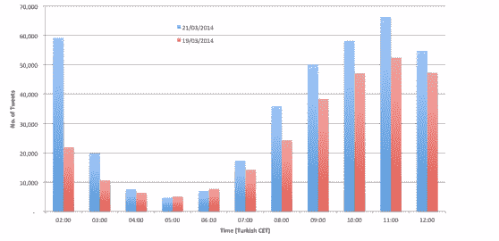

# 当创业和革命碰撞时

> 原文：<https://web.archive.org/web/https://techcrunch.com/2014/03/23/when-startups-and-revolutions-collide/>

在过去的两个月里，硅谷的小型创业公司已经证明了他们有能力颠覆半个地球之外的独裁者精心制定的计划。

[就在本周](https://web.archive.org/web/20230320210704/https://techcrunch.com/2014/03/21/twitter-says-it-is-standing-by-its-users-in-turkey-hopes-to-have-access-returned-soon/)，土耳其总理雷杰普·塔伊普·埃尔多安在禁止推特上的失败令人震惊，因为当地公民利用科技工具找到了简单的变通办法，避开了数万条嘲讽无能审查者的推特。

“我认为，初创企业可以履行曾经只属于政府的职能，但在涉足外交事务之前，它们最好接受尽可能多的教育，”国务卿希拉里·克林顿(Hilary Clinton)的前高级顾问亚历克·罗斯(Alec Ross)在给我的信中写道。

国务院不再是穿着睡衣的黑客和中东持不同政见者之间的唯一桥梁。任何有互联网连接的人都可以涉入革命的危险外交水域，这曾经是政府的专利。这种不受监管的新力量既有希望，也有危险。

**土耳其的适得其反**

在土耳其，反审查[技术迄今为止为笨拙的政府审查者提供了一个安全且简单得几乎令人尴尬的](https://web.archive.org/web/20230320210704/https://techcrunch.com/2014/03/21/twitter-says-it-is-standing-by-its-users-in-turkey-hopes-to-have-access-returned-soon/)变通方法。在法院批准禁止微博服务托管反政府内容后，埃尔多安公然威胁要“消灭”推特。

几乎就在禁令实施后，变通方法的信息就像病毒一样传播开来。Twitter 宣布了一项基于短信的锻炼计划:

[推特 https://twitter.com/policy/statuses/446775722120458241]

市民通过谷歌的替代路由系统(DNS)喷涂鸦指令颠覆审查者:

[tweet https://Twitter . com/FindikKahve/status/446961277739749376]

将流量秘密输送到东道国以外的服务器(虚拟专用网)的软件的移动应用下载量激增。最受欢迎的是 Anchorfree 的 Hotspot Shield，根据该公司提供的统计数据，12 小时内下载量从 1 万增加到 27 万(下面是土耳其应用商店的截图):

  

据卫报报道，[摆脱了政府审查的束缚，土耳其用户以每分钟大约 17K 条推文的速度涌入推特，打破了一项新的记录。下面](https://web.archive.org/web/20230320210704/http://www.theguardian.com/world/2014/mar/21/turkey-twitter-users-flout-ban-erdogan)[是 Brandwatch 提供的禁令前后推文数量的图表](https://web.archive.org/web/20230320210704/http://venturebeat.com/2014/03/21/turkeys-twitter-ban-backfires-tweets-up-138-vpn-usage-up-topic-trends/)。

然后，嘲笑的努力扫平服务开始了:

[推特 https://twitter.com/ekara571/statuses/446952025931395072]

[推文 https://Twitter . com/serdaroncode/status/432172959579389953]

“这是埃尔多安试图控制一个无法控制的空间，”罗斯向我解释道。

到目前为止，反审查技术是安全有效的，但这种情况可能不会持续很久，而且肯定不是对所有国家都适用。

**任务和注意事项**

像许多创业乐观主义者一样，Anchorfree 致力于改变世界。“AnchorFree 是一家使命驱动的公司，其使命是为地球上的每一个人提供获取世界信息的安全途径，”创始人大卫·戈尔德扬斯基(David Gorodyansky)在给我的信中写道。

但是，让人们访问互联网会鼓励无意中的冒险行为。“我鼓励土耳其的 Twitter 用户小心他们如何访问 Twitter，即使访问恢复了。叙利亚也在革命前恢复了 Twitter 访问，并利用它来识别抗议者，”Development Seed 首席执行官、前国务院官员伊恩·舒勒写道。事实上，在去年夏天的抗议活动中，土耳其当局[逮捕了](https://web.archive.org/web/20230320210704/https://techcrunch.com/2013/06/05/social-media-is-worst-menace-to-society-says-turkey-pm-25-twitter-users-arrested/) 25 名持不同政见者，罪名是使用 Twitter。

避开政府审查传统上一直是一场猫捉老鼠的游戏，被选中的活动人士愿意反击；密码学家很少设计出像《愤怒的小鸟》一样在全国范围内使用的软件。

活动人士的首选解决方案是不太用户友好的开源应用，比如 TOR，一套免费的匿名浏览工具。我们采访的许多专家只信任非商业软件。谈到 Anchorfree，[人权技术集团](https://web.archive.org/web/20230320210704/http://www.fastcompany.com/1746235/how-benetech-slays-monsters-megabytes-and-math) Benetech 的 Enrique Piracés 给我写道，“他们的解决方案似乎既方便又划算，而且他们的一些功能非常聪明，但是除非能够访问源代码，否则很难认为它是安全或值得信赖的解决方案。”

换句话说，商业产品可能会为了可用性而牺牲安全性。加密从来就不是一键操作的过程。tor 项目的执行董事 Andrew Lewman 告诉我，“免费和开源软件至少给了人们审查、改进和审计应用程序所基于的代码的能力。”

Anchorfree 的顾问罗斯表示，他认为该公司在安全方面已经做了尽职调查，商业产品有着重要的作用。“我理解对开源的偏见，但在什么能最好地帮助持不同政见者的问题上，人们不应该采取宗教观点。”

事实上，似乎在最激烈的时刻，公民-转-持不同政见者只是抓住任何可用的东西。我们采访的一名委内瑞拉活动人士描述了他在去年 2 月的抗议活动中如何接触到反审查技术。

“在这种情况下，应用程序的选择并不取决于品牌(因为有几个应用程序提供几乎相同的服务)…这只是一个抓住一个 VPN 应用程序以避免政府封锁的问题！一切开始的时候(2 月 12 日)我才知道这个应用。在那之前…我只是不知道 VPN 应用程序。我刚刚安装了它，它运行得非常好！”

结果是，在这些情况下，大多数用户都是新手，并不完全了解风险。容易下载的软件对于满足草根抗议队伍来说是很棒的，但是它把安全的责任放在了创业公司身上。

**灾难和行动呼吁**

“如果一项技术不安全或者一个策略不健全，它可能会害死人，”Ross 警告说。

[草堆计划就是这样一条由良好意愿铺就的通往灾难的道路。2010 年，当一名出生于俄亥俄州的 26 岁黑客为伊朗持不同政见者开发反审查技术时，他从未想到这会在用户背后画上一个大大的红色目标。在发现严重的安全漏洞后，Haystack 立即被下架。“如果你有测试程序的副本，请不要使用它，”制造商警告用户。](https://web.archive.org/web/20230320210704/http://www.economist.com/node/17043440/)

在全国范围的大规模革命中，笨拙设计的工具并不能解决问题。持不同政见者会抓住他们能找到的任何东西，这通常也是他们和朋友去下载单词的地方。因此，对于创业公司来说，这是一个巨大的帮助机会，但这也意味着误差就像刀刃一样薄。

“我的建议是，初创企业的积极分子与政府官员进行磋商，不一定是为了获得批准，”罗斯说，“而是为了了解情况，这有助于为他们的战略提供信息。”