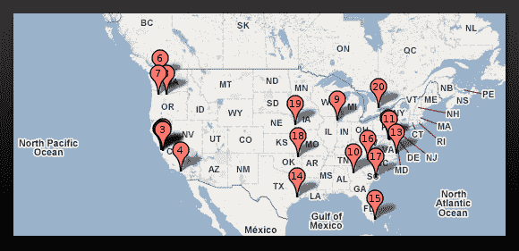
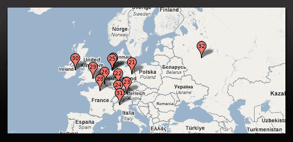
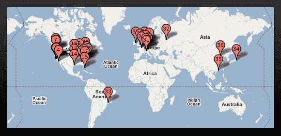

# 谷歌的数据中心都在哪里？

> 原文：<https://web.archive.org/web/https://techcrunch.com/2008/04/11/where-are-all-the-google-data-centers/>

# 谷歌的数据中心都在哪里？

谷歌的数据基础设施规模庞大，遍布全球。所有这些网页抓取、索引和搜索都需要巨大的计算能力，更不用说每个人都在使用 Gmail、Google Apps、Blogger、Google Reader 和谷歌总部的其他项目了。但是，所有这些数据中心在哪里，有多少个？谷歌其实没说。但这并不妨碍人们想办法弄清楚。 [Royal Pingdom](https://web.archive.org/web/20221209072818/http://royal.pingdom.com/?p=276) 共同发布了这张[地图](https://web.archive.org/web/20221209072818/http://www.wayfaring.com/maps/show/48030)显示了所有已知的谷歌数据中心，包括其租赁的和正在建设的空间。这些地图是基于数据中心知识部门编制的[列表](https://web.archive.org/web/20221209072818/http://www.datacenterknowledge.com/archives/2008/Mar/27/google_data_center_faq.html)。(而且，不对，Royal Pingdom 没有把这些放在谷歌地图上)。

总共有 36 个数据中心，19 个在美国，12 个在欧洲，3 个在亚洲，俄罗斯和南美各有一个。未来的数据中心站点可能包括台湾、马来西亚、立陶宛和南卡罗来纳州的布莱斯伍德，据报道，谷歌在那里购买了 466 英亩的土地。

有人知道微软、雅虎或 IBM 有多少数据中心吗？

【T9