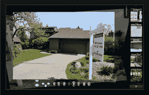

# 双喜临门:微软整合了 Photosynth 和虚拟地球

> 原文：<https://web.archive.org/web/https://techcrunch.com/2009/05/07/where-awesomeness-meets-microsoft-integrates-photosynth-with-virtual-earth/>

# 双喜临门:微软整合了 Photosynth 和虚拟地球

 [微软](https://web.archive.org/web/20230307225808/http://microsoft.com/)今天宣布将 [Photosynth](https://web.archive.org/web/20230307225808/http://photosynth.net/Default.aspx) 与其地图服务 [Virtual Earth](https://web.archive.org/web/20230307225808/http://www.microsoft.com/virtualearth/resources/news.aspx) 整合在一起，这项技术可以让你自动将多组照片拼接成一个大型互动 3D 观看体验。我认为这真的很酷，因为我是 Photosynth 的忠实粉丝，我也碰巧认为虚拟地球比谷歌地图/地球优越得多，但远不如谷歌地图/地球受欢迎。

在 YouTube 上发布的视频中(见下图)，微软声称“数十万”用户已经使用了 Photosynth——早在 2008 年 8 月[向公众](https://web.archive.org/web/20230307225808/http://www.crunchgear.com/2008/08/20/photosynth-its-here-its-awesome-and-now-its-yours/)发布——并在 35 万个 synth 上传了超过 1200 万张照片。

现在，它正在采取下一步措施，使用 Silverlight 技术，以使用户能够将他们的 Photosynths 移植到虚拟地球上，在 MAC 和 PC 上运行(当然，除非你拒绝在这些设备上运行 Silverlight)。它鼓吹这是旅游机构(原因显而易见)以及希望为他们的商店、经销店和办公室增加一个酷的视觉层的企业所必须的。它在虚拟地球产品网站上展示的例子[是一个房地产列表，synth 的结果一如既往地令人震惊。](https://web.archive.org/web/20230307225808/http://www.microsoft.com/virtualearth)

除了集成之外，微软还宣布，Photosynth 的最新版本引入了商业许可、隐私控制和一键高亮显示，以便观众轻松探索 synth。

同样值得注意的是，这一集成声明是在微软[开始在其 Live Maps 网络应用程序中包含指向托管的 photosynths 的超链接](https://web.archive.org/web/20230307225808/http://www.crunchgear.com/2008/11/06/live-maps-now-includes-photosynth-links/)几个月后发布的。

我真的可以看到世界各地有多少旅游机构和企业可以从展示我们星球的数字版本中受益，但我也看到了微软未来的挑战。毕竟，该公司不仅要说服这些组织，还要说服潜在的访问者在他们的电脑上安装和使用 Virtual Earth 和 Silverlight，并让人们知道类似 Photosynth 的东西是存在的。到目前为止，这些都是服务没有真正取得成功的例子，似乎离主流流行还很远。

不管怎样，我认为这种结合是强大而诱人的。你怎么想呢?

【YouTube http://www.youtube.com/watch?v = pgwwoaz 2 aiq & HL = en & fs = 1 & color 1 = 0x 234900 & color 2 = 0x 4 e9 e 00]