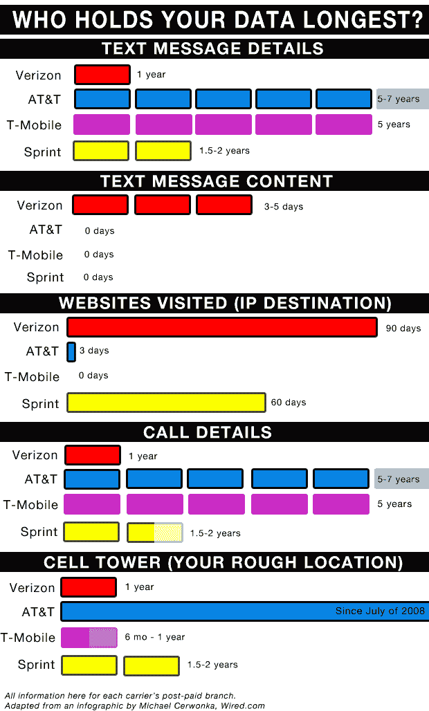

# 哪个无线运营商存储您的私人数据时间最长？

> 原文：<https://web.archive.org/web/https://techcrunch.com/2011/09/28/which-wireless-carrier-stores-your-private-data-the-longest/>

# 哪个无线运营商存储您的私人数据时间最长？

你的手机知道你的所有信息。它知道[你去了哪里](https://web.archive.org/web/20230205035030/https://techcrunch.com/2011/04/20/surprise-your-iphone-is-tracking-your-every-move/)，你访问了哪些网站，你给谁打了最多的电话，还有，取决于你发现自己喝醉了多少次，手机就在身边，你不穿裤子的样子。但是，你仍然可以感到欣慰的是，所有这些信息都可以被摧毁，只需要一块砖头和一点无节制的愤怒。

但是那些*没有*存在你手机里的东西呢？无线公式的另一半，运营商，也对你了如指掌。谁保存这些数据的时间最长？

根据 [Wired 的威胁等级](https://web.archive.org/web/20230205035030/http://www.wired.com/threatlevel/2011/09/cellular-customer-data/)获得的一份司法部文件(在美国公民自由联盟根据《信息自由法》获得该文件后)，没有任何明确的答案。每个运营商似乎至少在一个部门是最差的。

**最恶劣的罪犯:**

*   美国电话电报公司和 T-Mobile 掌握着你发短信时间最长的人的详细信息(但不是短信内容)
*   威瑞森似乎是唯一一个掌握你的文本内容的载体，至少是以任何可理解的方式
*   威瑞森似乎也是保存你在线活动时间最长的，Sprint 紧随其后
*   据报道，美国电话电报公司和 T-Mobile 至少可以保存你的通话记录长达五年
*   如果这份文件仍然是准确的(日期是 2010 年 8 月)，美国电话电报公司有追溯到 2008 年 7 月的手机信号塔使用数据(给出你在哪里的粗略估计)。

尽管我很想称赞任何一家运营商是隐私权的捍卫者，但这似乎是不可能的。他们都有这样或那样的糟糕之处。

这个故事的寓意是:无论是位置还是浏览数据，每个运营商都存储着对你不利的潜在证据。不要做你不想让窥探的目光在你的手机上看到的事情，因为这些数据可能在很长很长的时间内都不会出现在任何地方。