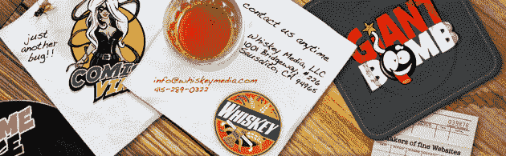

# 威士忌媒体筹集 250 万美元推出更多结构化内容网站 

> 原文：<https://web.archive.org/web/https://techcrunch.com/2009/12/31/whiskey-media-raises-2-5-million/>

# 威士忌媒体筹集 250 万美元推出更多结构化内容网站

Cnet 创始人[谢尔比·邦尼](https://web.archive.org/web/20221007150457/http://www.crunchbase.com/person/shelby-bonnie)和其他天使投资人又向威士忌媒体投资了[250 万美元，该媒体运营着小众媒体网站，如](https://web.archive.org/web/20221007150457/http://www.whiskeymedia.com/weve-raised-a-bit-of-money) [ComicVine](https://web.archive.org/web/20221007150457/http://www.comicvine.com/) (漫画) [GiantBomb](https://web.archive.org/web/20221007150457/http://www.giantbomb.com/) (游戏)和 [AnimeVice](https://web.archive.org/web/20221007150457/http://www.animevice.com/) (动漫)。这家成立于 2007 年的公司之前也筹集了约 150 万美元的天使投资。

威士忌媒体的网站是类似维基百科的内容网站，类似于 CrunchBase 或 GDGT，它们围绕读者可以编辑的结构化数据库而建立。(事实上，CrunchBase 的灵感来自威士忌媒体的第一个网站，现已退休的 [PoliticalBase](https://web.archive.org/web/20221007150457/http://www.beta.techcrunch.com/2007/10/09/cnet-founder-shelby-bonnie-unveils-his-new-startup-politicalbase/) )。

威士忌媒体公司的合伙人迈克·塔图姆通过电子邮件告诉我:

> 去年对威士忌媒体来说是重要的一年，因为我们看到我们的网站组合强劲增长，到年底 uniques 用户超过 300 万。与此同时，我们能够对我们的发布平台进行必要的投资，这将使我们在 2010 年推出更多的网站。

该公司将利用这笔资金在不同的利基媒体上在同一技术平台上推出更多的结构化内容网站，这是目前流行的策略。就邦妮而言，他总是在思考新的媒体模式，并认为是时候结束 CPM 了。