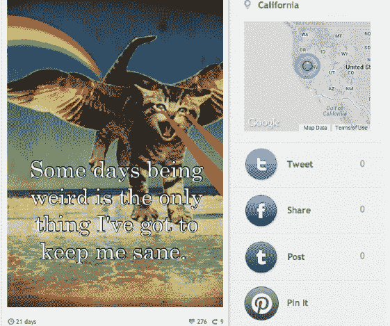

# 秘密分享应用 Whisper 从红杉获得 2100 万美元，Roelof Botha 加入其董事会 

> 原文：<https://web.archive.org/web/https://techcrunch.com/2013/09/04/whisper-21m-sequoia/>

秘密分享应用 [Whisper](https://web.archive.org/web/20230118194227/http://whisper.sh/) 已经完成了新一轮融资，以 7500 万至 1 亿美元的后期估值获得了 2100 万美元。据《T2》最初报道，这轮融资由红杉资本(Sequoia Capital)牵头，现有投资者光速创投(Lightspeed Ventures)参与。

有了这笔融资，红杉资本的合伙人[鲁洛夫·博塔](https://web.archive.org/web/20230118194227/http://www.sequoiacap.com/us/roelof-botha/info)也加入了 Whisper 的董事会。Malik 最初在几周前报道了这家初创公司正在从红杉获得 1 亿美元的估值，但我们的消息来源告诉我们，估值可能会略低，在 7500 万美元到 1 亿美元之间。

一位消息人士告诉我们，Whisper 在一次发行中卖出了 1500 万美元，融资前估值为 6000 万美元，融资后估值为 7500 万美元，而创始人和早期投资者在二次发行中又卖出了 600 万美元。根据这一信息，合并后的股票销售总额达到 2100 万美元。

利用去年 11 月发布的蜉蝣网，Whisper 为用户提供了一个简单的方法来给图片添加文字并匿名分享。这让人想起了长期运行的网站 [PostSecret](https://web.archive.org/web/20230118194227/http://www.postsecret.com/) ，用户在明信片上发送匿名秘密。但这款应用绝对是移动的，它提供的功能允许用户在公开场合和私下里互相回复。如果 Instagram 是亮点卷轴，那么 Whisper 代表了人类体验的幕后，引出了类似“我害怕我最好的朋友正成为我最大的敌人”的忏悔文本；“我希望我知道为什么我想要我想要的”；以及像这篇文章中嵌入的图片。

像许多社交网络一样，Whisper 应用程序在 18-24 岁的年轻用户中非常受欢迎。但是，尽管上一代社交应用中的大多数应用都是基于用户身份的，但 Whisper 通过匿名通信来区分自己——这是对普遍身份的拒绝，就像 Snapchat 正在消失的消息一样。

用户要么上传自己的照片到 Whisper，要么通过应用程序搜索互联网上的照片，然后可以在照片上叠加文字。该应用程序根据收到的回复和“心”来显示用户分享的最受欢迎的秘密，并允许用户查看附近其他用户分享了哪些秘密。

Whisper 用户可以通过公开创建和上传自己的秘密来做出回应，但该应用还有一个私人消息功能，用户每月支付 5.99 美元。显然，正是这种病毒式传播和货币化的结合让投资者对这款应用感兴趣。根据 AllThingsD 的数据， Whisper 一个月有 25 亿的页面浏览量(这显然超过了美国有线电视新闻网[的浏览量](https://web.archive.org/web/20230118194227/http://www.theatlantic.com/technology/archive/2013/08/the-genius-of-whisper-the-massively-popular-app-you-havent-heard-of/278774/))。超过 40%的用户在应用程序上创建内容，平均每天用户访问 Whisper 30 分钟。

随着博塔的加入，Whisper 将得到一位风投的帮助，这位风投以发现社交网络和移动领域的巨大机遇而闻名。博塔是 PayPal 的前首席财务官，他已经投资了一系列大规模高调退出的初创公司，包括 YouTube、Tumblr 和 Instagram。他还是 EventBrite、Square、TokBox 和 Jawbone 的董事会成员。对 Whisper 的投资引人注目，因为这将是博塔自收购 Instagram 和 Tumblr 以来的第一笔投资，我们都知道那些投资进展如何(旁注:博塔将在下周的 Disrupt SF 上[登台)。](https://web.archive.org/web/20230118194227/https://techcrunch.com/2013/09/03/announcing-your-disrupt-sf-finals-judges-marissa-mayer-roelof-botha-keith-rabois-david-lee-chris-dixon-and-michael-arrington/)

就在几个月前，Whisper 已经筹集了由 Lightspeed Venture Partners 牵头的 300 万美元 A 轮融资，Trinity Ventures、Shoedazzle 创始人布莱恩·李(Brian Lee)和 Flixster 的乔·格林斯坦(Joe Greenstein)也参与其中。

就像 Instagram 能够通过照片联系人们一样，Whisper 也有机会通过匿名和分享他们在现实生活中通常不会与他们认识的人分享的经历来联系人们。如果 Instagram 教会了我们什么，那就是围绕有形体验建立的网络的力量可以产生病毒效应，有一天价值高达 10 亿美元。

我们已经联系了不愿对谣言发表评论的人。

