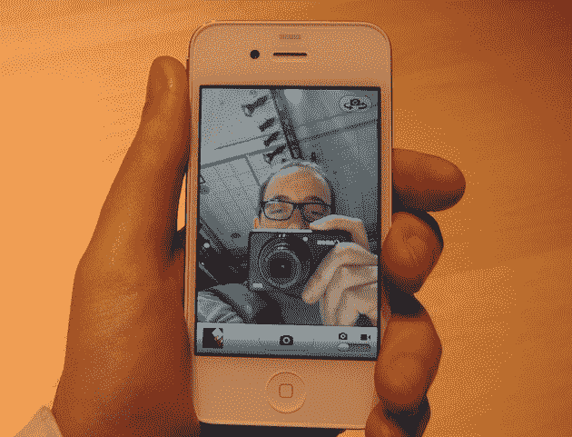

# 白色 iPhone 又延迟了。明年春天，它会击败 iPhone 5 上市吗？

> 原文：<https://web.archive.org/web/https://techcrunch.com/2010/10/26/white-iphone-spring/>

# 白色 iPhone 又延迟了。明年春天，它会击败 iPhone 5 上市吗？

据说劳动节过后你不应该穿白色的衣服。看起来，苹果公司坚持这一原则。没错，难以捉摸的白色 iPhone 又被延迟了。

正如苹果公司代表告诉路透社的那样，白色版本的设备要到明年春天才会上市。这是该设备的第三次推迟，因为最初[将](https://web.archive.org/web/20221210062255/https://beta.techcrunch.com/2010/06/23/apple-white-iphone-4-wont-be-available-until-second-half-of-july/)从 6 月的发射日推迟到 7 月的下半月。然后是[推](https://web.archive.org/web/20221210062255/https://beta.techcrunch.com/2010/07/23/apple-due-to-manufacturing-challenges-white-iphone-4-wont-be-available-until-late-2010/)到 7 月下旬的“今年晚些时候”。现在来看下一个问题:它真的会击败下一个版本的设备上市吗？

像钟表一样，苹果公司每年 6 月初都会在 WWDC 发布会上推出新版 iPhone。它通常在 6 月底/7 月初上市。从技术上来说，今年的夏天要到 6 月 22 日才开始，这款设备的下一个版本，姑且称之为“iPhone 5”，很有可能至少会在春天亮相——现在是白色 iPhone 的发布会。

更令人困惑的是威瑞森 iPhone 的整个故事情节。现在普遍认为苹果将在明年一月推出兼容威瑞森网络的 CDMA 版 iPhone。它可能会在那之后不久上市销售。这应该是 iPhone 4 的改装版。但是在 WWDC，苹果可以用 iPhone 5 的 CDMA/GSM 版本统一 iPhone 产品线。苹果真的希望其他两个版本(威瑞森 iPhone 4 和白色 iPhone 4)在那之前的几个月或几周(T4)发布吗？

你会注意到，在路透社的报道中，没有引用苹果公司关于“白色 iPhone 4”即将到来的说法，只是说“白色 iPhone”即将到来。或许现在的想法只是在 iPhone 5 之前放弃第二代手机？

那会惹恼很多等着白色的人。但不管出于什么原因，苹果就是没能把它做出来。这很奇怪，因为我在六月 iPhone 4 的发布会上玩过一个(见上图)。我没有注意到它有什么问题，但有报道称，很难用正确的白色颜料给外壳着色，或者它让光线透过。

谁知道是怎么回事。我所知道的是，如果你现在想要一部白色的 iPhone 4，这可能是一个更好的选择。

假期特别版[迪士尼白雪公主iPhone 4](https://web.archive.org/web/20221210062255/https://beta.techcrunch.com/2010/07/23/apple-white-iphone-4-problem/) 到此为止！