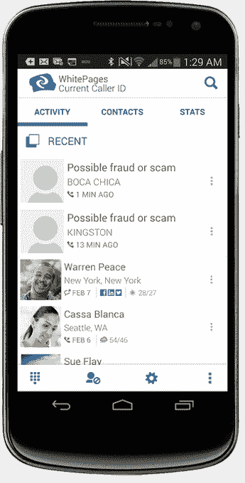

# Android 当前的白页现在可以抵御“一环”骗局 

> 原文：<https://web.archive.org/web/https://techcrunch.com/2014/02/25/whitepages-current-for-android-now-protects-against-one-ring-scam/>

面向 Android 用户的免费来电和短信识别应用程序 WhitePages Current 今天进行了更新，以应对“一环骗局”这一瘟疫。如果你不熟悉，骗子[现在正试图利用智能手机用户的“未接来电”屏幕](https://web.archive.org/web/20221207113549/https://beta.techcrunch.com/2014/02/02/missed-call-scam/)，通过编程每小时拨打数千个号码，所有这些号码在一声铃响后立即挂断。

看到这些未接来电的用户通常会出于好奇回拨该号码，然后按他们保持通话的每分钟收费。(根据 [BBB](https://web.archive.org/web/20221207113549/http://concord.bbb.org/article/one-ring-phone-scam-on-the-rise-45629) 的说法，电话被连接到付费的国际成人娱乐服务，或者位于美国以外的其他付费服务。)

white pages 当前的应用程序已经可以识别未知号码，包括来自已知诈骗者的号码，但该公司今天宣布，它现在已经增加了 20，000 多个与“One Ring”和类似诈骗直接相关的新诈骗号码。当这些号码拨打你的电话时，你会收到一个提示，上面写着“可能是诈骗或垃圾邮件”这在来电时显示在屏幕上。

你还可以在该应用的最近通话记录中收到可疑号码的警报，这很有帮助，因为“一响”骗子通常会比你回答的速度更快地挂断电话。

最后，如果您要向垃圾邮件得分高的号码拨打呼出电话，该应用程序将发出显著警告——以防您错过所有其他通知，并真的希望您错过的电话是昨晚在酒吧遇到的那个男孩或女孩打来的。

“一环”骗局实际上相当聪明，因为它依赖于这样一个事实，即许多消费者现在非常认真地对待一个电话。如果有人真的在给你打电话，而不是通过某个应用程序发短信，那么这通常就足够重要了，值得你关注。

[WhitePages Current 应用程序](https://web.archive.org/web/20221207113549/https://play.google.com/store/apps/details?id=com.webascender.callerid)是该公司 iOS 和安卓应用程序系列中的众多应用程序之一，也包括 WhitePages(旗舰应用程序)和 Number 先生。到目前为止，它已经收到了超过 90 亿个用户打来的电话和短信，其中有 70 亿是自 2012 年夏天推出以来收到的。

安卓市场上还有许多其他的[来电显示应用程序](https://web.archive.org/web/20221207113549/https://play.google.com/store/search?q=caller%20id&c=apps)，包括许多自称是身份欺诈者电话号码的应用程序。然而，WhitePages 的更新特别针对“一环”诈骗犯，并提供了针对数万个“一环”诈骗数字的保护，这就是该应用程序更新引人注目的地方。

(或者，您知道，您可以停止拨打未知号码。我的意思是，如果是*重要，他们会留下语音邮件，对吗？)*