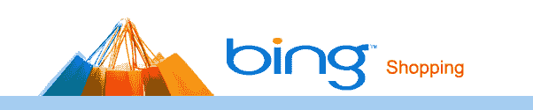

# 谁在偷窥谁？必应的购物结果也不那么干净

> 原文：<https://web.archive.org/web/https://techcrunch.com/2012/11/28/who-is-scroogling-who-bings-shopping-results-arent-all-that-clean-either/>

微软今天早上发起了一场颇具争议的反谷歌运动，指控谷歌实质上是在误导用户，因为该公司所有的购物结果现在都是付费的。“不要被 Scroogled”页面今天得到了相当多的关注，但同时，也有人对 Bing 如何组织自己的购物结果感到不安。

毕竟，最近和的合作了。虽然 Bing 以前允许商家提交自己的订阅源，但该公司现在表示，“该计划不接受新的商家。”相反，宾说，商人应该与 Shopping.com 合作。据 Bing 称，其中一个原因是“付费优惠将在整个 Bing 购物中突出显示，包括搜索结果和产品页面。”

值得注意的是，Shopping.com 将自己描述为“一个高效的广告平台，通过领先的出版商网络为商家提供直接回应和有针对性的广告解决方案。”在这种情况下，必应只是 Shopping.com 网络中的另一个出版商。

不过，有必要将这一点放在一定的背景下考虑:必应目前没有接纳新的商户这一事实并非闻所未闻，而是该公司在假期之前为确保服务顺利运行而采取的一项举措。总的来说，Bing 支持 Shopping.com feed 和商家 feed，并从其网络爬虫获取数据。

人们有正当的理由担心谷歌转向为其购物结果提供完全付费的平台，以及从长远来看这对该公司意味着什么。

谷歌不会公开发表关于必应和 Shopping.com 的声明，但它可能会说，尽管必应指责谷歌通过价格进行排名，但价格只是其排名机制中的一个信号。此外，由于 Shopping.com 与必应的关系，并不总是清楚哪些结果以某种形式得到了回报，哪些没有。在谷歌上，很明显所有的结果都是付费的。

谷歌和必应都辩称，它们明确标记了任何赞助结果。不过，这两家公司不同意他们的竞争对手确实在这么做。

当然，我们询问了谷歌和必应的反应。

Bing 的高级主管 Stefan Weitz 说:

> Bing 包括数百万来自商家的免费列表，排名完全由与你的查询最相关的产品决定。虽然商家可以付费加入我们的第 3 ^(rd) party 购物网站，并随后可能通过我们的合作伙伴关系出现在 Bing Shopping 中，但我们不会根据谁向我们付费来提高商家的排名，也不会让商家付费来提高其产品在 Bing Shopping 搜索结果中的排名。

以下是谷歌对这一争议的(相当平淡的)声明:

> 谷歌购物让购物者更容易快速找到他们想要的东西，比较不同的产品，并与商家联系进行购买。凭借全新的 360 度互动产品图片、社交购物清单和全球超过 10 亿种产品的快速增长库存，谷歌是购物者找到所需商品的绝佳资源，在这个假期为他们所爱的人提供优惠价格。