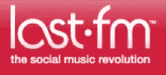

# 谁需要音乐标签？Last.fm 开始向未签约的艺术家支付版税

> 原文：<https://web.archive.org/web/https://techcrunch.com/2008/07/09/who-needs-music-labels-lastfm-starts-paying-royalties-to-unsigned-artists/>

 音乐流媒体服务 [Last.fm](https://web.archive.org/web/20230318183139/http://www.last.fm/) 现在为其服务上播放的每首歌曲向未签约艺术家支付版税。自从公司去年一月宣布这个计划以来，已经有 170，000 名艺术家和小唱片公司注册，450，000 首歌曲上传。

Last.fm 在这里所做的是为音乐家创造一个官方版税收取组织的替代品(即 [SoundExchange](https://web.archive.org/web/20230318183139/http://www.soundexchange.com/) )。去年，互联网上流媒体音乐的版税提高了，这使得广告支持的音乐初创公司更难生存。Last.fm 被 CBS 收购了，所以没有倒闭的危险。对于参与 SoundExchange 的唱片公司或艺术家所拥有的任何歌曲，Last.fm 将继续支付互联网电台版税。但它开始绕过声音交换，给新的、未签约的艺术家一个选择。

Last.fm 声称，通过取消中间商(唱片公司、SoundExchange ),签约该节目的艺术家将获得两倍于商业电台播放同一首歌曲的版税。那是因为钱直接给了艺术家。(不过，版税总额低于它支付给 SoundExchange 的费用)。Last.fm 向未签约艺人支付的版税相当于与其歌曲相关的广告收入的 10%(***更新**:在某些情况下，见下文*)。音乐家每季度得到一张支票，一旦达到 10 美元就可以提取。

我们这里说的不是很多钱，每首歌几分之一便士。但随着在线音乐产业的发展，以及针对音乐听众的在线广告，这些数字的总和可能开始变得有意义。

更重要的是，它在 Last.fm 和尚未被唱片公司发现或签约的后起之秀之间建立了直接的经济联系。该计划还吸引了那些不参与 SoundExchange 的小唱片公司，因为它们太小或者太麻烦了。(任何已经通过 SoundExchange 收取版税的人都没有资格参加该计划)。到目前为止，在 17 万注册用户中，30%是唱片公司。自 1 月份宣布以来，每日艺人帐户创建量总体增长了 60%。

由于这是 Last.fm 的节目，它控制着支付的版税，版税可以根据这些歌曲产生的广告收入进行调整。现在，真的有人想听这些歌曲吗？大量生病的音乐人从唱片公司转向这种直接安排？这将决定这到底有多大的破坏性。

**更新** : Last.fm 提供分级版税。来自[的常见问题](https://web.archive.org/web/20230318183139/http://musicmanager.last.fm/help/faq/?category=Artist+Royalty+Program):

> **如果您的曲目在我们的免费电台服务中播放，您将从免费电台服务中获得 Last.fm 净收入的 10%份额(参见条款和条件中“份额”和“净收入”的定义)。
> *如果您的曲目在我们的个性化高级电台服务中播放，您将获得 Last.fm 从个性化电台服务中获得的净收入的 10%,或在个性化电台服务中每次完整播放获得 0.0005 美元，以金额较大者为准。
> *如果您的曲目在我们的免费点播服务上播放，您将获得 Last.fm 点播服务净收入的 30%。
> *如果您的曲目是在我们的付费点播服务上播放的，您将从付费点播服务中获得 Last.fm 净收入的 30%,或在预付费或订阅点播服务上每次完整播放获得 0.005 美元，以两者中的较大者为准。*