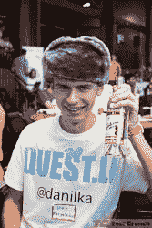

# 谁说黑客没有风格？

> 原文：<https://web.archive.org/web/http://techcrunch.com/2011/09/11/who-said-hackers-dont-have-style/>

黑客不一定因为他们的时尚感而出名。通常，都是关于代码的。就这一点而言，他们可能还穿着连体衣——或者说他们的生日礼服。但是在 Disrupt 黑客马拉松上，我们的一些黑客试图证明这个世界是错误的。有一些服装的辉煌正在酝酿中，它以头饰的形式出现。

没错。帽子。

就像黑客马拉松上的这些编码奇才一样，这些帽子有许多形状、大小、颜色和风格。它们是否真的在 T2 流行，我们实际上无法报道。我们将把它留给普通大众。但有一点是肯定的:黑客心帽子。很多。

下面，废话不多说，这些帽子:

#### 帽子

Karriem Khan，Nicole Yang，Siamak "Ash" Ashrafi，Devin Foley

#### 球帽

Brigham Hausman，Kevin Jhangiani，Raimundo Martinez，胡天衡，Omid Ahourai，Tom Puskarich

#### 高尔夫球帽

贾斯汀·马霍，布雷特·巴罗斯，菲尔·威

#### 头发

克里斯托弗·冯·内比

#### 不可解释的

尼克·潘努托，维·周，米基塔·天皇

#### 荣誉奖，苏联奇迹

丹尼尔·科济亚特尼科夫