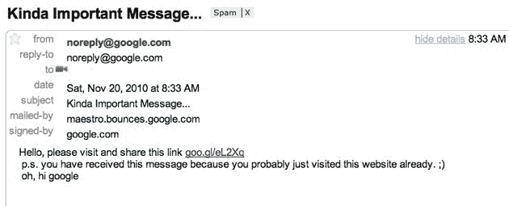
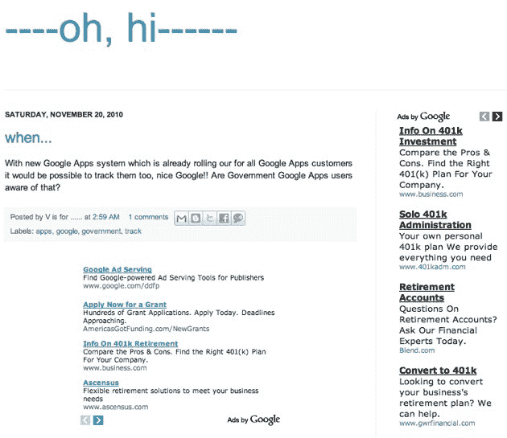

# 哇，谷歌，这是一个相当大的安全漏洞 

> 原文：<https://web.archive.org/web/https://techcrunch.com/2010/11/20/whoa-google-thats-a-pretty-big-security-hole/>

**见文章底部的更新。**

脸书可能只是[认为这是一个功能](https://web.archive.org/web/20230202221509/https://techcrunch.com/2010/11/12/how-to-mass-export-all-of-your-facebook-friends-private-email-addresses/)，但我们其他人肯定会认为这是一个很大的安全漏洞。http://guntada.blogspot.com 的创造者(暂时不要访问那个网站)今天早上发邮件给我们解释。

如果你已经登录了谷歌账户(Gmail 等)。)，然后访问那个网站，他就收获了你的谷歌邮箱。并且马上给你发邮件来证明。

而且它甚至在[“微服私访”模式](https://web.archive.org/web/20230202221509/https://techcrunch.com/2009/02/01/google-chrome-not-cool-enough-for-google-docs-facebook-if-youre-browsing-incognito/)(又称色情模式)下也能工作。

漏洞是什么？我们不知道，谷歌尚未就此事回复我们。我们注意到，利用这个漏洞的网站是在谷歌自己的博客平台上。我们采访的一位开发人员也很困惑，他说:

> 我不知道这是利用了什么，但很有可能与 Friend Connect 以及它在 iFrames 之间传递数据的方式有关(也就是说，它很可能与 opensocial 有关)。不管发生了什么，这都是极其严重的安全和隐私侵犯，我相信谷歌会在几分钟内解决这个问题。
> 
> 我不记得曾经在一个主要的国内流离失所者的网站上看到过这样的东西。这是可怕的东西。

如果你坚持自己尝试这种方法(嘿，我试过了)，发给你的邮件可能会在你的垃圾邮件过滤器里。

这不是一个特别危险的利用，但肯定是很多人喜欢在自己的网站上使用的东西。从已经登录谷歌的任何人那里收集电子邮件的能力是非常有价值的，更不用说确切地看到谁在访问这个网站了。一个月前 App Engine 的一个相关问题见第二个评论线程[这里](https://web.archive.org/web/20230202221509/http://news.ycombinator.com/item?id=1794800)。

更新:网站现在关闭了。它看起来是这样的:

**更新 2:** 来自幕后黑手瓦赫的邮件:

> 嗨，阿林顿先生，我看到你已经分享了这个消息。谷歌把它弄下来很好，我真的不想让人们知道这是怎么做到的(如果谷歌联系我，我肯定会告诉他们——他们只是不回复我的电子邮件)。问题完全依赖于谷歌。
> 问题是我问了很多人，他们中的大多数人并不真正理解和关心这种事情，大公司表现得好像他们都真的保护我们的隐私之类的，但他们看到人们并不关心，也不真正做任何事情。
> 
> 问候，
> Vahe G .(一个 21 岁的亚美尼亚人，谷歌甚至不想和他说话)

**更新 3:** 来自谷歌:*“我们非常重视潜在的安全问题，我们的团队正在积极调查这一问题。我们将很快分享更多信息。”我建议谷歌直接联系 Vahe，他似乎很乐意与他们交谈。*

**更新 4:** 谷歌称该问题现已解决:*“我们很快修复了谷歌应用套件脚本 API 中的问题，该 API 可能允许在未经 Gmail 用户许可的情况下向他们发送电子邮件，如果他们在登录他们的帐户时访问了一个特别设计的网站。我们立即删除了出现这一问题的网站，并很快禁用了该功能。我们鼓励向 security@google.com 负责任地披露潜在的应用程序安全问题。”*