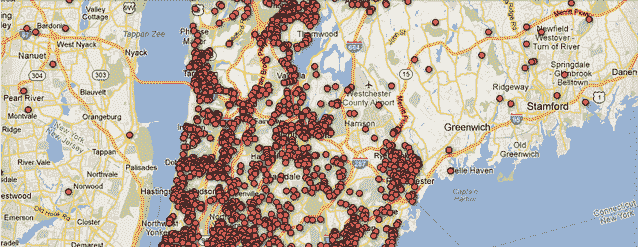

# 哎呦！持枪许可证持有者的谷歌地图非常不准确 

> 原文：<https://web.archive.org/web/https://techcrunch.com/2013/01/28/whoops-google-map-of-gun-permit-holders-was-woefully-inaccurate/>

# 哎呦！持枪许可证持有者的谷歌地图非常不准确

当*日报新闻*在全国引起轩然大波，并危及其工作人员的生命来创建[持枪许可持有者](https://web.archive.org/web/20221206133148/https://beta.techcrunch.com/2012/12/26/journalists-addresses-posted-google-maps-gun/)的谷歌地图时，为了透明和公民对话的事业，这是正当的。不幸的是，现在看来，这张地图非常不准确，可能牵涉到那些已经死亡、丢掉枪支或转移的公民。“从来没有人打电话核实过这个地址，”迈克·史密斯说，他在地图上看到自己的地址时很惊讶，显然是因为他哥哥在申请手枪执照时用了他的地址而被标记的。哎呦！

纽镇大屠杀一周后,*新闻*杂志发布了一张交互式谷歌地图，上面显示了纽约部分城市持枪许可证持有者的姓名和地址。这一举动引起了数周的全国头条新闻，甚至引发了(讽刺性的)报复行为，包括康涅狄格州的一名律师张贴了该报员工的电话号码和地址。

虽然关于持枪许可所有权是否应该成为公共信息存在合理的争论，但当它危及错误的公民时，透明度没有任何好处。显然，在洛克兰县，16，998 个许可证持有者中的绝大多数被认为是“历史性的”，一些可以追溯到 20 世纪 30 年代。只有 3，907 个(22%)是当前的。

政府记录的透明度仍然是最近的发展；技术的进步跟不上笨重的记录保持的速度，给了过分热情的记者比公民拥有的防御力量更多的进攻力量。

也许，下一次，我们应该联系负责信息的数据极客，看看我们的结论有多准确。