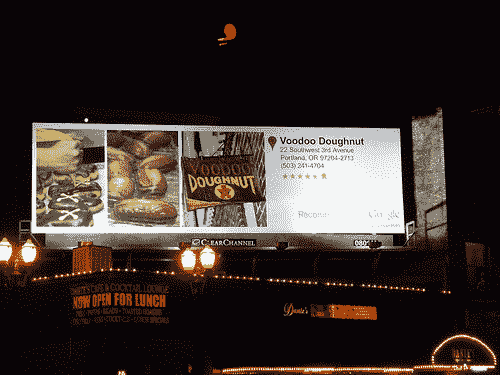

# 为什么日常交易变得不公平 TechCrunch

> 原文：<https://web.archive.org/web/https://techcrunch.com/2011/06/03/why-daily-deals-raw-deal/>

***编者按**:这篇客座博文是由[洛基·阿格拉瓦尔](https://web.archive.org/web/20230209125118/http://www.linkedin.com/profile/view?id=247423&authType=name&authToken=qe2l&locale=en_US&pvs=pp&trk=ppro_viewmore)撰写的，他是一位企业家，自 1995 年以来一直致力于当地产品。他在[重新设计](https://web.archive.org/web/20230209125118/http://blog.agrawals.org/)写博客，发微博 [@rakeshlobster](https://web.archive.org/web/20230209125118/http://twitter.com/#!/rakeshlobster) 。*

在 Groupon 提交 IPO 申请之后，有必要审视一下要约的基本面。迄今为止，增长数字是惊人的。但这是一项可以持续的业务吗？

我们喜欢每日交易，原因很简单:交易一直很出色。如果说第一次互联网泡沫中的收入增长是以 50 美分的价格出售 1 美元，那么日常交易业务的增长则是让其他人以 50 美分的价格出售他们的美元，并收取他们 25 美分的特权费。

经历了我们有生之年最严重的经济衰退，这使得此类交易更具吸引力。

这些交易好得令人尴尬。我昨天在 Floyd's Coffee 使用了第一个 Google Offers 交易。花 3 美元，我得到了价值 10 美元的食物。让我告诉你，在咖啡店花 10 美元真的很难。我点了一份红豆米饭、一杯墨西哥可乐、一个甜甜圈和一块巧克力曲奇。总数是 9.95 美元。

这对我来说很划算，但对业务来说是不可持续的。(我预计，在这种情况下，经济学与典型的日常交易经济学不同，但我们稍后会谈到这一点。)

对于大多数当地餐馆来说，仅食物的成本就占价格的 25-30%。可持续的折扣是 15-30%。肯定不是 75%。日常交易的增长建立在对消费者的价值定位上，这在经济上是不可持续的。

***交易经济学***

一般的交易结构如下:

*   正常价格的 50%作为客户折扣
*   价格的 25%归企业所有
*   价格的 25%归交易提供商所有

具体的百分比会有所不同，但这些都是粗略的近似值。一个企业不可能降价一半，把剩下的一半给别人，还能盈利。

这是一个三方零和博弈。钱要么流向客户(未付款)，要么流向企业，要么流向交易提供商。

如果企业希望在交易中获得一点利润，这笔钱可以来自减少交易提供商的份额(这将削减利润)或减少客户折扣(这将降低交易的吸引力)。

商家被告知，不要担心这笔交易的利润。都是为了获客！你会得到新的客户，将来你会从中赚很多钱。这有几个问题:

*   很多进门的顾客都是你的现有顾客。你刚刚对你的产品重新定价，收入下降了 75%。假设你做了一笔交易，价值 40 美元的食物卖 20 美元。你卖了 2000 个。25%的兑换者是现有客户。你刚刚失去的现有客户带来了 15，000 美元的收入。(25%这个数字其实比我从商家那里听说的要低。数字越高，商业案例越糟糕。一家公司声称 90%的团购者都是老客户。)重新设定客户对你的价值的期望值也有潜在的长期影响。
*   许多客户来自你的主要市场区域之外。对于附近的餐馆，典型的市场区域在 5 英里以内。即使最近按地理位置划分了市场，交易提供商也不会把目标定得那么窄。对他们来说，服务于更大的地理区域更有效率。如果有人愿意开车 25 英里到你的公司来节省几美元，那很可能是你不想要的客户。有些[餐馆人们愿意开一个小时的车并支付全价](https://web.archive.org/web/20230209125118/http://www.flickr.com/photos/asmythie/3403224257/)——但是这些餐馆不需要进行交易。
*   交易公司不向商家提供交易购买者的任何联系信息。这取决于他们与每一个客户接触，并想办法让他们回来。肯定有办法做到这一点，所以如果你经营一笔交易，确保你做到了。鼓励客户注册你的 Twitter 或脸书 feed。获取他们的电子邮件地址。钩住他们。但我很少看到本地企业这样做。
*   你无法控制人们什么时候会出现。[我采访的一位商家在一次 Groupon 促销活动中卖出了一个月的生意。](https://web.archive.org/web/20230209125118/http://redesignmobile.com/2011/05/10/shop-talk-square-and-groupon/)另一个商家排了很长的队，无法提供他通常提供的服务水平。在这种情况下，你能推出让你感到自豪的产品吗？

抵消经济效益的是，商家保留了未兑换的团购收入。

交易提供者需要确保该业务为商家服务。在我与商人的交谈中，很明显有些人已经加入了交易的行列，因为这是热门的事情；不是因为他们仔细计算了投资回报率。

让这些交易对企业更有利的一个潜在方法是对它们进行使用限制，这样它们只能在非高峰时间使用。但这降低了对消费者的吸引力，也降低了交易网站展示你的可能性。其他方法包括更好的培训，以帮助商家最大化他们的交易位置。

在这个阶段，评估商家的满意度是困难的，而且很大程度上是传闻。(Groupon 的 S-1 几乎没有提供指导。莱斯大学商学院的 Utpal M. Dholakia 进行的一项研究发现，42%的 Groupon 商家不会经营另一家 Groupon:“许多企业主普遍认识到，社交推广用户并不是他们所希望的关系型客户，也不是他们的企业长期成功所必需的。相反，许多受访者对这些消费者的极端价格敏感性和交易取向感到失望。"

***一线商家***

并非所有的企业都是平等的。有些是顶级企业，而大多数不是。全国一流企业的例子包括亚马逊、好市多、星巴克、塔吉特和苹果。如果你在塑料丛林上查找他们的礼品卡，他们通常以面值交易。人们认为它们和现金一样好。你很少会从他们那里看到巨大的折扣，除非是别人为折扣买单。苹果如此保护自己的品牌，以至于它甚至不希望你放弃它的产品。

消费者喜欢这些品牌，所以一些交易公司会自掏腰包支付折扣。我刚刚从 50 美元的 Nordstrom 购物中拿回了 25 美元。25 美元是由交易公司提供的。

还记得 Groupon 第一次在全国范围内进行的 Gap 交易吗？这笔交易为 Groupon 增加了大约 20 万名客户。根据我估计的 26.50 美元的客户获取成本，这笔交易为 Groupon 提供了 530 万美元的用户价值。即使 Groupon 没有向 Gap 收取任何推广费用，与 Gap 合作并获得这些订户也是值得的。(加上这场运动产生的所有宣传效果。LivingSocial 开展了一项促销活动，补贴亚马逊礼券的成本，售出了大约一百万张礼券。这是建立名单和制造轰动的好方法。

同样的事情也适用于本地市场。有一些业务可以用来建立清单；别人挣钱。在波特兰，谷歌从去年冬天就开始了大规模的营销活动。他们为当地企业购买广告牌，包装公共交通工具，赞助开拓者运动会的活动，举办私人音乐会等等。(见[这篇文章](https://web.archive.org/web/20230209125118/http://redesignmobile.com/2011/02/19/google-hotpot-takes-a-stand-in-portland/)的详细报道。)

这些活动大多围绕着标志性的波特兰企业，如伏都教甜甜圈。谷歌最近在波特兰宣布了报价。但是像伏都教甜甜圈这样的企业不需要报价。买甜甜圈已经等了 40 分钟了。(他们值得等待！)如果我在管理 Voodoo 甜甜圈，即使谷歌不想要分成*并为顾客*支付折扣，我也不会提出报价。(它贬低了我的品牌。)我会考虑其他事情，但不会忽略我备受追捧的产品。

但是，追踪这些高调的企业对建立这个名单很重要。随着越来越多的优惠推出，看看谷歌瞄准哪些企业将会很有趣。如果我们看到许多大牌，这是一个好迹象，表明谷歌要么放弃其费用，甚至支付折扣。鉴于弗洛伊德咖啡 70%的折扣，我预计这笔交易要么是无利润，要么是负利润。

***国货和假货定价***

我在过去 6 个月中看到的一个趋势是，交易提供商的国内交易数量越来越多。这些包括像花店，相册，照片扫描，定制 t 恤，旅游等。一般来说，他们使用相同的 50 / 25 / 25 定价。但现实情况是，给客户的五折，通常只有 20-30%的折扣。余额来自假定价。

许多国有企业将虚假定价作为日常业务的一部分。如果你在梅西百货按全价购买，那你就太贵了。(好市多和诺德斯特龙是罕见的例外。)使用虚假定价最令人震惊的例子之一是 FTD。他们经常在正常价格的基础上大幅打折促销。我看过 FTD 的促销活动，在那里你可以用比从航空公司单独购买里程更低的价格获得常旅客里程和鲜花。

FTD 也因在 Groupon 上使用虚假定价被抓。为了兑换您的 Groupon，您必须访问一个专门的 Groupon 品牌 FTD 网站。那个网站的价格比你直接去 FTD.com 要高。(这也高于 FTD 众多促销活动中的任何一个。)当它被抓住的时候，FTD 做了正确的事情，用 FTD 主网站上的价格兑现了 Groupon。

旅游是另一个广泛使用虚假定价的类别。我最喜欢的例子是喜达屋的五折证书。您可以用 1，000 积分兑换一张优惠券，享受酒店住宿五折优惠。但这是基于酒店的满座率，几乎没有人会支付。作为测试，我打电话询问明天皇宫酒店的价格。SPG50 的价格是 299 美元。最好的电话费率是 199 美元。我的团体价是 169 美元。最好的网上价格是 161 美元。一些交易！(我爱喜达屋酒店，但这个比率只是让品牌尴尬。)

越来越多的使用国家交易，虽然提供了一个收入和潜在的销售成本较低，但有几个问题:

*   它污染了交易提供商的价值主张。Groupons 过去有一种好市多式的简单。我知道如果我买了一个，我会得到一个好价钱。我唯一要做的决定是我想要产品还是服务。在虚假定价的情况下，我现在必须弄清楚这是否是一笔好交易。
*   全国性交易也有更多的限制。某些品牌被排除在外，或者优惠对销售商品无效，或者只在特定时期有效。旅行经常受到“可用性”的影响。你想在 7 月 4 日去参观明尼苏达州湖边的小屋吗？你可能只能在二月份预订它。(穿暖和点，可能零下 20 度。)
*   由于它们的规模，国内零售商将能够更大程度地谈判价格，这意味着交易提供商的利润率更低。

Groupon 的 S-1 列出了许多风险。但最大的风险是，当地企业将意识到，他们不能放弃商店，消费者将意识到，全国交易根本不是交易。