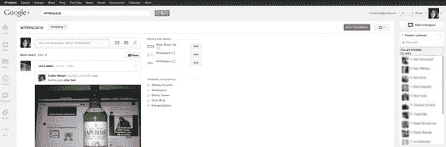

# 为什么新的 Google+使用了这么多空白？

> 原文：<https://web.archive.org/web/https://techcrunch.com/2012/04/11/why-does-the-new-google-use-so-much-whitespace/>

# 为什么新的 Google+使用了这么多空白？

今天早些时候，谷歌推出了 Google+ 的大规模重新设计。对于该公司羽翼未丰的社交网络的新界面的反应通常是积极的，但大多数用户都有点困惑，为什么网站上突然有这么多[空白](https://web.archive.org/web/20221001103644/http://en.wikipedia.org/wiki/White_space_(visual_arts))。事实上，[#空白标签](https://web.archive.org/web/20221001103644/https://plus.google.com/s/%23whitespace/posts)目前正在网站上流行，这可能是新设计中讨论最多的“特性”。不过，我认为这种疯狂背后是有原因的。

当谷歌的维克·冈多特拉今天早上宣布这些变化时，他没有谈到的是，谷歌现在也转向了 Google+的响应式网页设计。响应式设计可以适应浏览器窗口的大小，而不是传统的固定宽度设计。因此，尽管你的脸书页面看起来总是一样的，不管你是否最大化了浏览器窗口，新的 Google+设计实际上会随着你调整浏览器窗口的大小而改变。目前，谷歌在这方面做的还不多，但它肯定是围绕这个想法重新设计的。

要看到这一点，只需前往 Google+并重新调整你的浏览器。如果你的窗口足够大，你的 Google Chat 好友列表会出现在屏幕的右侧，或者当你缩小浏览器时，它会在窗口的右下方以折叠菜单的形式出现。

在今天早上早些时候的一次简短谈话中，维克·冈多特拉指出，谷歌显然很清楚空白。他还说，谷歌不打算利用这个空间做广告，但没有透露更多信息。

谁也不知道谷歌将如何利用这一领域。随着我们转向更大更宽的屏幕(这实际上对于像 Google+、脸书和 Twitter 这样的服务中心的新闻源来说是次优的)，对谷歌来说，尝试更宽的布局并找出如何最好地使用它们才是有意义的。

不过，在它真正利用这些新发现的空间做些事情之前，你可以[安装这个 Chrome 插件](https://web.archive.org/web/20221001103644/https://chrome.google.com/webstore/detail/hjhgeibimkoddhdkkgimnipkdodobgpm)来暂时移除空白。

[图片来源:[马克·瑟曼](https://web.archive.org/web/20221001103644/https://plus.google.com/112098178418351012596/posts/RYTJC1D3T9C)