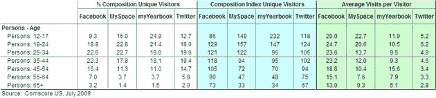
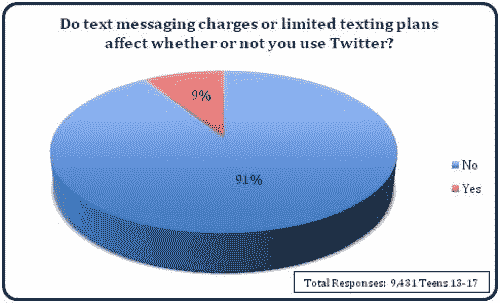
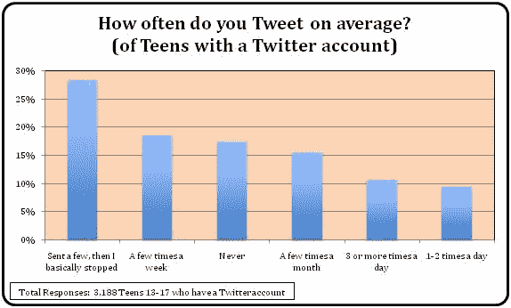
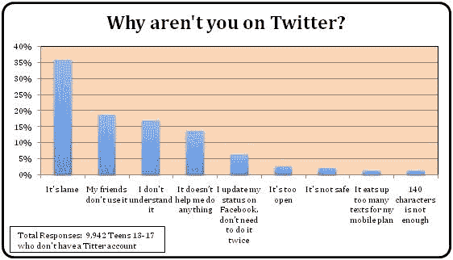
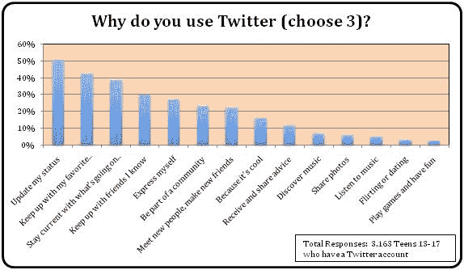
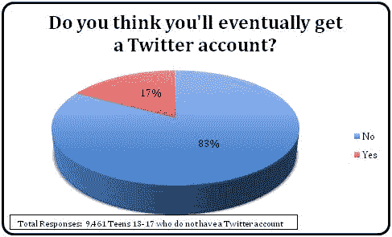
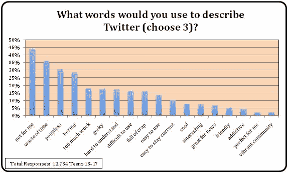
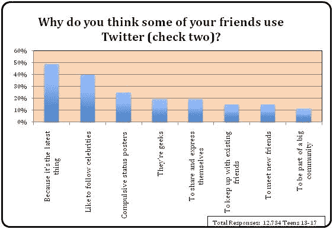

# 为什么青少年不发微博？我们询问了超过 10，000 人。

> 原文：<https://web.archive.org/web/https://techcrunch.com/2009/08/30/why-dont-teens-tweet-we-asked-over-10000-of-them/>

 *这篇客座博文由社交网站 [myYearbook](https://web.archive.org/web/20230202232842/http://www.myyearbook.com/) 的联合创始人兼首席执行官[杰夫·库克](https://web.archive.org/web/20230202232842/http://www.crunchbase.com/person/geoff-cook)撰写。这些天，关于 Twitter 的一切都在好转，当然除了一些烦人的运行时间问题。但最近的一些报告也表明，青少年是一个似乎不像我们其他人那样拥抱 Twitter 的群体。因此，当我兴奋地看到罗伯特·斯考伯宣称推特价值 100 亿美元时，分析一些数据来理解为什么青少年不认为推特像我们其他人一样酷可能是个好主意。*

在过去的几个月里，每个人都在思考“为什么青少年不发微博”这个问题——似乎除了青少年。我们最近对 10，000 多名 13-17 岁的美国青少年进行了一项调查，看看我们是否可以为这个问题增加一些新的内容。事实证明，这个问题本身是有缺陷的。

迄今为止，对于青少年对 Twitter 的厌恶，人们给出了各种各样的理由，从居高临下的“因为他们无话可说”，到负责任的“[因为它不安全](https://web.archive.org/web/20230202232842/http://techcrunch.com/2009/07/13/why-teens-arent-using-twitter)，到[莱特曼式的](https://web.archive.org/web/20230202232842/http://www.crunchgear.com/2009/07/22/video-kevin-spacey-tries-to-explain-twitter-to-david-letterman)“因为他们负担不起”——至少是没有移动数据计划的。

当然，所有这些原因都是基于“青少年不发微博”这一广为接受的观念——这是一个需要解释的现象。就在上周，纽约时报引用了只有 11%的推特用户是青少年的事实来证明推特在这个群体中不受欢迎。

言下之意是，11%是个小数字，但如果我们深入观察，就会发现 Twitter 上的青少年比脸书更集中。你可以在下面的图表中看到，脸书只有 9%的青少年，所以 Twitter 实际上比脸书更青少年，后者从来没有被认为有“青少年问题”脸书有如此多的用户，从定义上来说，青少年在这项服务中所占的比例不可能那么大。

在一份注定会成为推特热门话题的报告中，尼尔森还建议“[青少年不要发推特](https://web.archive.org/web/20230202232842/http://blog.nielsen.com/nielsenwire/online_mobile/teens-dont-tweet-twitters-growth-not-fueled-by-youth)”。几乎就在它发布的同时，包括[丹娜·博伊德](https://web.archive.org/web/20230202232842/http://www.zephoria.org/thoughts/archives/2009/08/06/teens_dont_twee.html)在内的一些博客作者驳斥了这项研究对 2-24 岁年龄组的记录，但却得出了关于青少年的结论，指出 Twitter 上没有太多 2 岁的孩子。

可以肯定的是,“青少年不发微博”这个标题的真实性很有说服力。这确实让人感觉是真的，在某种程度上是真的:绝大多数青少年不发微博。当然，绝大多数成年人也不会发微博。

事实证明，青少年实际上比普通人发的微博更多，这促使硅谷内部人士昨天说，“[孩子们不再讨厌 Twitter 了](https://web.archive.org/web/20230202232842/http://www.businessinsider.com/chart-of-the-day-kids-dont-hate-twitter-anymore-2009-8)”根据 comScore 的数据，Twitter 在 12-17 岁年龄段的独立访客构成指数为 118(超过 100 的值代表该年龄段的独立访客相对于该年龄段在整个网络中的集中度更高)。更有趣的是，Twitter 的 12-17 岁组成指数为 118，高于 25-34 岁和 35-44 岁年龄组的组成指数。底线是:Twitter 实际上比一般网站更偏向青少年，比脸书更偏向青少年。

同样，青少年每月访问 Twitter 5.2 次，比 25-44 岁的用户更频繁，后者每月访问不到 5 次。

但是，这个故事不仅仅是对数据的普遍误解。毕竟，为什么大多数青少年不发微博呢？当摩根士丹利发表了一份由来自英国的 15 岁实习生马修·罗布森撰写的有影响力的报告后，青少年和 Twitter 的问题第一次得到关注，这份报告立即成为热门话题。报告建议青少年不发推特的原因如下:

> 大多数人已经注册了这项服务，但当他们意识到他们不会更新它时，他们就离开了(主要是因为发推特会耗尽信用，他们宁愿用信用给朋友发短信)。

为了验证这一解释，我们进行了一项调查，询问数千名美国青少年短信费用是否与他们是否使用 Twitter 有关，超过 90%的人说:“不——反正我不会使用 Twitter。”(注意:无限短信计划在美国很常见，而摩根士丹利的报告是从英国青少年的角度撰写的。)

罗布森还观察到，他在英国的朋友和同学注册了这项服务，然后就再也没有使用过，这种模式在美国非常相似。事实上，在我们的调查中，我们发现 45%拥有推特账户的 13-17 岁青少年不发推特。大多数人发了几条，然后就完全停止了，17%的人一条也没发。

同样，我们研究了这样一种观点，即青少年可能对 Twitter 的开放性感到厌恶，认为它不安全。我们也没有发现对这一假设的支持，几乎没有人引用“它太开放”或“它不安全”作为他们不使用 Twitter 的理由，如下图所示。

那为什么呢？为什么 Twitter 不能激发大多数敢于冒险注册账户的青少年的热情？答案在于青少年使用 Twitter 的原因。在拥有 Twitter 账户的青少年中，使用该服务的四大原因依次是:

*   更新我的状态
*   关注我最喜欢的音乐家、乐队或名人
*   了解世界上正在发生的事情
*   与我认识的朋友保持联系

如果我们逐一分析这些主要原因，就会更清楚地了解为什么 Twitter 在青少年中不受欢迎。

*   青少年已经在脸书、MySpace 和 myYearbook 等网站上虔诚地更新他们的状态。
*   青少年使用 MySpace 与音乐家和名人保持联系，这是 MySpace 与众不同的地方。
*   作为一个群体，青少年不是任何渠道新闻的主要消费者，这使得“保持最新”成为主流采用的一个糟糕的驱动因素——尽管当然也有例外。
*   青少年使用 MySpace 和脸书与他们认识的朋友保持联系。

鉴于上述情况，青少年渗透率不高就不足为奇了。Twitter 对大多数青少年的价值定位才是问题所在。

毫无疑问，这就是为什么大多数青少年把 Twitter 描述为“不适合我”，也是为什么大多数不上 Twitter 的青少年引用一般原因为“因为它很无聊。”Twitter 没有帮助他们中的大多数人做任何新的事情，所以对他们来说，它是蹩脚的。当然，对于那些热衷于名人或新闻的青少年，或者那些寻找更新状态的观众的人来说，Twitter 是无价的。

但现在我们又兜了一圈。大多数青少年不使用 Twitter，因为它不能让他们做任何他们在别处不能做的事情，这也是大多数成年人不使用 Twitter 的原因。这与任何青少年特有的担忧无关，比如发短信的计划或安全性。这可以归结为更简单的事情:超越脸书和 MySpace 提供价值——脸书正在一步一步地弥合这一竞争护城河，从人人按钮到收购 FriendFeed，再到流媒体本身的中心地位。

“为什么青少年不使用 Twitter？”就是“为什么大家都不用 Twitter”这个问题答案似乎是显而易见的，也是异端的……也许 Twitter 并不适合所有人。

其他青少年和 Twitter 调查结果:

声明:这是我们调查的青少年小组的更多信息。我们并不认为 10，000+的调查结果代表了美国青少年的权威调查。然而，我们确实声称，我们的用户看起来非常像其他社交网络的用户，我们的受众与 MySpace、脸书和 Twitter 有很大的重叠，myYearbook 青少年的见解可能对这一分析有用。