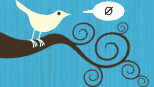
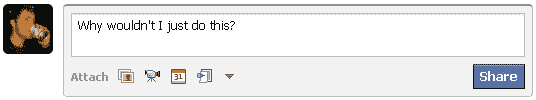
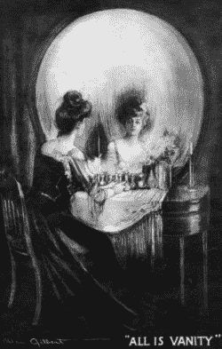
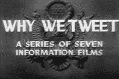

# 为什么我不用 Twitter 

> 原文：<https://web.archive.org/web/https://techcrunch.com/2009/08/17/why-i-dont-use-twitter/>

**一份宣言**

我相信[推特](https://web.archive.org/web/20230225230638/http://www.crunchbase.com/company/twitter)。我相信人们想要使用它，它对他们是有用的。我不太确定它对货币化的敏感性，但话又说回来，我报道的是相机和拉面机器人，而不是互联网业务。尽管如此，由于我将在几周后参加 TechCrunch 50 会议，并且可能是唯一一个不使用 Twitter 的人，我觉得我应该提供一个解释。我并不认为我是否使用它对任何人真的很重要，但通过先发制人，我将避免在向我遇到的那些人重复解释它时声音嘶哑。我也很好奇 TechCrunch 的读者群中是否还有其他“abstwainers”(或者更好的是，“Tweetotallers”，“无论哪种方式，我都创造了一个术语”)，如果有，你的观点是什么。

现在，如果我说我没有在等待一个机会来表达我自己，那我就是在撒谎(这可能是为什么这篇文章这么长的原因(虽然我的插入语写作风格也有责任))，但它似乎足够相关，而且时机也合适。请记住，这些是我自己不使用服务的理由，而不是你停止使用的理由；我不是想改变信仰。我将从我的主要主张开始:一条推特从根本上说是没有价值的。

 **推文没有价值**

什么是推文？我认为这些数据毫无用处，至少在这种情况下是如此。**140 个字能说的，要么琐碎，要么删节；在第一种情况下，最好不要说，在第二种情况下，最好给它应有的空间。**当然，这个规律也有例外:“是个男孩！”例如，这就足够了，也值得告诉你认识的每一个人(顺便祝贺 CrunchGear 的作者 Matt 有了新宝宝)，但我想我们都知道，Twitter 的大部分内容并不是改变生活的公告或简洁机智的小颗粒。也不是有意的——但是*的意图*在*我的*法庭上是不被接受的，先生。

继续:我上面说的“这个语境”简单来说就是推文不分青红皂白的传播。我认为这进一步贬低了他们；否则可以接受的消息(“1 点在 Hi-Spot 吃早午餐！”)发给这么多人就变得没有人情味，毫无意义了。是的，有@来指定另一个 tweet 或 Twitterer(如果他们给这个网站起了别的名字，这个可恶的基于鸟的行话让我发疯)，但这只是加剧了事情。我喜欢这样想:Twitter 是一群围坐在一张桌子旁的朋友，所有人都在同一时间大喊——并在那大喊世俗。@功能只是意味着你在世俗面前呼喊某人的名字。其他人还是要听。交谈是不可能的；每一次交流都是电报式的(不幸的是，在其他媒体中越来越如此)。

但是推文中可以有链接，当然，这使它更加通用——除了链接和简单的文本一样受到价值减少的影响。在推特上发布一个链接很像把它发送到你的整个地址簿。如果你认为*你认识的*每个人都应该看到它，它最好是*值得*在山顶呼喊。那是多么罕见啊！如果你喜欢别人根据他们的时间表为你找到你的内容，这不是问题，但对我来说是。此外，事实上可能有一半的推文是自动生成的，我们在这里得到的是一个没有传达任何有价值的信息的失败。

对此的自然反对意见是，你选择跟随他人，你没有被强加于人。真的！那么，我说，如果有人这么经常地发现有价值的内容，为什么他们不开一个博客呢？在那里，内容可以被提供背景、讨论，也许还有预览，这样人们就不会盲目地进入了。我喜欢阅读有趣的博客。我不希望每次有人找到他们认为所有人都应该看到的东西时都收到链接。Twitter 只是在等式上增加了另一层——我不喜欢层。

所以你有它。那里的每条推特要么是不必要的，要么是不必要的缩写。为什么会有人*希望*成为这样一个笨拙的小数据包的所有者呢？

 **不完整**

这一个可能有争议，但是我拥抱争议。我让它不舒服。我把手放在它的后口袋里。我亲吻它的嘴唇。因此，我认为 Twitter 是一项不完整且笨拙的服务。Twitter 元服务的光环表明(在我看来)这项服务的受欢迎程度较低，更多的是它如何达不到目标。当它不停机时，Twitter 提供一个；人们想要 A，B，c。

它只是文本，当然，这是它成为 Twitter 的原因——但是简单并不等同于优雅(尽管两者经常被看到在一起)。URL 缩短的图片托管服务表明人们想把他们的图片放在 tweet-stream 中，或者你管它叫什么。像 Tweetdeck 这样的 Twitter 应用(那是一个吧？)暗示 web 服务不充分。诸如此类。

一个*可能*夸大了 Twitter 服务的范围，将其作为一种基本的替代通信协议，就像电子邮件或即时消息一样，并说客户端是这种协议的自然延伸——但我认为这是不真诚的，也是错误的。错了，因为 Twitter 的本意是*简单*，而不是*根本*。这是一个显著的差异。不真诚，因为你知道事实并非如此:如果是的话，Twitter 将更好地与现有服务整合。

我并不是责怪 Twitter 没有成为我所希望的样子——但是，如果它没有任何用途，那么跳到一个看起来像过渡形式的服务上似乎是不明智的。我会上 Twitter 2.0，谢谢。

**不替换任何东西，也不增加任何东西**

你发微博之前做了什么？这是一个社交网站，相当于所有的公告，或者…类星体什么的。以前，当你需要把一些无关紧要或紧急的东西发给一群可能想看也可能不想看的人时，你会怎么做？唯一想到的就是空中写作。现在的方法多得我都数不过来。Twitter 当然是一个大公司，但是它真的比它的竞争对手——比如脸书的 feed——更好、更容易或者更快吗？在外行人看来(也就是说，在我看来)，脸书似乎在很多方面都让 Twitter 相形见绌(不过老实说，我也算不上一个 Facebook 用户)。

Twitter 的确更具移动性——这一点我同意；脸书应该在这方面做得更好，收购 FriendFeed 应该会在未来几个月内将这一点做得很好。Twitter 当然更适合功能手机(相对于智能手机)，但这有点像移动目标，因为功能手机越来越智能，智能手机越来越便宜。如果我用手机拍了一张疯狂的照片，我宁愿把它发到脸书，而不是推特上，尽管有了推特，它可能会被更多的人看到，因为脸书的反馈几乎一样简单，而且更强大。这里值得一提的是，我几乎是在胡说八道，因为我不是脸书的特别活跃的用户，而且我可能提到过我根本不使用 Twitter。但是如果你禁止无知的争论，那么，整个互联网就完了。

**被关注者和未被关注者的新闻报道都一样**

至于传播消息，我可以看到它可能对一些人有帮助。并不是说在 Twitter 上爆料的同一条新闻不可能在其他地方爆料，但 Twitter 新闻确实有某些东西。一定的紧迫性，因为它是不断扩大的转发浪潮的一部分，你应该转发它。我肯定你们中的一些人想知道一个博客不使用 Twitter 是如何生存的。我想提醒你，这篇文章出现在 TechCrunch 上，这是世界领先的基于 Twitter 的新闻来源。每一条推文在出现在互联网上之前都必须经过迈克和 MG 的*亲自批准*。有这些人盯着，我没什么好担心的。(他们可以站在[过滤器多一点，虽然](https://web.archive.org/web/20230225230638/http://www.breitbart.com/article.php?id=CNG.80c182849ca932a32a5eda49e4fe1b02.3b1&show_article=1))

关键是，我看不出有什么特别的理由去使用 Twitter，而不是依赖脸书、RSS 甚至电子邮件。如果很热，它会以某种方式传播。不幸的是，我想不出比这更不具暗示性的说法了。

此外，(我讨厌提出这个老论点，但我认为它在这里是适用的)在 Twitter 出现之前，我们不是已经被信息饱和了吗？除了电子邮件、即时消息、信息、帖子、投票、邀请、活动、反馈，天知道还有什么，我们真的需要持续不断的推文吗？我对你说不！关于这一点:

 **纯粹是虚荣**

这话从一个*专业博主*口中说出来可能有点丰富，但我不喜欢广播自己。在这篇文章之前，我已经试着把我在这个博客和 CrunchGear 上的自我介绍限制在诸如“我更喜欢佳能，但是……”或者“SNES 将永远优于创世纪”这样的事情上我认为公开宣传自己或故意吸引注意力是低级趣味的，无论是在推特上发布你的最新行动，还是有一头浓密的头发，或者在聚会上让每个人都听你的笑话。虚荣！推特鼓励它。这更像是一个哲学观点，所以我不会在这里争论太多，但我的立场是，人们应该说更少、更有意义的话，针对他们相关的人——而不是像发信号弹一样尖叫说你超级讨厌周一，等等！

我认为它吸引了大脑中爬行动物的部分。这是大男子主义，有追随者。当你广播的时候，你会觉得人们在关注，谁不喜欢关注呢？但如今我们的注意力分散得如此之少，以至于专注于像推特这样的小事的部分可能根本就没有。广播可能会安慰自我，但这是虚假的安慰。它是(有意义的注意力)的替代物，不能通过这种方式获得。

**你为什么发微博？**

但是够了。我大概可以在这个和那个问题上多背诵几段，但我不想浪费读者的耐心。1800 个单词对 1796 年来说太多了，我本可以简单地说“我不想”。你必须明白，考虑到 TechCrunch 和 Twitter 是紧密相连的，我认为这值得彻底研究。我安慰自己，这篇文章虽然很长，你们很快就会告诉我，但字数仍然远远少于 Twitter 上平均一周的帖子。

所以我有个问题要问你。**您为什么使用或不使用 Twitter？这不是一个陷阱；我真的很好奇，因为它似乎为许多人提供了一些东西，为一些人提供了许多东西，而对少数(有才华和英俊的)人没有任何东西。任何如此两极分化的事情都值得讨论，那就讨论吧。**

我只禁止一个回答:“因为别人都在做。”这和人们穿锤子裤是一个道理。

【**更新**:很高兴看到这么多回复。很有意思。不过，毒液太多了！]