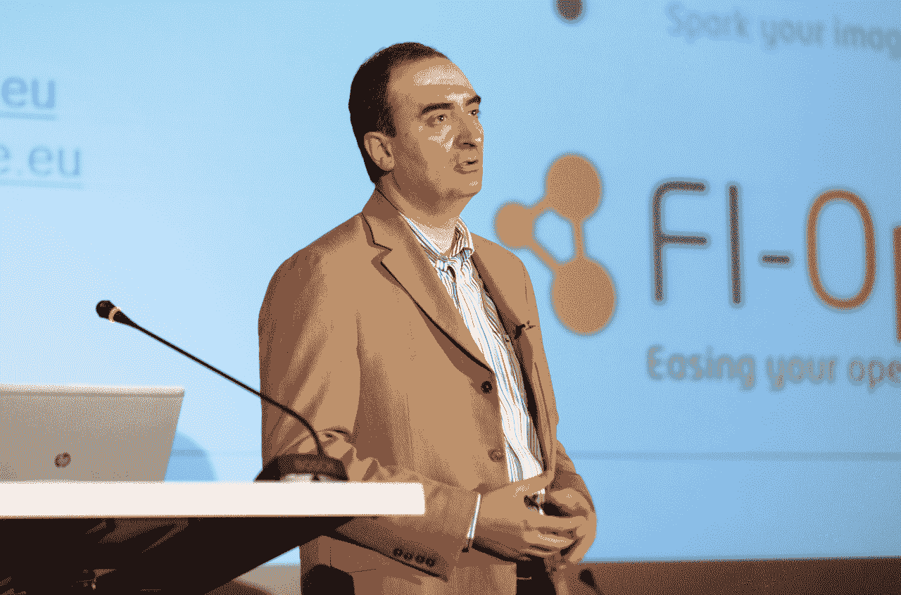

# 为什么欧盟委员会要在一场毫无意义的黑客马拉松上花费€1 亿英镑？TechCrunch

> 原文：<https://web.archive.org/web/https://techcrunch.com/2014/03/18/why-is-the-european-commission-spending-e100m-on-a-pointless-hackathon/>

欧盟委员会宣布，它将向来自任何地方的企业家和初创公司提供 1 亿€(1 . 4 亿美元)，以创建一个基于“ [FI-WARE](https://web.archive.org/web/20230312060249/http://fi-ware.org/) ”的原型“智能城市”应用程序，这是一个由 EU-资助的项目“未来互联网”创建的开放 API 平台。

我们到底在说什么？嗯，FI-WARE 是一个相当曲折的名字，指的是由欧盟委员会资助的公私合作伙伴关系，它也有西班牙电信公司 Telefonica 的投资。FI-WARE 有许多开源、支持 API 的工具，这些工具应该允许开发者创建(除了其他用途之外)“智能城市”应用。这个想法是，开发人员使用 F-WARE 的沙盒环境来测试他们的原型，并从平台上的智能城市专家和开发人员那里获得反馈。

软件人定期举办黑客马拉松比赛，以推广名为“校园日”的平台，前 20 名参赛者分享约 5.6 万€的奖金。您可以在比赛的其他预赛中争夺€145，000 英镑。

只要开发者在软件平台上创建原型(注意，没有产品和创业)，他们就有资格参与竞争，并可以继续赢得现金。

[胡安乔·耶罗](https://web.archive.org/web/20230312060249/https://www.linkedin.com/in/jhierro)(如图)是西班牙电信公司的高级技术专家，负责 FI-WARE 项目，他甚至还围绕物联网、机器人、实时数据和所谓的“安全”等主题举办了其他黑客马拉松和活动

现在，这一切听起来非常值得称赞，但我想问一个问题:这到底有什么意义？

有人听说过从这些软件竞赛中脱颖而出的成功项目吗？

因为从我的角度来看，固件是一个完全没有意义的练习。

显然，他们的新闻办公室告诉我，以前的获奖者创造了 FoodLoop 等应用程序，“通过利用超市对临近保质期的新鲜农产品的折扣，寻求最大限度地减少食物浪费。”

很可爱。

现在，Foodloop [在一般的谷歌搜索中并不是很高](https://web.archive.org/web/20230312060249/https://www.google.co.uk/search?q=Foodloop&oq=Foodloop&aqs=chrome..69i57j69i59j0l4.7173j0j7&sourceid=chrome&espv=210&es_sm=119&ie=UTF-8)，但是询问欧盟，我被告知[在这里](https://web.archive.org/web/20230312060249/http://www.foodloop.de/)。

该项目正在进行中。这对年轻的创造者来说很好，但我要告诉你的是，就欧盟经济而言，“正在进行的项目”加起来并不算什么。事实上，如果这些有创造力的年轻人不被更多地鼓励将他们有趣的想法转化为成熟的创业公司，而不是致力于更多的软件黑客马拉松比赛，那就太好了。

很少有证据证明黑客马拉松奖金能创造任何工作或新公司。事实上，T2 已经有四个多月没有接触过历届黑客马拉松冠军的源代码了。

Github 上的其他 FI-WARE“CampusHack”日黑客正在[收集樟脑丸，无处可去](https://web.archive.org/web/20230312060249/https://github.com/CampusHacks/)。

仅此一项就对这些计划的效力提出了**谴责性的起诉**。

让我们看看谁在智能城市中真正创造了有形的价值。一方面，像 [Waze](https://web.archive.org/web/20230312060249/http://waze.com/) 这样的公司，从一开始就生产一种产品，而不是坐在某个孤独的黑客马拉松里收集竞争资金。他们走出去，重复他们的产品，直到被数百万人使用，最终被谷歌以 10 亿美元收购。

所有创始人现在都是百万富翁，他们将投资于自己的创业生态系统。Waze 现在是一种产品，正如我们所说的，它实际上让城市变得更聪明。

从 FI-WARE 中产生的任何东西都可以宣称这是一个壮举吗？

为什么囊中羞涩的欧盟委员会在黑客马拉松奖金上花费如此之多？

它应该只是鼓励市政当局开放他们的交通基础设施数据，这样私营部门的初创公司就可以开发应用程序。

正如初创公司[的城市地图软件](https://web.archive.org/web/20230312060249/https://citymapper.com/)在伦敦交通方面所做的一样，非常成功。伦敦的工作效率更高，因为人们喜欢这个应用，而 CityMapper 会做得很好，创造经济价值。

对于 Telefonica 来说，FI-WARE 越来越像是一个简单的幌子，而欧盟也越来越像是在“做点什么”

FI-WARE 生产的原型大多是基于无处可去的过时技术。它不会创造价值、经济发展或成功的初创公司和企业家。

我想起了那幅古老的漫画，两个人挖洞、填洞，只是为了保持活跃和就业。

多么伟大的倡议。

FI-WARE？变成不可用，更像是。