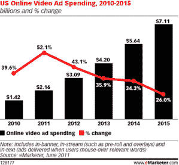

# 在线视频广告未能达到之前预测的 9 个原因 

> 原文：<https://web.archive.org/web/https://techcrunch.com/2011/10/08/why-online-video-advertising-failed-forecasts/>

**编者按:** *以下客座博文由撰稿人[Ashkan Karbasfrooshan](https://web.archive.org/web/20230205045631/http://www.crunchbase.com/person/ashkan-karbasfrooshan)[WatchMojo](https://web.archive.org/web/20230205045631/http://www.watchmojo.com/index.php?id=1)创始人兼 CEO 撰写。*

2011 年，预测者预测美国在线视频广告收入为 19 亿至 56 亿美元。我向 Forrester、Magna Global、eMarketer 和 Accustream 发送了电子邮件，并获得了以下信息:

*   magna global:19 亿美元
*   eMarketer:21.6 亿美元
*   accus tream:56 亿美元

Forrester Research 预计 2012 年的收入为 71 亿美元，但无法给出 2011 年的估计数字。

所有来源包括:

*   流内和横幅内视频广告
*   围绕视频和文本内容的视频广告。

**半信半疑**

2007 年，我发表了一篇[帖子](https://web.archive.org/web/20230205045631/http://watchmojo.com/blog/business/2007/11/05/2012-video-ads-71b/)，汇总了一系列对在线视频广告未来发展方向的预测。2004 年的一项估计显示，到 2009 年，美国在线视频广告市场的预期规模为 6 . 57 亿美元。一年后，2009 年的估价为 15 亿美元。根据 IAB 的数据，2009 年视频广告的实际数字是 9 . 08 亿美元(2010 年增长到 14 亿美元)。

如果你回到 2007 年，对 2011 年的估计从 43 亿美元到 100 亿美元不等。2008 年至 2009 年的经济崩溃使得所有之前的预测都变得毫无意义，但是它的净效应有利于在线广告和视频，而牺牲了印刷和电视广告。尽管如此，eMarketer 目前对 2011 年 21.6 亿美元的预测是其四年前预测的一半。

这是球拍吗？

一个愤世嫉俗的人会争辩说，风险投资本质上是支持这种“研究”来提升投资组合公司的估值，让每个人都陷入一种[狂热](https://web.archive.org/web/20230205045631/https://techcrunch.com/2010/08/20/online-video-advertising-frenzy/)。这并非完全不公平，但也不正确。

**在线视频将继续存在**

毫无疑问，在线视频是一项主流活动，也是生态系统的一部分:“据 comScore 估计，每天将有 1 亿人观看 10 亿条视频内容*，不可否认，广告商比以往任何时候都有更多的机会利用视频，”数字广播集团首席产品官马修·科尔宾说，他曾在 YouTube 和震颤视频工作。*

 *但我密切关注投资者的预期和分析师的预测，我个人认为在线视频没有达到预期，更不用说超过预期了。

为什么？

**1)** **这与语义无关**

悬而未决的论点是“缺乏定义”。那是废话。“视频广告”是否包括围绕一篇文章的横幅内视频广告或视频前的视频预滚动并不重要。最终，在线视频应该是包含一个视频组件的所有东西。

**2)** **它始于 YOUTUBE 的统治**

尽管在线视频呈爆炸式增长，但没人能预见到 YouTube 对真实视频观看的日益掌控。我曾经说过，YouTube 很早就战略性地坐拥收入，只有当他们的统治地位稳固后，他们才开始实施能为制作人赚更多钱的的[事情，最后在最近增加了一个](https://web.archive.org/web/20230205045631/http://www.mediapost.com/publications/?fa=Articles.showArticle&art_aid=135391)[游戏规则改变者](https://web.archive.org/web/20230205045631/http://watchmojo.com/blog/business/2011/08/22/youtube-and-comscore-deal-has-potential-to-make-online-video-blow-up/)——观众跟踪和分析。

**3)** **UGC 仍然是成交量的主要驱动力**

用户生成的内容仍然是最受欢迎的内容类别之一。随着发行公司“监管”UGC，许多营销人员不愿意支付 premium 命令的溢价，我们看到围绕 UGC 的货币化比以往任何时候都多。再加上无限的库存，这拉低了总广告收入增长率——毫无疑问。广告客户无需支付额外费用，只需支付更少的费用就能接触到用户，因为他们可以在更便宜的 UGC 内容旁边投放广告。而且并不是所有的 UGC 库存都卖光了。有大量未售出的存货，所以营销人员压低价格。

**4)** **缺乏透明度**

虽然什么是“在线视频广告”的定义并不是一个真正的问题，但缺乏透明度是一个问题，特别是当涉及到[区分](https://web.archive.org/web/20230205045631/http://www.mediapost.com/publications/?fa=Articles.showArticle&art_aid=144477)横幅内和流内库存，披露它，以及[相应地定价](https://web.archive.org/web/20230205045631/http://www.mediapost.com/publications/?fa=Articles.showArticle&art_aid=145550)时。如果广告客户习惯于为流内广告付费，而在横幅广告中获得广告，这就扭曲了现实和预期。

**5)** **错误指标**

我一岁的女儿站在电视机前，双手贴着屏幕。但是你猜怎么着？我三岁的孩子没有。我妻子和我都不知道。就因为点击率(CTR)是显示横幅和搜索结果的一个可接受的([有问题](https://web.archive.org/web/20230205045631/http://www.foliomag.com/2011/3-044-reasons-why-ctr-wrong-metric-media-buying-and-selling))指标，为什么它就应该是视频的呢？有多少正常的普通观众甚至*知道*你可以点击一个视频？视频是用来做品牌推广的，不管有没有点击，品牌推广都会起作用，但是当广告购买是基于点击率而“优化”的时候，你自然会向前迈两步，向后退一步。

**6)** **YOUTUBE 迟到预滚党**

不管你喜不喜欢，视频营销人员工具箱中的主要工具仍然是前期宣传。拍摄一个 30 秒的电视广告并将其改编成网络版很简单。谢天谢地，我们看到 15 秒广告成为常态。YouTube 拥有如此大的浏览量份额(根据 comScore 的数据，超过 40%)，而且直到最近才开始接受预滚动，难怪视频广告没有达到之前设定的预期。据 Accustream 称，2010 年，随着 YouTube 播放前库存的增加，数字视频媒体支出飙升了 89%。

**7)**好莱坞正在拉眼镜蛇指挥官

当营销人员看到迫使他们这样做的内容时，他们只会在网上花更多的钱。随着 NBC、迪士尼和福克斯退出免费广告支持的发行，预计广告商在开放之前需要更多的说服力。

**8)** **移动外卡**

美国移动广告将首次超过 10 亿美元，其中大部分来自展示和搜索广告。自然，移动设备可以成为视频内容的强大驱动力，但不一定是视频预播放。在 iPhone 突然打开移动市场之前，运营商一直在压制移动视频。

**9)**精简

“我们已经取得了进展。需求和库存都在增长，VAST 和 VPAID 等标准缓解了这一压力。但购买数字视频并了解你买了什么仍然太难了。”TubeMogul 的布雷特威尔逊。

**降低预期**

谷歌在搜索领域的[完美风暴](https://web.archive.org/web/20230205045631/http://watchmojo.com/blog/business/2007/11/19/who-will-be-the-google-of-video/)不会在视频领域重演:视频领域不会有一个明确的赢家，那些存活下来的人只会被认为是成功的，相对于他们繁荣发展所需的投资。2014 年在线视频广告会突破 50 亿美元吗？有人出价 100 亿美元吗？除非在线视频行业齐心协力，否则这些预测将会和之前的预测一样错误。*