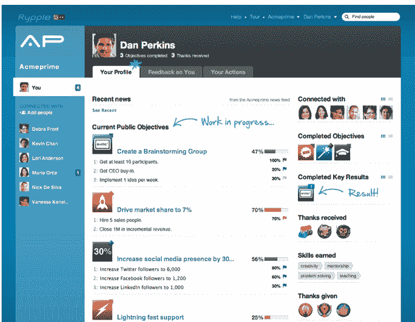

# 为什么 Salesforce 想要进入价值 60 亿美元的人才管理软件市场 

> 原文：<https://web.archive.org/web/https://techcrunch.com/2011/12/16/why-salesforce-wants-in-on-the-6-billion-talent-management-software-market/>

昨天，Salesforce [宣布收购社交绩效平台](https://web.archive.org/web/20221127014303/https://beta.techcrunch.com/2011/12/15/salesforce-acquires-social-performance-platform-rypple-will-launch-human-capital-management-unit-successforce/)[ry ple](https://web.archive.org/web/20221127014303/http://www.crunchbase.com/company/rypple)的，并透露将通过推出新产品 Successforce 进入人力资本管理(也称为员工和人才管理软件)市场。对于 Salesforce 来说，宣布新产品垂直市场和进入新市场是一件大事。当你考虑到 SAP 最近以 34 亿美元收购人才管理软件巨头 SuccessFactors 时，事情开始变得有趣起来。

我们采访了 Salesforce 的执行副总裁 John Wookey，他将领导 Successforce，是前 SAP 和 Oracle 高管；以及 Rypple 联合 CEO、联合创始人丹尼尔·德博(Daniel Debow)；讨论此次收购对 Salesforce 的意义。

背景来说，Rypple 是一个帮助管理者和员工提升绩效的社交绩效管理平台。从本质上来说，Rypple 用一种更具社会性和协作性的方法取代了传统的绩效评估。该软件被比作“企业的 Zynga”，允许经理跟踪项目，指导他们的团队，并向值得称赞的员工致敬，让其他人在它的在线应用程序中看到。

Rypple 还采用了各种游戏机制，如徽章，可以定制以反映公司自己的价值观。例如，员工可以积累“获得的技能”，这种方法让人想起在虚拟世界或 MMORPG 中建立一个角色。该公司的软件被脸书、Spotify、Gilt Groupe 和其他公司使用。

伍基解释说，进入人力资本管理软件市场，他说这是一个每年 60 亿美元的市场机会，符合 Salesforce 使企业更加社会化的总体目标。他解释说:“人们一直关注社会企业，但这也需要在组织内部发挥作用，这必须从公司的人员和人才开始。”。“这不仅仅是关于人力资本管理，而是关于如何使用社会企业的概念来有效地管理人。这是实现社会企业的下一步。”

正如我们上面解释的，Rypple 在将社会行为引入人才管理领域方面一直在挑战极限。Debow 告诉我们，工作世界已经发生了变化，但用于管理人员的流程却没有发生任何变化，他认为成功因素是旧式人才软件的一部分，这种软件基本上实现了业务形式的自动化，但没有实现行为的自动化。

“Rypple 放大了推动真实表现的行为，”Debow 说。在指导、目标设定、评估等方面，我们通过实际复制人们在生活中采取的许多社会行动来帮助提高绩效。”他用最近与 Spotify 合作的例子来帮助设定目标。凭借新的“社交目标 2.0”产品，Rypple 帮助 Spotify 与员工合作，评估如何利用目标和结果推动业务向前发展。Debow 解释说，用户可以为 Spotify 创建目标，邀请人们发表评论，并致力于一个目标。

“事实是，我们与这个星球上一些更具社会性的组织一起开发了这个产品，包括脸书，”他说。

伍基说，在 Salesforce 评估其进入人力资本管理领域时，该公司确实观察了潜在的竞争对手，发现有许多软件人们不满意，并决定社交方法将扩大市场。“社会行动与你如何有效地调整奖励、学习系统、帮助员工职业道路和支持个人才能之间有一种天然的协同作用，”他补充道。

虽然 Salesforce 仍然需要推出 Successforce 并完全集成 Rypple，但该公司已经计划集成到现有的 Salesforce 产品中，如 Chatter、销售云等。Debow 表示，集成将包括与 Chatter、CRM 和其他产品合作的能力，以跟踪完成率或工作并将其记录到 Successforce 中。

Salesforce 可能没有像 Radian6 的[【3.26 亿美元收购](https://web.archive.org/web/20221127014303/https://beta.techcrunch.com/2011/03/30/salesforce-buys-social-media-monitoring-company-radian6-for-326-million/)那样投入那么多现金，但这并不意味着它没有投入大量资源来使收购成为 CRM 巨头的一项新业务。在与 Wookey 和 Debow 交谈后，很明显 Salesforce 对社交人力资本管理有很大的野心，将其作为新产品和收入线(Wookey 对收入方面持乐观态度)。

但如果伍基对 60 亿美元人力资本管理市场的估计是正确的，这可能最终成为 Salesforce 的一个重要的新增长源。

