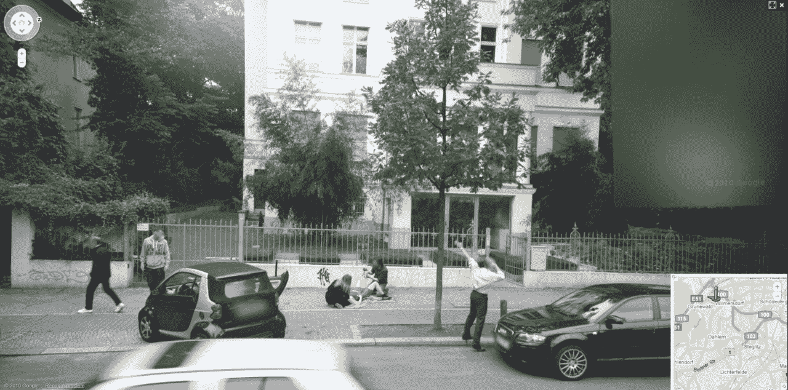

# 为什么谷歌街景上的婴儿出生是假的

> 原文：<https://web.archive.org/web/https://techcrunch.com/2010/11/24/why-that-baby-birth-on-google-streetview-is-fake/>

# 为什么谷歌街景上的婴儿出生是假的

一个孩子出生在路边，一辆谷歌街景车呼啸而过。好得难以置信。的确如此。

这张显然是在德国郊区威尔默斯多夫拍摄的*照片，就在柏林 Hubertusallee 37 号外面，看起来像是由谷歌的一辆摄影车拍摄的。它现在正在推特和脸书上传播。*

一名男子手里抱着一个新生婴儿，站在一辆车门开着、匆忙停在街上的汽车旁。嗯嗯…

德国网站 pcgames.de [称这是一个骗局](https://web.archive.org/web/20230202220549/http://www.pcgames.de/Google-Street-View-Thema-236065/News/Google-Street-View-Geburt-auf-offener-Strasse-nur-ein-Fake-801270/)，不难看出为什么。

这里应该是照片拍摄的地方。注意它离附近的医院有多近？