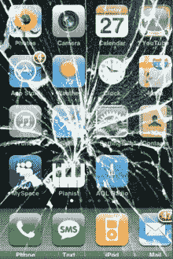

# 为什么联邦通信委员会想要砸开 iPhone | TechCrunch

> 原文：<https://web.archive.org/web/https://techcrunch.com/2009/08/01/why-the-fcc-wants-to-smash-open-the-iphone/>

现在，苹果可能希望它从来没有拒绝过来自 iPhone 的谷歌语音(T2)和相关应用(T4)。或者可能是美国电话电报公司拒绝了这些应用。没人真正知道。但是联邦通信委员会昨晚发起了一项调查，向所有三家公司(苹果、美国电话电报公司和谷歌)发函，要求他们解释到底发生了什么。

从表面上看，对于一些人来说，联邦通信委员会正在调查一个 iPhone 应用程序被拒绝的事情似乎有些奇怪。毕竟每天都有 iPhone 应用被拒绝。但是谷歌语音被拒绝引起了不同寻常的骚动，没有什么比这个高调的案例更能在推行更大的政策议程中杀鸡儆猴了。FCC 的调查不仅仅是对单个应用程序的任意拒绝。这是 FCC 的一种方式，让手机运营商控制的无线网络像互联网一样开放。

如今，互联网上的应用程序和设备有两套不同的规则。在有线互联网上，我们可以连接任何类型的 PC 或其他计算设备，并在这些设备上使用我们想要的任何应用程序。在由美国电话电报公司等移动运营商控制的无线互联网上，我们只能使用他们允许在网络上使用的手机，只能使用他们批准的应用程序。当无线网络主要用于语音通话时，这还不错。但是现在它们越来越多地成为我们连接互联网的移动设备，移动电话正在成为成熟的移动电脑，一种论点正在增长，即统治有线互联网的开放接入规则也应该适用于无线互联网。

虽然苹果和美国电话电报公司不会对 FCC 的调查感到太高兴，但谷歌肯定会暗自高兴。就在两年前，在 700MHz 无线频谱拍卖之前，[恳求 FCC](https://web.archive.org/web/20230406113909/https://techcrunch.com/2007/07/22/the-fcc-needs-to-listen-to-google/) 采纳保证应用程序、设备、服务和其他网络开放接入的原则。两年后，在不同的背景下，在不同的政府领导下，联邦通信委员会正在推行同样的原则。

在要求所有三家公司提供更多信息的信函中，FCC 引用了“关于无线开放接入(RM-11361)和手机排他性(RM-11497)的未决 FCC 诉讼”。第一次关于开放接入的诉讼可以追溯到 2007 年，当时 [Skype 要求](https://web.archive.org/web/20230406113909/http://www.crunchgear.com/2007/02/22/skype-begs-fcc-to-open-cell-networks/)手机运营商向所有应用开放他们的网络(见 [Skype 的请愿书](https://web.archive.org/web/20230406113909/http://74.125.47.132/search?q=cache:WMsHzJyFR6IJ:www.publicknowledge.org/pdf/pisc-skype-comments-20070430.pdf+RM-11361&cd=2&hl=en&ct=clnk&gl=us&client=firefox-a))。像谷歌语音一样，Skype 帮助消费者绕过运营商。运营商不喜欢这样，因为这侵蚀了他们的核心业务，把他们变成了哑管道。

但是我们需要的是哑管道。它们有利于消费者，也有利于竞争，因为它们允许任何应用程序和任何设备在合理的范围内在无线互联网上开花结果。因此，如果你看看联邦通信委员会提出的问题，它想知道为什么谷歌语音应用被拒绝，以及美国电话电报公司(运营商)是否与这一拒绝有关:

> 2.在决定拒绝谷歌语音应用和相关应用时，苹果是单独行动，还是与美国电话电报公司协商？。。。
> 
> 3.美国电话电报公司在 iPhone 应用程序的审批中有任何作用吗(或者在某些情况下)？如果有，是在什么情况下，起什么作用？

联邦通信委员会还希望苹果解释其应用程序审批过程的随意性:

> 4.请解释谷歌语音 iPhone 应用程序与苹果公司批准用于 iPhone 的任何互联网协议语音(VoIP)应用程序之间的任何差异。是否有任何被批准的 VoIP 应用程序可以在美国电话电报公司的 3G 网络上运行？
> 
> 5.还有哪些应用程序被拒绝在 iPhone 上使用，原因是什么？是否有提供给潜在供应商/开发商的禁用应用程序或应用程序类别列表？如果是，这是发布在 iTunes 网站上还是以其他方式向消费者披露？
> 
> 6.考虑和批准 iPhone 应用的标准是什么？此类申请的审批流程是什么(时间、拒绝原因、上诉流程等)。)?申请被拒的百分比是多少？拒绝申请的主要原因是什么？

好问题。希望联邦通信委员会能与美国其他地方分享苹果的答案。然而，这一切都有点荒谬。为什么需要政府机构的正式请求才能让苹果(和美国电话电报公司)解释无线互联网的规则是什么？更重要的是，为什么这些公司被允许成为无线互联网的看门人？iPhone 需要砸开，FCC 在抡锤子。

**更新**:在& T 回复了这个帖子，声明如下:

> 美国电话电报公司不管理或批准应用程序商店的应用程序。我们已经收到信，当然会回复。
> 
> 客户可以在我们的网络上使用任何兼容的 GSM 手机，而不仅仅是我们已经批准和销售的手机。他们也可以使用我们不批准的应用程序。我们不批准 iPhone 应用程序。

所以你有它。你可以在美国电话电报公司上使用任何你喜欢的移动应用程序——除非是 iPhone 应用程序(苹果拒绝了这一应用程序)。苹果曾经拒绝过美国电话电报公司要求的应用吗？也许他们会给联邦通信委员会一个直截了当的答复。

(Flickr 图片来源:[斯蒂芬·海伍德](https://web.archive.org/web/20230406113909/http://www.flickr.com/photos/thetechbuzz/3709438002/))。