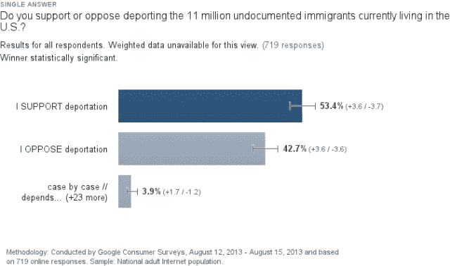
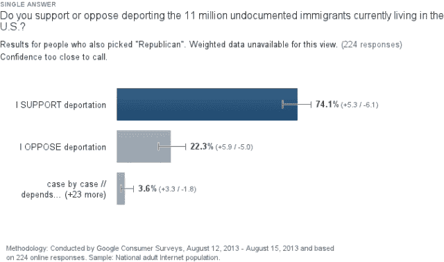

# 为什么我们不能相信关于移民的民意调查，在一张可怕的排外图表中 

> 原文：<https://web.archive.org/web/https://techcrunch.com/2013/08/15/why-we-cant-trust-polls-on-immigration-in-one-horribly-xenophobic-chart/>

# 为什么我们不能相信关于移民的民意调查，在一个可怕的排外图表中

虽然民意调查一直显示美国人压倒性地支持科技行业的头号立法目标，全面的移民改革，但我想知道我是否能让他们同意一项可怕的排外计划，该计划与拟议的法案相反:驱逐所有 1100 万无证移民。我们通过谷歌调查进行了一次 CrunchGov 民意调查，结果令人惊讶。

首先，记住美国人喜欢同意一些事情:他们同意更大的汽车，更多的债务，当然，更多的油炸面包丁在他们的橄榄园沙拉上。所以，当民意测验专家问美国人他们是否“支持”一个想法时，平均来说，答案是肯定的。

在我们的民意调查中，大多数美国人(53%)和高达 74%的共和党人希望驱逐每一个非法移民([详情在此](https://web.archive.org/web/20221210071630/http://www.google.com/insights/consumersurveys/view?survey=24c5dkvcjl4uo&question=2&filter&rw=1&dataGen=65) *)。请记住，*没有人*，甚至是国会中最反移民的成员，提出任何接近这个想法的提议。至多，国会议员不同意当前的非法移民是否应该被允许成为公民，而不是他们是否可以留在这个国家。

更重要的是，来自我们正在进行的 CrunchGov 民意调查的结果发现，希望给予公民身份的人与想把他们全部赶走的人的比例大致相同。迷茫？你应该担心，因为这两种观点截然相反。

调查方法学家亲切地将这称为“[禁止/允许不对称](https://web.archive.org/web/20221210071630/https://beta.techcrunch.com/2012/07/22/how-to-spot-bad-statistics-privacy-hysteria-edition/)”，在这种情况下，受访者更可能支持“允许”行动的想法，而不是禁止它，即使结果完全相同。

正如我以前所写的，“1989 年，一项民意调查发现，当被问及政府是否应该“允许”跨种族婚姻(32%)与“禁止”这种婚姻(19%)时，更多的受访者似乎支持跨种族婚姻，尽管从法律上讲，这是完全一样的。被称为“禁止/允许不对称”的投票不规则性表明，看似无害的变化可能会导致结果的巨大差异。

调查是一件棘手的事情，看似无关紧要的差异可能会导致截然不同的结果。国会领导人知道这一点，这就是为什么玩调查游戏通常无法说服他们支持某个想法。相反，让我们坚持争论一个计划的优点；它更诚实，也肯定更可靠。

* *方法注释:民意调查是使用谷歌对 1，000 名受访者进行的调查。结果目前正在结束，但数字保持稳定，具有统计意义。关于我们为什么使用谷歌调查的更多细节，[阅读这里](https://web.archive.org/web/20221210071630/https://beta.techcrunch.com/2013/07/20/how-google-surveys-could-turn-anyone-into-a-professional-pollster-as-shown-in-1-graph/)。*