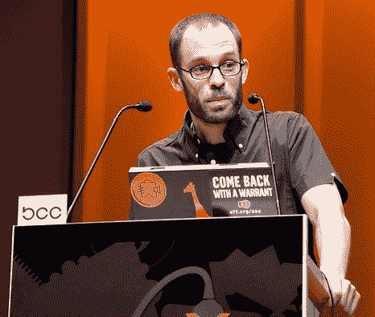

# 互联网不可阻挡:维基解密叛逃者即将推出 open leaks TechCrunch

> 原文：<https://web.archive.org/web/http://techcrunch.com/2010/12/10/wikileaks-defectors-openleaks/>

# 互联网无法停止:维基解密叛逃者即将推出 OpenLeaks

维基解密创始人朱利安·阿桑奇(Julian Assange)在英国监狱中煎熬，据报道，除了他最初因涉嫌瑞典性犯罪而被捕外，美国的起诉[即将到来](https://web.archive.org/web/20230203072611/http://www.cbsnews.com/8301-503543_162-20025289-503543.html)，他的一些前员工已经准备为告密者推出一个名为 OpenLeaks 的竞争网站。新网站将由丹尼尔·多姆沙伊特·伯格领导，他曾是阿桑奇的得力助手，去年九月因不满阿桑奇的专制方式而离职。

OpenLeaks 的结构将与维基解密略有不同。它将被设计成以安全和匿名的方式接受泄密，但自己不会公布。相反，OpenLeaks 将与其他出版商合作，包括世界各地的报纸和网站，这些出版商将评估任何泄露文件的新闻价值，并在发布前对其进行适当的编辑和编辑。

通过这种方式，OpenLeaks 希望解决对维基解密最大的早期批评之一:它不加选择地发布敏感文件，而不顾那些文件中可能提到的人的安全。阿富汗战争文件就是如此，这也是维基解密叛逃者建立 OpenLeaks 的主要原因之一。在当时的一次网上聊天中，当提到阿桑奇处理阿富汗战争文件第一次泄露的方式时，多姆舍特-伯格指责他的行为“像某种皇帝或奴隶贩子”

尽管维基解密在当前的 Cablegate 文件上受到了同样鲁莽的指控，但它似乎已经从第一次错误中吸取了教训。到目前为止，Cablegate 的所有文件都是与世界各地的报纸合作发布的，这些报纸的编辑人员会酌情审查和编辑这些文件中的名字。

最重要的是，OpenLeaks 的存在表明，即使维基解密被关闭，其他服务也在一旁等待着出现并取代它的位置。多亏了互联网，泄密者[无法被阻止](https://web.archive.org/web/20230203072611/https://techcrunch.com/2010/12/08/media-wikileaks/)。

*图片来源:Flickr/[andygee 1](https://web.archive.org/web/20230203072611/http://www.flickr.com/photos/andymcgee/4229690842/)*