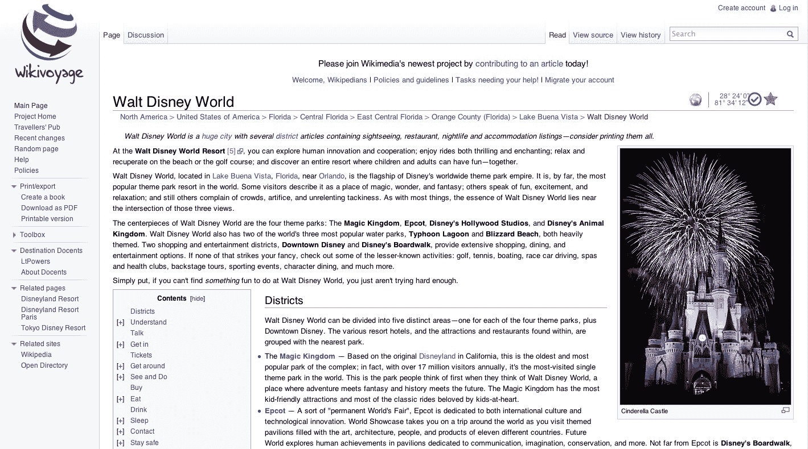

# Wikimedia 推出众包 Wikivoyage 在线旅游指南 TechCrunch

> 原文：<https://web.archive.org/web/https://techcrunch.com/2013/01/15/wikimedia-launches-its-crowdsourced-wikivoyage-online-travel-guide/>

维基百科的非营利母组织[维基媒体基金会](https://web.archive.org/web/20230216093207/http://wikimediafoundation.org/)刚刚正式启动了它的第十二个官方项目:[维基百科](https://web.archive.org/web/20230216093207/http://www.wikivoyage.org/)。这个新网站已经测试了一段时间，有一段[动荡的历史](https://web.archive.org/web/20230216093207/http://en.wikipedia.org/wiki/Wikivoyage)，是一个免费的在线旅游指南，就像维基百科一样，是合作编辑的。它目前有大约 50，000 篇文章，并吸引了大约 200 名志愿编辑组成的核心小组。该网站提供英语、荷兰语、法语、德语、意大利语、俄语、葡萄牙语、西班牙语和瑞典语版本。

“全球对旅游信息的需求很大，但很少有既全面又非商业的来源。维基媒体基金会执行董事苏·加德纳在今天的一份声明中说:“这种情况将会改变。“Wikivoyage 对旅行者来说是一项伟大而有用的服务，我希望在维基媒体基金会和全球维基媒体编辑社区的支持下，它会变得更大更好。”

尽管 Wikivoyage 本身是新的，但该项目本身实际上可以追溯到 2006 年，当时最初的 [Wikitravel](https://web.archive.org/web/20230216093207/http://en.wikipedia.org/wiki/Wikitravel) 网站被出售给互联网品牌，许多用户和编辑离开了该网站，因为新所有者在该服务上引入了广告。然而，Wikitravel 上的材料仍然受到知识共享许可的保护，在经历了许多来回之后，许多 Wikitravel 编辑决定在 2012 年将该项目分叉，并将其与 Wikivoyage 合并，wiki voyage 本身在几年前从 Wikitravel 中分离出来。因此，你目前会在 [Wikitravel](https://web.archive.org/web/20230216093207/http://wikitravel.org/en/Mount_Aso) 和 [Wikivoyage](https://web.archive.org/web/20230216093207/http://en.wikivoyage.org/wiki/Mount_Aso) 上找到很多相同的材料。

Wikitravel 的内容最终在去年 11 月转移到了 Wikivoyage，直到今天还处于测试阶段。

“维基百科协会的宗旨是促进世界上所有国家和地区的教育和知识，以及各国之间的理解，”维基百科协会董事会主席斯特凡·富桑说。“我们对 Wikivoyage 作为维基媒体项目的推出感到非常兴奋，也对该协会未来通过其计划支持 Wikivoyage 社区的作用感到非常兴奋。”

鉴于网上的许多旅游信息写得很差，已经过时，而且完全错误，维基百科在网上肯定有一席之地。正如维基百科管理员彼得·菲茨杰拉德在接受旅游新闻网站 Skift [today](https://web.archive.org/web/20230216093207/http://skift.com/2013/01/15/interview-wikipedias-travel-site-wikivoyage-launches-today-amidst-big-hopes/) 采访时承认的那样，该网站的覆盖面仍然有点不均衡。然而，作为回报，你经常可以在 Wikivoyage 上找到商业旅游指南中没有的信息。

【T2