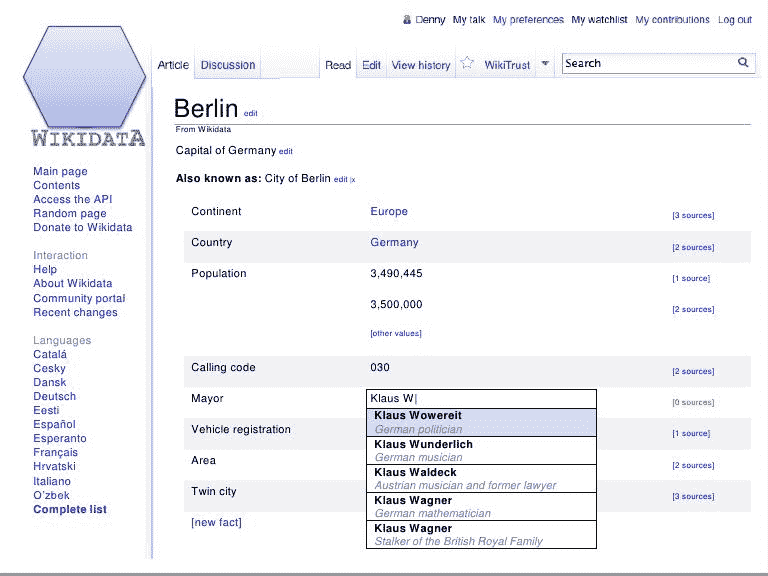

# 维基百科的下一件大事:维基数据，一个机器可读、用户可编辑的数据库，由谷歌、保罗·艾伦和其他人资助

> 原文：<https://web.archive.org/web/https://techcrunch.com/2012/03/30/wikipedias-next-big-thing-wikidata-a-machine-readable-user-editable-database-funded-by-google-paul-allen-and-others/>

自 2006 年以来，[维基媒体基金会](https://web.archive.org/web/20230326031632/http://www.crunchbase.com/company/wikimedia-foundation)的第一个新项目，维基数据，现在已经开始开发。该组织以其用户编辑的知识百科全书[维基百科](https://web.archive.org/web/20230326031632/http://www.crunchbase.com/product/wikipedia)而闻名，最近在柏林举行的二月语义技术&商业会议上宣布了这个新项目，将维基数据描述为提供一个人类和机器都可以阅读和编辑的知识数据库的新努力。

之前也有其他尝试来创建一个基于维基百科数据的语义数据库——例如， [DBpedia](https://web.archive.org/web/20230326031632/http://dbpedia.org/) ，一个从维基百科中提取结构化内容并使其在线可用的社区努力。不同的是，有了维基数据，数据不仅仅是可用的，它还可以被任何人编辑。

该项目的目标是开发一个语义的、机器可读的数据库，这不仅有助于推动网络向前发展，也有助于维基百科本身。这些数据将使维基百科的所有本地化版本在它们所包含的基本事实方面相互平等。今天，英语、德语、法语和荷兰语版本提供了最多的覆盖面，其他语言远远落在后面。

维基数据还将使用户能够提出不同类型的问题，如*世界十大城市中哪个有女市长？例如*。如今，像这样的查询由用户创建的维基百科列表来回答——也就是手动创建的结构化答案。另一方面，维基数据将能够自动创建这些列表。

创建维基数据的最初努力是由维基媒体德国分部领导的，其首席执行官 Pavel Richter 称该项目是“开创性的”，并将其描述为“40 个国际维基媒体分部之一所承担的最大的技术项目。”导致维基数据概念的大部分早期实验是在德国完成的，这就是为什么它作为新事业的运作基地。

德国分会将执行维基数据创建过程中的最初开发工作，但完成后会将运营和维护工作移交给维基媒体基金会。据估计，移交将在一年后的 2013 年 3 月进行。

整个项目将有三个阶段，第一阶段包括为维基百科超过 280 种支持的语言中的每个维基百科条目创建一个维基数据页面。这将为在线百科全书提供一个通用的结构化数据来源，可以在所有文章中使用，无论它们使用哪种语言。例如，某人的出生日期将被记录并保存在一个地方: [Wikidata](https://web.archive.org/web/20230326031632/http://meta.wikimedia.org/wiki/Wikidata) 。第一阶段还包括集中维基百科不同语言版本之间的链接。这部分工作将于 2012 年 8 月完成。

在第二阶段，编辑将能够在维基数据中添加和使用数据，这将在 2012 年 12 月推出。最后，第三阶段将允许基于 Wikidata 中的数据自动创建列表和图表，然后可以填充维基百科的页面。

就维基数据将如何影响维基百科的用户界面而言，该计划是让数据存在于维基百科页面右侧的“信息框”中。(例如:纽约市页面[右侧的那些)。数据将在 data.wikipedia.org 的](https://web.archive.org/web/20230326031632/http://en.wikipedia.org/wiki/New_York_city)[输入，然后驱动信息框出现在任何地方，跨语言，以及使用相同信息框的其他页面。但是，由于该项目刚刚进入开发阶段，其中的一些细节可能会发生变化。](https://web.archive.org/web/20230326031632/http://data.wikipedia.org/)

下面是维基数据的一个早期概念:

Wikidata 中包含的所有数据都将在免费的知识共享许可下发布，这将开放给任何数量的外部应用程序使用，包括电子政务、科学等等。

Denny Vrandeč博士从卡尔斯鲁厄理工学院加入了 Wikimedia，他正在领导一个由八名开发人员组成的团队建立 Wikidata，牛津大学的 Markus krtzsch 博士也加入了该团队。值得注意的是，krtzsch 和 Vrandeč都是语义 MediaWiki 项目的联合创始人，该项目在过去几年中追求与 Wikidata 相似的目标。

维基数据的最初开发由 130 万欧元的捐款资助，其中一半由微软联合创始人保罗·艾伦于 2010 年成立的[艾伦人工智能研究所](https://web.archive.org/web/20230326031632/http://www.ai-squared.org/)提供。该研究所的目标是支持有可能加速人工智能(包括网络语义)进展的长期研究活动。

“维基数据将建立在我们长期支持的语义技术之上，将加快科学发现的步伐，并将为世界创造一个非凡的新数据资源，”艾伦研究所副总裁马克·格里夫斯博士说。

另外四分之一的资金来自[戈登和贝蒂·摩尔基金会](https://web.archive.org/web/20230326031632/http://www.moore.org/)，通过它的[科学](https://web.archive.org/web/20230326031632/http://www.moore.org/science.aspx)项目，另外四分之一来自[谷歌](https://web.archive.org/web/20230326031632/http://www.google.com/)。据谷歌开源总监克里斯·迪博纳(Chris DiBona)称，谷歌希望维基数据能够向“所有人”提供大量结构化数据。(所有的意思，当然也是指谷歌本身。)

这又回到了所有那些关于未来几个月谷歌搜索引擎将会有“重大变化”的模糊报道，这些报道似乎远远早于任何实际新闻(像这样)，可能是一种公关推动[来转移人们对围绕 Google+的日益增长的批评的注意力……或者可能只是通过教育公众什么是“语义网”*来戏弄新闻。*](https://web.archive.org/web/20230326031632/https://techcrunch.com/2012/03/15/google-search-changes-in-a-nutshell-please-stop-talking-trash-about-spyw-we-have-semantic-search/)

 *Google，[声明](https://web.archive.org/web/20230326031632/http://online.wsj.com/article_email/SB10001424052702304459804577281842851136290-lMyQjAxMTAyMDEwNDExNDQyWj.html)将加大努力为普通查询提供直接答案——比如那些有具体事实数据的查询——显然可以在维基数据这样的东西上建立很大的基础。随着它进一步进入语义搜索，它可以提供用户搜索的人、地点和事物的详细信息。它实际上知道事物是什么，是否出生日期、位置、距离、大小、温度等等。以及它们与其他数据点的连接方式。谷歌此前表示，预计语义搜索的变化将影响 10%至 20%的查询。(谷歌拒绝就其在这一领域的未来计划发表任何公开评论)。

具有讽刺意味的是，维基百科的努力结果可能实际上意味着谷歌对维基百科页面的推荐减少。简短的答案可以由谷歌自己提供，放在搜索结果的顶部。点击阅读维基百科全文(或任何文章)的需求将会减少，导致谷歌用户在谷歌上花费更多时间。*