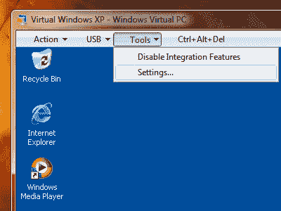
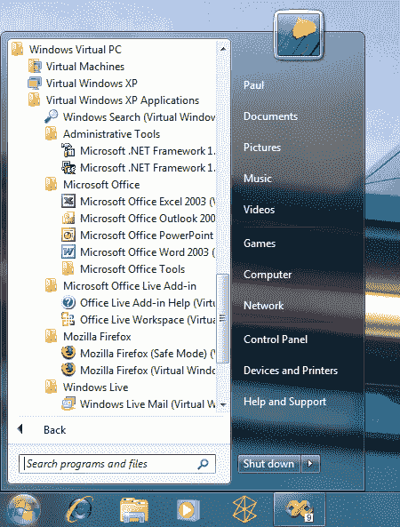

# Windows 7 揭示了 XP 模式，也就是 IT 人员的梦遗

> 原文：<https://web.archive.org/web/https://techcrunch.com/2009/04/25/windows-7-reveals-xp-mode-aka-the-it-guys-wet-dream/>

# Windows 7 揭示了 XP 模式，也就是 IT 人员的梦遗

[所以在 Windows 7 中将会有](https://web.archive.org/web/20230325125748/http://community.winsupersite.com/blogs/paul/archive/2009/04/24/secret-no-more-revealing-virtual-windows-xp-for-windows-7.aspx)XP 模式。那是什么意思？对于 Windows 7 专业版、企业版和旗舰版的用户——对不起，是低端用户！–您将获得一个完整的 Windows XP 副本，它将在虚拟处理器下运行。然而，XP 模式不是创建一个新的桌面环境，而是将应用程序作为一个窗口显示在 Windows 7 中。这意味着你可以在不启动虚拟机的情况下“原生”运行 IE 6 这样的应用。

该虚拟机还将提供一个桌面界面，但你在 XP 下安装的应用程序将出现在 Windows 7 的开始菜单中，这是一个有趣的举动。简而言之，XP 应用程序将以 Windows 7 应用程序的形式出现，只是加载量要大一些。
 

为什么会这样？主要是因为 Vista 长期以来被视为玩物，而不是 IT 部门的严肃选择。通过添加一个 XP 模式，最后一个论点是“这不是 XP！”–反对 Windows 7 已经死了。我玩过 Wn7，我很期待它，作为一名前 it 人员，我可以毫不含糊地说这是一件大事。