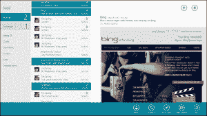
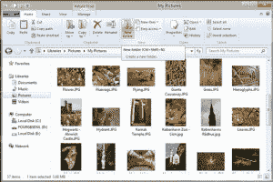

# Windows 8:一开始你肯定会讨厌它(但不管怎样，给它一个机会)

> 原文：<https://web.archive.org/web/https://techcrunch.com/2012/06/17/windows-8-youll-absolutely-hate-it-at-first-but-give-it-a-chance-anyway/>

毫无疑问，Windows 8 是微软近年来最雄心勃勃的版本。它抛弃了多年来用户对 Windows 的许多期望。例如，标志性的开始按钮不见了。相反，我们现在得到了一个有点分裂个性的操作系统，Metro 取代了开始菜单，提供全屏应用程序和带有常用任务栏的传统桌面，基本上看起来像 Windows 7.5。所有这些都让专家们担心，一旦用户拿到他们的第一台 Windows 8 电脑，他们会作何反应。人们不喜欢改变，正如路透社上周指出的，微软的用户可能会为重新设计而挣扎。事实上，一开始你可能会非常讨厌 Windows 8。

不过，我不认为这都是坏事。TechCrunch 几乎完全是一家 Mac 商店，但自从 2 月份推出消费者预览版以来，我一直将 Windows 8 作为我的主要桌面操作系统。当《T3》发布时，我们[报道了这个版本，发现它很酷，而且明显两极分化。](https://web.archive.org/web/20221207144417/https://beta.techcrunch.com/2012/02/29/windows-8-the-road-ahead/)

毫无疑问，第一周是艰难的——并不是因为操作系统有问题(它实际上比任何人对预览版的合理预期都要好得多)。Metro 和传统台式机之间的不断切换让我彻底疯了。没有开始按钮和使用热点来打开开始菜单(或使用 Windows 键)的新模式感觉不太好。微软在开发这款操作系统时，似乎也没有考虑到人们会如何在多个屏幕上使用它。仅仅为了适应微软的突发奇想而交换多年的内存对我来说没有多大意义。

地铁邮件应用程序

但是也有很多理由喜欢 Windows 8。它启动速度很快(即使在传统硬盘的机器上)。感觉很有反应。我扔给它的每一个遗留程序和游戏都没有出现问题(TechSmith 的 [Jing 截图工具](https://web.archive.org/web/20221207144417/http://feedback.techsmith.com/techsmith/topics/jing_always_crashes_on_windows_8_consumer_preview)是个罕见的例外)。微软改进了许多小细节，尽管我不是这个世界上最喜欢功能区界面的人(MG 正确地[取笑了微软关于它在 Windows Explorer 中的使用的博客文章](https://web.archive.org/web/20221207144417/https://beta.techcrunch.com/2011/08/30/we-need-an-invert-selection-button))，它很容易隐藏和习惯。对于那些真正需要开始菜单的人来说，已经有很多黑客把它带回了 Windows 8。

## 地铁和桌面:过了一段时间，这感觉像是一种怪癖，而不是一种烦恼

自 2 月份发布第一个公开测试版以来，微软已经迭代并修复了我最初在 Windows 8 上遇到的许多问题(例如，多屏支持现在已经得到了很大改善)。事实上，在强迫自己使用它并习惯它之后，我承认我越来越喜欢它了。用 Metro 作为开始菜单开始觉得正常了。拖动鼠标到左下角开始感觉就像点击开始按钮一样自然。我仍然尽可能地避免 Metro 应用程序(它们在大的桌面屏幕上对我来说没有多大意义)，但我可以看到它们在平板电脑上看起来会很棒。

尽管如此，Windows 8 仍然感觉像是两个操作系统被迫合二为一，但在使用了一段时间后，现在感觉这更像是一种怪癖，而不是一种烦恼。

带有功能区界面的 Windows 资源管理器

问题是，我花了整整两三个星期才走到这一步。大多数人也没有耐心重新学习如何使用他们的电脑。如果它惹恼了那些每天付费测试应用程序并普遍接受变化的权威人士，主流用户可能会更加讨厌它，it 部门会做得更好，只是暂时跳过这个版本(他们中的大多数人现在仍然在向 Windows 7 迁移，所以大多数人可能会跳过这个升级周期)。

微软知道它必须对 Windows 8 做一些激进的事情，正如该公司倾向于做的那样，决定拥有结合“两个世界的最佳”的东西将只是给用户两个世界，而两者之间没有太多联系。

微软表示，Metro 和台式机应该能够协同工作，但在目前的测试版中几乎没有证据表明这一点。好的一面是，一旦你进入桌面模式，并且你已经把大部分经常使用的应用程序固定在任务栏上，你就很少能看到 Metro 了。然而，时不时地(例如，在你安装了一个新程序之后)，你必须切换回 Metro 模式，并且会被提醒这个切换是多么不和谐，Metro 在桌面上是多么不合适。

这里有很多好东西——对我来说，这比怪癖更重要。但我能把它推荐给目前使用 Windows 7 的用户吗？那对我来说仍然是悬而未决的。也许 Metro 在最终版本中会感觉更加完整。也许使用触摸屏会让一切走到一起。不过，我相当确定的是，当大多数人在台式机或笔记本电脑上看到 Windows 8 时，他们一开始会讨厌它。坚持下去并重新训练自己会有一些回报，从某种程度上来说，这个过程与新 Mac 用户从 Windows 转到 OS X 的体验没有太大区别。

如你所见，我和微软一样对 Windows 8 感到困惑，所以请在评论中评论，让我们知道你的想法。