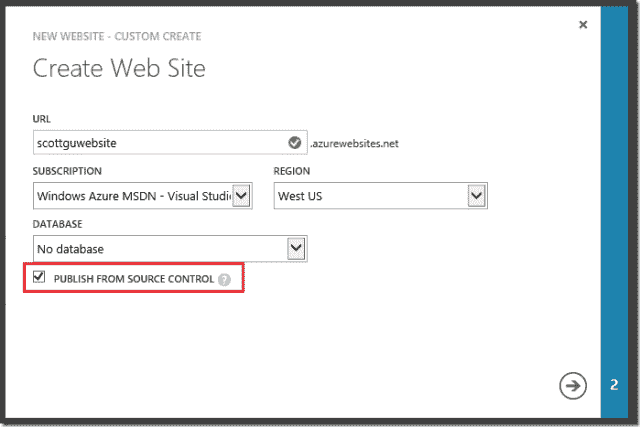

# Windows Azure 与 AWS 竞争更加激烈，推出了新的移动功能、网站扩展、数据同步等技术

> 原文：<https://web.archive.org/web/https://techcrunch.com/2012/12/21/windows-azure-gets-more-competitive-with-aws-launches-new-mobile-features-website-scaling-data-sync-and-more/>

# Windows Azure 与 AWS 竞争更加激烈，推出了新的移动功能、网站扩展、数据同步等等

Windows Azure】增加了八项新功能，包括新的移动服务、网站缩放和数据同步。

[副总裁斯科特·格思里](https://web.archive.org/web/20221208074637/http://weblogs.asp.net/scottgu/archive/2012/12/21/great-updates-to-windows-azure-mobile-services-web-sites-sql-data-sync-acs-media-more.aspx)在他的博客上详细介绍了新功能。以下是一些更值得注意的改进:

**移动服务:**更好的后台作业调度能力，因此用户体验不会受到干扰。作业可以按预设的时间间隔进行调度，允许开发人员在不创建或管理单独的虚拟机的情况下执行场景。此外，Azure 移动服务现已在北欧推出。此前，Windows Azure 移动服务仅在 Windows Azure 的美国东部和美国西部地区受支持。

**网站扩展:**开发者现在可以将网站扩展到 6 个共享实例和最多 10 个保留实例。这些可以是小型、中型或大型的。以前，开发人员只能扩展到三个共享实例和三个保留实例。Guthrie 还写道，Azure 现在有一个新的自定义创建工作流，允许将源代码管理设置的配置作为站点创建的一部分。

**数据同步:** SQL 数据同步服务现在可以在新的 Windows Azure 管理门户中使用。Guthrie 解释说，SQL 数据同步允许您在多个 SQL 数据库之间同步数据。这些 SQL 数据库可以跨您的内部环境和云，或者跨多个云托管的数据库，这些数据库可能包括世界各地的多个 Windows Azure 区域。

以下是可用资源的完整列表:

*   移动服务(作业调度支持、欧洲地区支持、命令行支持)
*   网站(规模改进、集成源代码控制)
*   SQL 数据同步(新 HTML 门户中的支持)
*   ACS 管理(新 HTML 门户中的支持)
*   媒体服务(作业和任务管理、blob 存储支持、预留计算)
*   虚拟网络增强
*   订阅过滤支持
*   Windows Azure 商店(现已在更多国家提供)

Windows Azure 最近有许多更新，这表明它试图与亚马逊网络服务(AWS)更具竞争力。Azure 离真正的挑战者还有一段距离，但它一直在不断增加新功能，这表明它决心缩小差距。

本月早些时候，该团队报告称，开发者可以为 iOS 移动应用程序自动推送更新。它还宣布了存储价格的[下降。本周早些时候](https://web.archive.org/web/20221208074637/https://beta.techcrunch.com/2012/12/05/windows-azure-storage-drops-pricing-by-as-much-as-28-in-price-fight-for-market-share/) [Forrester Research](https://web.archive.org/web/20221208074637/https://beta.techcrunch.com/2012/12/17/forrester-report-shows-amazon-aws-reigns-supreme-with-developers-as-windows-azure-gains-momentum/) 报道 Azure 在开发者中的受欢迎程度仅次于 AWS。它仍然远远落后于亚马逊网络服务，但 Azure 团队正在向开发者展示它的可信度。这是一件大事，表明一个社区确实正在 Azure 云上兴起。