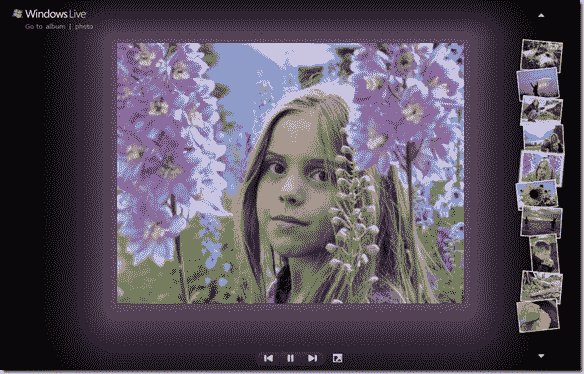
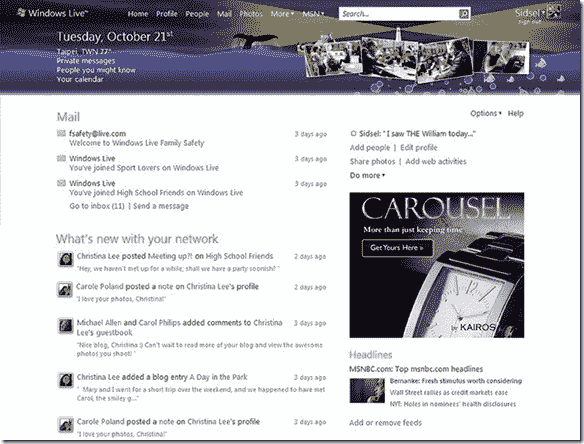

# Windows Live 推出新的社交网络中心，将 sky drive/照片存储提升至 25 GB TechCrunch

> 原文：<https://web.archive.org/web/https://techcrunch.com/2008/12/02/windows-live-rolls-out-its-new-social-network-hub-boosts-skydrivephoto-storage-to-25-gb/>

# Windows Live 推出新的社交网络中心，将 sky drive/照片存储提升至 25 GB

今天，微软推出了两周前宣布的从 T2 到 T4 的全面变革。Windows Live 似乎正逐渐取代 MSN，成为你在网上做任何事情的微软中心。

新的主页显示了你的电子邮件和你的联系人在网上的活动流。它比脸书更像 FriendFeed，还加入了一点 MyYahoo。您还可以自定义它来显示当地天气、日历和新闻标题。顶部显示了一些您最近的照片，以及搜索框和其他实时服务的链接(个人资料、人物、邮件、照片、活动、空间、群、SkyDrive 甚至 MSN)。

这里的新服务是群、照片和个人资料。个人资料页面显示了你在 Wndows Live 以及 Twitter、Flickr 和 Yelp 等其他网络服务上的所有活动。群组允许您设置与其他人的协作页面，并包含一个群组日历。Windows Live Photos 还有一个漂亮的幻灯片放映功能，它使用 Silverlight 来更改背景色，以匹配每张照片的主色。

通过这次重新设计，微软还将其在线文件存储服务 SkyDrive 的存储限制从 5GB 提高到 25GB。这主要是为了让 Windows Live Photos 成为更具竞争力的照片共享服务。这些照片会占用您的 SkyDrive 帐户的存储空间。

